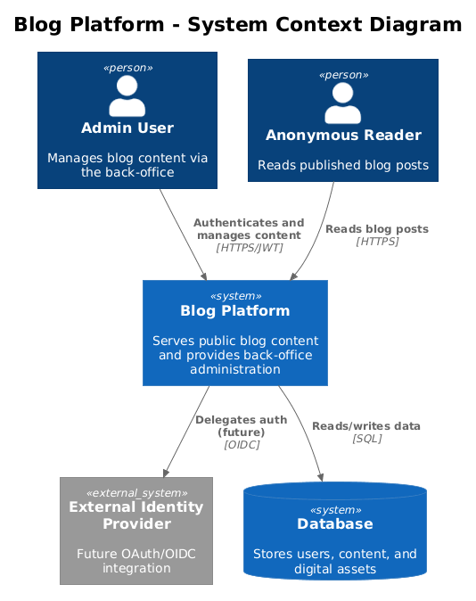
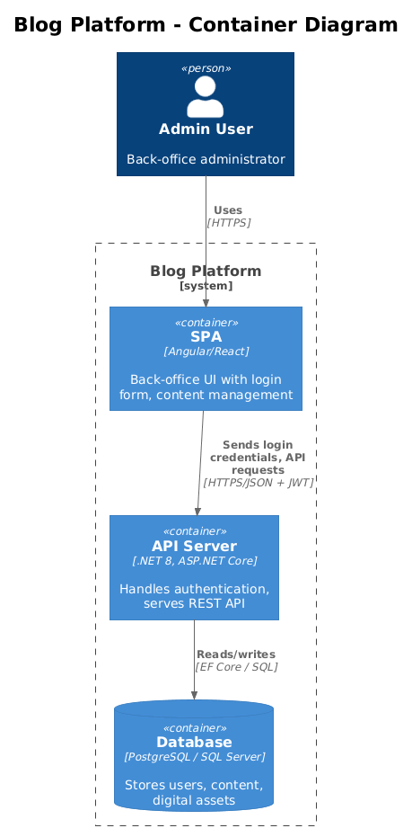
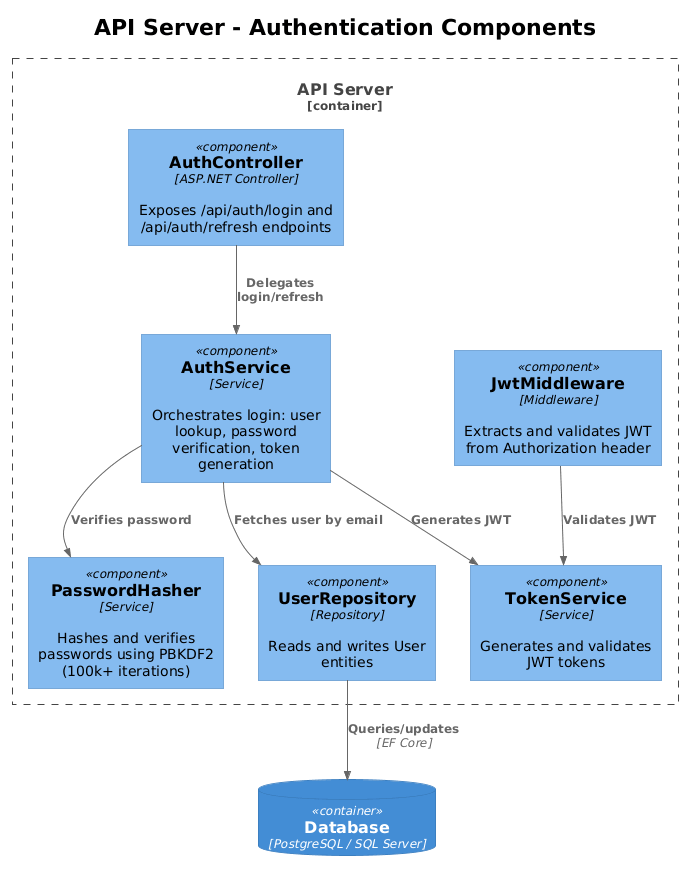
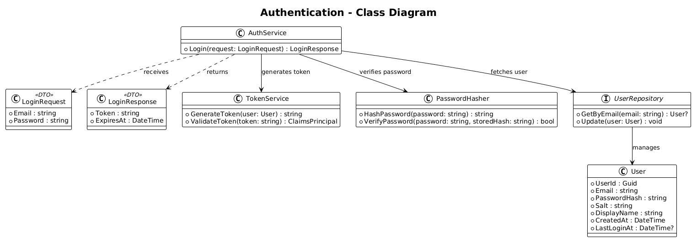
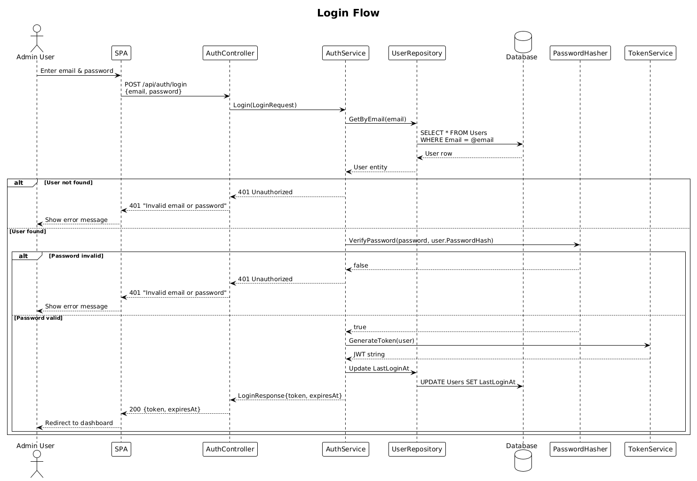
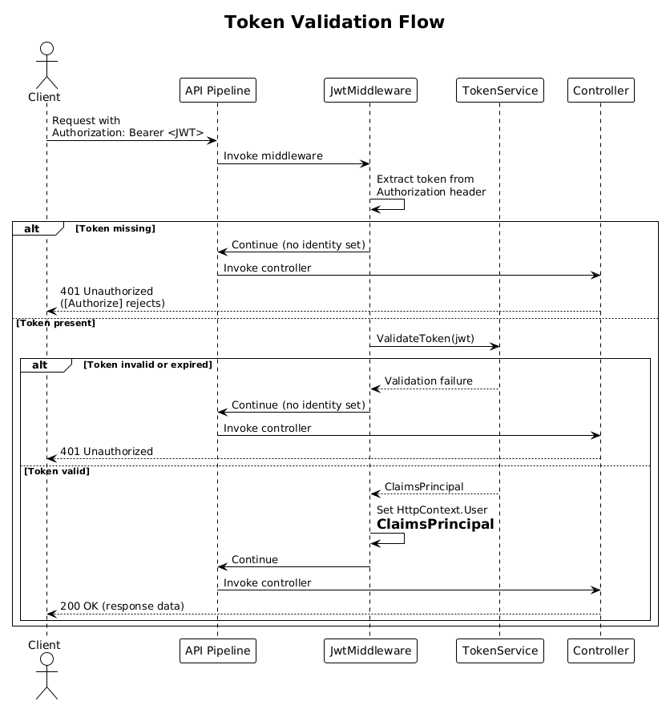

# Feature 01: Authentication & Authorization

## 1. Overview

This feature provides JWT-based authentication and authorization for the Blog platform's back-office administration interface. All administrative operations (content management, user management, digital asset handling) require authenticated access via JWT bearer tokens. The public-facing blog site remains fully anonymous with no authentication required.

**Requirements Traceability:**

| Requirement | Description |
|-------------|-------------|
| L1-006 | Authenticate and authorize back-office users with secure, industry-standard mechanisms |
| L2-023 | JWT-based authentication with configurable expiration |
| L2-024 | Password security with bcrypt/Argon2/PBKDF2 hashing (100k+ iterations) |

Per the UI design in `docs/ui-design-back-office.pen`, the login page uses a split layout at XL/LG breakpoints with gradient branding panel and centered form at smaller breakpoints.

## 2. Architecture

### 2.1 C4 Context Diagram

The system context shows the Blog Platform in relation to its users and external systems.



- **Admin User** authenticates via the back-office SPA to manage blog content.
- **Anonymous Reader** accesses the public site without authentication.
- **Database** stores user credentials and session data.
- **External Identity Provider** is reserved for future OAuth/OIDC integration.

### 2.2 C4 Container Diagram

The container diagram shows the major deployable units involved in authentication.



- **SPA (Angular)** hosts the login form and stores the JWT in memory.
- **API Server (.NET)** handles authentication endpoints and validates tokens on protected routes.
- **Database (SQL Server/PostgreSQL)** persists user accounts and hashed credentials.

### 2.3 C4 Component Diagram

The component diagram details the authentication-related components inside the API server.



## 3. Component Details

### 3.1 AuthController

- **Responsibility:** Exposes HTTP endpoints for login and token refresh.
- **Endpoints:** `POST /api/auth/login`, `POST /api/auth/refresh`
- **Behavior:** Delegates credential validation to `AuthService`, returns JWT on success, returns 401 on failure.

### 3.2 AuthService

- **Responsibility:** Orchestrates the login workflow -- looks up the user, verifies the password, and triggers token generation.
- **Dependencies:** `UserRepository`, `PasswordHasher`, `TokenService`
- **Behavior:** Returns a `LoginResponse` DTO on success or throws an authentication exception on failure. Updates `LastLoginAt` on the user record.

### 3.3 TokenService

- **Responsibility:** Generates and validates JWT tokens.
- **Configuration:** Token secret, issuer, audience, and expiration are read from `appsettings.json` under the `Jwt` section.
- **Behavior:**
  - `GenerateToken(User user)` -- creates a signed JWT with claims (sub, email, displayName, iat, exp).
  - `ValidateToken(string token)` -- validates signature, expiration, issuer, and audience; returns a `ClaimsPrincipal`.

### 3.4 PasswordHasher

- **Responsibility:** Hashes and verifies passwords using PBKDF2 with a minimum of 100,000 iterations (per L2-024).
- **Behavior:**
  - `HashPassword(string password)` -- returns a hash string that includes the salt, iteration count, and hash.
  - `VerifyPassword(string password, string storedHash)` -- returns `bool`.
- **Algorithm:** PBKDF2-SHA256, 128-bit salt, 256-bit derived key, 100,000+ iterations. The hash format encodes algorithm parameters so future upgrades are backward-compatible.

### 3.5 JwtMiddleware

- **Responsibility:** ASP.NET Core middleware that intercepts requests to protected endpoints, extracts the `Authorization: Bearer <token>` header, validates the token via `TokenService`, and sets `HttpContext.User`.
- **Behavior:** If the token is missing or invalid, the request proceeds without an identity; the `[Authorize]` attribute then returns 401.

## 4. Data Model

### 4.1 User Entity



| Field | Type | Constraints |
|-------|------|-------------|
| UserId | Guid | PK, auto-generated |
| Email | string | Required, unique, max 256 chars |
| PasswordHash | string | Required, max 512 chars |
| Salt | string | Required, max 128 chars |
| DisplayName | string | Required, max 128 chars |
| CreatedAt | DateTime | UTC, set on creation |
| LastLoginAt | DateTime? | UTC, updated on each successful login |

### 4.2 DTOs

**LoginRequest:**

| Field | Type | Validation |
|-------|------|------------|
| Email | string | Required, valid email format |
| Password | string | Required, min 8 chars |

**LoginResponse:**

| Field | Type | Description |
|-------|------|-------------|
| Token | string | Signed JWT |
| ExpiresAt | DateTime | UTC expiration timestamp |

## 5. Key Workflows

### 5.1 Login Flow



1. User enters email and password in the SPA login form.
2. SPA sends `POST /api/auth/login` with `LoginRequest` body.
3. `AuthController` delegates to `AuthService.Login()`.
4. `AuthService` calls `UserRepository.GetByEmail()` to fetch the user record.
5. If the user is not found, return 401 Unauthorized.
6. `AuthService` calls `PasswordHasher.VerifyPassword()` with the provided password and stored hash.
7. If verification fails, return 401 Unauthorized.
8. `AuthService` calls `TokenService.GenerateToken()` to create a JWT.
9. `AuthService` updates `LastLoginAt` via `UserRepository`.
10. `AuthController` returns 200 with `LoginResponse` (token + expiration).
11. SPA stores the token in memory and includes it in subsequent API requests.

### 5.2 Token Validation Flow



1. Client sends a request with `Authorization: Bearer <token>` header.
2. `JwtMiddleware` extracts the token from the header.
3. `JwtMiddleware` calls `TokenService.ValidateToken()`.
4. `TokenService` verifies the signature, expiration, issuer, and audience.
5. On success, a `ClaimsPrincipal` is constructed and assigned to `HttpContext.User`.
6. The request continues to the controller, which is guarded by `[Authorize]`.
7. If validation fails, `HttpContext.User` remains unauthenticated, and the `[Authorize]` attribute returns 401.

## 6. API Contracts

### 6.1 POST /api/auth/login

**Request:**

```http
POST /api/auth/login
Content-Type: application/json

{
  "email": "admin@blog.com",
  "password": "secureP@ssw0rd"
}
```

**Success Response (200):**

```json
{
  "token": "eyJhbGciOiJIUzI1NiIsInR5cCI6IkpXVCJ9...",
  "expiresAt": "2026-04-04T14:30:00Z"
}
```

**Error Response (401):**

```json
{
  "type": "https://tools.ietf.org/html/rfc7235#section-3.1",
  "title": "Unauthorized",
  "status": 401,
  "detail": "Invalid email or password."
}
```

### 6.2 POST /api/auth/refresh

**Request:**

```http
POST /api/auth/refresh
Authorization: Bearer <current-valid-token>
```

**Success Response (200):**

```json
{
  "token": "eyJhbGciOiJIUzI1NiIsInR5cCI6IkpXVCJ9...",
  "expiresAt": "2026-04-04T15:00:00Z"
}
```

**Error Response (401):** Returned if the current token is expired or invalid.

## 7. Security Considerations

### 7.1 Password Hashing

- Passwords are hashed using PBKDF2-SHA256 with a minimum of 100,000 iterations (L2-024).
- Each user has a unique cryptographically random salt (128-bit).
- Passwords are never stored or logged in plaintext.
- The hash format encodes the algorithm and parameters to support future migration to Argon2 or bcrypt.

### 7.2 Token Expiration

- Access tokens have a configurable expiration (default: 60 minutes).
- Token expiration is enforced on every request by `JwtMiddleware`.
- The refresh endpoint issues a new token only if the current token is still valid (not expired).
- Token secrets are stored in configuration (environment variables in production, never in source control).

### 7.3 Rate Limiting on Login

- The login endpoint is rate-limited to 5 attempts per email address per 15-minute window.
- After exceeding the limit, the endpoint returns `429 Too Many Requests` with a `Retry-After` header.
- Rate limiting is implemented via ASP.NET Core rate limiting middleware with a sliding window policy.
- Failed login attempts are logged (without the password) for security monitoring.

### 7.4 Additional Measures

- The JWT signing key must be at least 256 bits.
- HTTPS is required for all API endpoints in production.
- The `Authorization` header is never logged.
- Timing-safe comparison is used in password verification to prevent timing attacks.
- Error messages on login failure are generic ("Invalid email or password") to prevent user enumeration.

## 8. Open Questions

| # | Question | Impact | Status |
|---|----------|--------|--------|
| 1 | Should we support refresh tokens with rotation (separate long-lived token stored server-side), or is short-lived access token + re-login sufficient for the back-office? | Token management complexity | Open |
| 2 | Which password hashing algorithm should be the primary choice: PBKDF2, bcrypt, or Argon2id? L2-024 permits any of the three. | Security posture, dependency selection | Open |
| 3 | Should account lockout be implemented after N failed attempts, or is rate limiting sufficient? | Security vs. usability tradeoff | Open |
| 4 | Will the External Identity Provider (OAuth/OIDC) integration be needed in a near-term release, and should we design the auth abstraction to accommodate it now? | Architecture extensibility | Open |
| 5 | What is the required token expiration duration for the back-office? Default is 60 minutes. | Security vs. convenience | Open |
