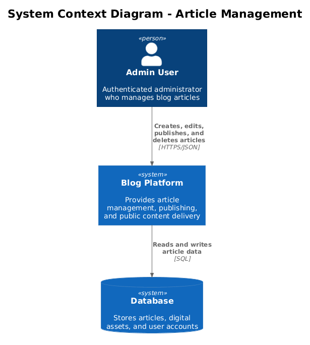
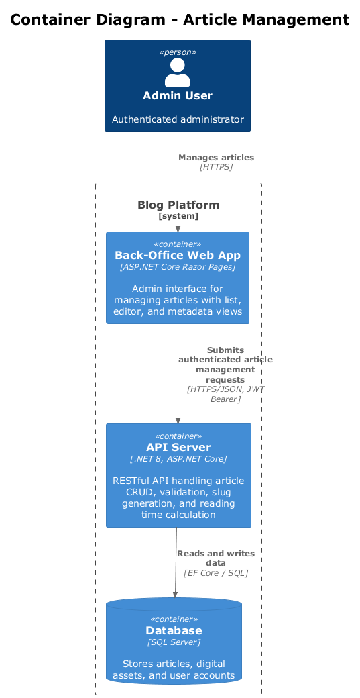
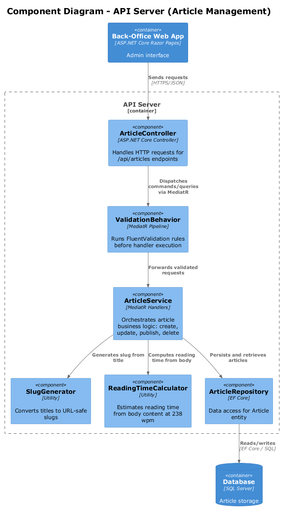
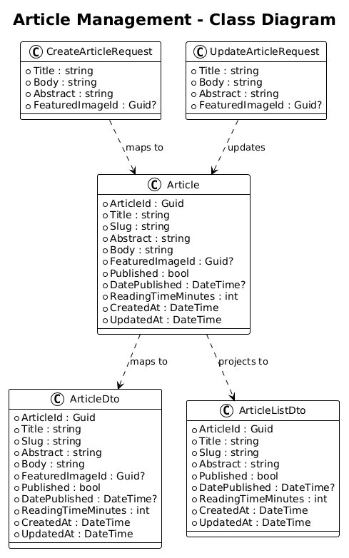
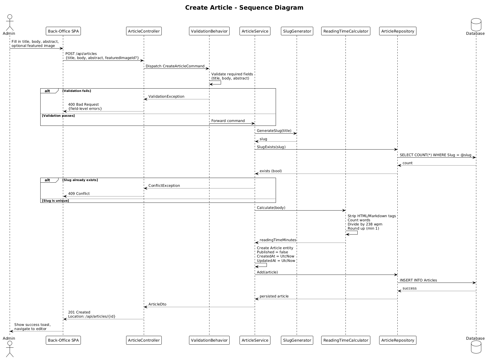
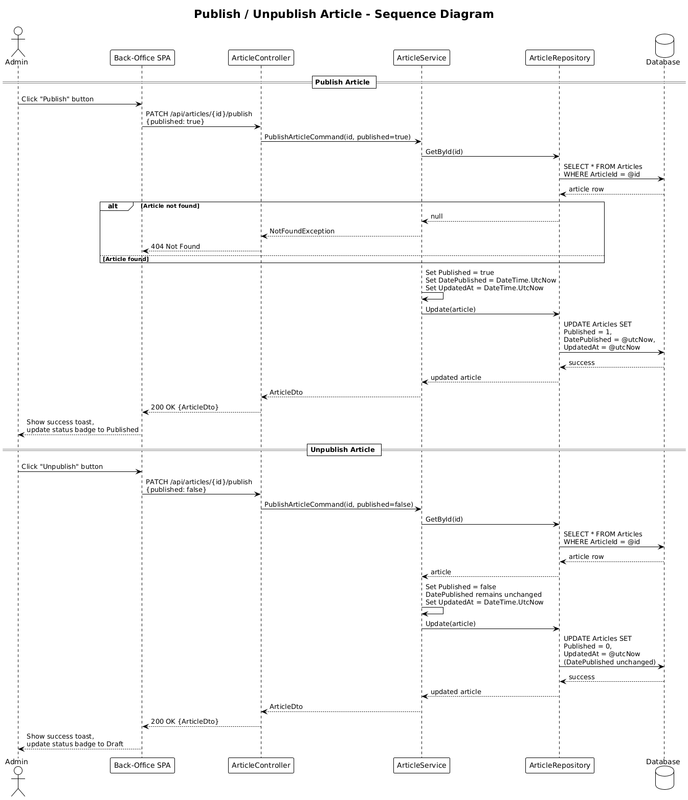

# Feature 02: Article Management (Back Office)

## 1. Overview

This feature delivers full CRUD operations for articles within the back-office administration interface. Articles are the sole content type in the blog platform. The workflow supports creating draft articles, editing content and metadata, publishing and unpublishing with date tracking, and permanent deletion with digital asset disassociation.

All operations require authentication. Articles include a precomputed reading time estimate (238 words per minute) calculated at save time.

### Requirements Traceability

| Requirement | Description |
|-------------|-------------|
| L1-001 | Create, edit, publish, unpublish, and delete articles |
| L2-001 | Create Article |
| L2-002 | Edit Article |
| L2-003 | Publish / Unpublish Article |
| L2-004 | Delete Article |
| L2-038 | Precomputed Reading Time |

## 2. Architecture

### 2.1 C4 Context Diagram

The blog platform sits between the admin user and the persistence layer.



**Source:** [diagrams/c4_context.puml](diagrams/c4_context.puml)

### 2.2 C4 Container Diagram

The system is composed of a back-office Razor Pages web application, an API server, and a relational database.



**Source:** [diagrams/c4_container.puml](diagrams/c4_container.puml)

### 2.3 C4 Component Diagram

Within the API server, article management is handled by a set of focused components following the vertical-slice pattern.



**Source:** [diagrams/c4_component.puml](diagrams/c4_component.puml)

## 3. Component Details

### 3.1 ArticleController

- **Responsibility:** HTTP endpoint routing, request deserialization, response serialization.
- **Endpoints:** See [Section 6: API Contracts](#6-api-contracts).
- **Behavior:** Delegates all business logic to `ArticleService`. Returns appropriate HTTP status codes (200, 201, 400, 401, 404, 409).

### 3.2 ArticleService

- **Responsibility:** Orchestrates article business logic including create, update, publish/unpublish, and delete workflows.
- **Dependencies:** `SlugGenerator`, `ReadingTimeCalculator`, `MarkdownConverter`, `ArticleRepository`.
- **Key behaviors:**
  - On create: generates slug, converts Markdown body to HTML via `MarkdownConverter`, computes reading time, defaults `Published = false`.
  - On update: regenerates slug if title changed; if body changed, reconverts Markdown to HTML and recomputes reading time.
  - On publish: sets `Published = true` and `DatePublished = DateTime.UtcNow`.
  - On unpublish: sets `Published = false`, preserves `DatePublished`.
  - On update, publish, and delete: enforces optimistic concurrency using the current article version carried through `ETag` / `If-Match`.
  - On delete: removes article and disassociates linked digital assets.

### 3.3 SlugGenerator

- **Responsibility:** Converts an article title into a URL-safe slug.
- **Algorithm:** Lowercase, replace spaces with hyphens, strip non-alphanumeric characters (except hyphens), collapse consecutive hyphens, trim leading/trailing hyphens.
- **Example:** `"My First Blog Post!"` becomes `"my-first-blog-post"`.

### 3.4 MarkdownConverter

- **Responsibility:** Converts Markdown source to sanitized HTML using the Markdig library.
- **Behavior:** Parses the Markdown body with a configured Markdig pipeline (advanced extensions: tables, autolinks, task lists, pipe tables) and produces HTML output. The resulting HTML is then sanitized via Ganss.Xss HtmlSanitizer (see Feature 08) before storage. Conversion runs at save time so the public site serves pre-rendered HTML with no runtime Markdown processing overhead.

### 3.5 ReadingTimeCalculator

- **Responsibility:** Estimates reading time in minutes from article body content.
- **Algorithm:** Strip Markdown formatting, count words (split on whitespace), divide by 238 (average reading speed), round up to nearest integer. Minimum value is 1 minute.

### 3.6 ArticleRepository

- **Responsibility:** Data access for the `Article` entity via Entity Framework Core.
- **Operations:** `GetById`, `GetAll` (with pagination), `Add`, `Update`, `Remove`, `SlugExists`.

### 3.7 ValidationBehavior

- **Responsibility:** MediatR pipeline behavior that runs FluentValidation validators before the handler executes.
- **Behavior:** Collects validation errors and throws a `ValidationException` with field-level error details, which the exception-handling middleware maps to a 400 response.

## 4. Data Model

### 4.1 Article Entity



**Source:** [diagrams/class_diagram.puml](diagrams/class_diagram.puml)

| Field | Type | Constraints |
|-------|------|-------------|
| ArticleId | `Guid` | Primary key, generated on creation |
| Title | `string` | Required, max 256 characters |
| Slug | `string` | Required, unique, max 256 characters |
| Abstract | `string` | Required, max 512 characters |
| Body | `string` | Required, Markdown source content |
| BodyHtml | `string` | Required, pre-rendered HTML generated from Body at save time |
| FeaturedImageId | `Guid?` | Nullable FK to DigitalAsset |
| Published | `bool` | Default `false` |
| DatePublished | `DateTime?` | UTC, set on first publish |
| ReadingTimeMinutes | `int` | Computed at save time, minimum 1 |
| Version | `int` | Required concurrency token, default 1 |
| CreatedAt | `DateTime` | UTC, set on creation |
| UpdatedAt | `DateTime` | UTC, updated on every save |

### 4.2 Entity Configuration

- `Slug` has a unique index for duplicate detection and public URL lookups.
- `Published` and `DatePublished` are indexed together for efficient public listing queries.
- `Body` (Markdown source) and `BodyHtml` (pre-rendered HTML) are stored as `nvarchar(max)` / `TEXT` and excluded from list projections.

## 5. Key Workflows

### 5.1 Create Article



**Source:** [diagrams/sequence_create_article.puml](diagrams/sequence_create_article.puml)

1. Admin submits title, body (Markdown), abstract, and optional featured image ID.
2. `ValidationBehavior` validates required fields (title, body, abstract).
3. `ArticleService` calls `SlugGenerator` to produce a slug from the title.
4. `ArticleService` checks `ArticleRepository.SlugExists()` -- returns 409 if duplicate.
5. `ArticleService` calls `MarkdownConverter` to convert the Markdown body to sanitized HTML, stored as `BodyHtml`.
6. `ArticleService` calls `ReadingTimeCalculator` to compute reading time from the Markdown body.
7. `ArticleService` creates the `Article` entity with `Published = false` and `CreatedAt = UtcNow`.
8. `ArticleRepository` persists the entity.
9. API returns 201 with the created `ArticleDto` and a `Location` header.

### 5.2 Edit Article

1. Admin submits updated fields for an existing article ID.
2. `ValidationBehavior` validates that title is not empty (if provided).
3. `ArticleService` retrieves the article -- returns 404 if not found.
4. If title changed and the article is **not published**, `SlugGenerator` regenerates the slug; `SlugExists` checks for conflicts (409). If the article **is published**, the slug is frozen and unchanged regardless of title changes.
5. The service validates the incoming `If-Match` version token against the current article version and returns 412 if they do not match.
6. If body changed, `MarkdownConverter` reconverts Markdown to sanitized HTML (`BodyHtml`), and `ReadingTimeCalculator` recomputes reading time.
7. `ArticleService` updates fields, increments `Version`, and sets `UpdatedAt = UtcNow`.
8. `ArticleRepository` persists changes.
9. API returns 200 with the updated `ArticleDto` and a fresh `ETag`.

### 5.3 Publish / Unpublish



**Source:** [diagrams/sequence_publish.puml](diagrams/sequence_publish.puml)

**Publish:**
1. Admin sends PATCH to `/api/articles/{id}/publish` with `{ "published": true }`.
2. `ArticleService` retrieves article -- 404 if not found.
3. The service validates the incoming `If-Match` version token against the current article version and returns 412 if they do not match.
4. Sets `Published = true` and `DatePublished = DateTime.UtcNow`.
5. Increments `Version`, persists, and returns 200 with a fresh `ETag`.

**Unpublish:**
1. Admin sends PATCH to `/api/articles/{id}/publish` with `{ "published": false }`.
2. `ArticleService` retrieves article -- 404 if not found.
3. The service validates the incoming `If-Match` version token against the current article version and returns 412 if they do not match.
4. Sets `Published = false`. `DatePublished` is **not** cleared.
5. Increments `Version`, persists, and returns 200 with a fresh `ETag`.

### 5.4 Delete Article

1. Admin sends DELETE to `/api/articles/{id}`.
2. `ArticleService` retrieves article -- 404 if not found.
3. The service validates the incoming `If-Match` version token against the current article version and returns 412 if they do not match.
4. Disassociates any linked digital assets (nullifies `FeaturedImageId`).
5. `ArticleRepository` removes the entity.
6. API returns 204 No Content.

## 6. API Contracts

All endpoints are under `/api/articles` and require a valid JWT bearer token. Per Feature 06, successful JSON responses are wrapped in the standard `{ data, timestamp }` envelope, while the examples below focus on the inner DTO shape plus any required concurrency headers.

### 6.1 List Articles

```
GET /api/articles?page={page}&pageSize={pageSize}
```

**Response 200:**
```json
{
  "items": [
    {
      "articleId": "guid",
      "title": "string",
      "slug": "string",
      "abstract": "string",
      "published": true,
      "datePublished": "2026-01-15T10:30:00Z",
      "readingTimeMinutes": 5,
      "createdAt": "2026-01-10T08:00:00Z",
      "updatedAt": "2026-01-15T10:30:00Z"
    }
  ],
  "page": 1,
  "pageSize": 9,
  "totalCount": 42
}
```

### 6.2 Get Article by ID

```
GET /api/articles/{id}
```

**Response 200:**
```json
{
  "articleId": "guid",
  "title": "string",
  "slug": "string",
  "abstract": "string",
  "body": "string (Markdown source)",
  "bodyHtml": "string (pre-rendered HTML)",
  "featuredImageId": "guid or null",
  "published": false,
  "datePublished": null,
  "readingTimeMinutes": 3,
  "createdAt": "2026-01-10T08:00:00Z",
  "updatedAt": "2026-01-10T08:00:00Z"
}
```

**Response 404:** Article not found.

### 6.3 Create Article

```
POST /api/articles
Content-Type: application/json

{
  "title": "string (required)",
  "body": "string (required, Markdown)",
  "abstract": "string (required)",
  "featuredImageId": "guid (optional)"
}
```

**Response 201:** Created `ArticleDto` (includes `body` as Markdown source and `bodyHtml` as rendered HTML) with `Location` header.
**Response 400:** Validation errors (missing title, body, or abstract).
**Response 401:** Unauthenticated.
**Response 409:** Duplicate slug conflict.

### 6.4 Update Article

```
PUT /api/articles/{id}
Content-Type: application/json

{
  "title": "string (required)",
  "body": "string (required, Markdown)",
  "abstract": "string (required)",
  "featuredImageId": "guid (optional)"
}
```

**Response 200:** Updated `ArticleDto` (includes `body` as Markdown source and `bodyHtml` as rendered HTML).
**Response 400:** Empty title or body.
**Response 401:** Unauthenticated.
**Response 404:** Article not found.
**Response 409:** Duplicate slug conflict (if title changed).
**Response 412:** `If-Match` version mismatch.

### 6.5 Publish / Unpublish Article

```
PATCH /api/articles/{id}/publish
Content-Type: application/json
If-Match: W/"article-{id}-v{version}"

{
  "published": true
}
```

**Response 200:** Updated `ArticleDto`.
**Response 401:** Unauthenticated.
**Response 404:** Article not found.
**Response 412:** `If-Match` version mismatch.

### 6.6 Delete Article

```
DELETE /api/articles/{id}
```

**Response 204:** No content.
**Response 401:** Unauthenticated.
**Response 404:** Article not found.
**Response 412:** `If-Match` version mismatch.

## 7. UI Design Reference

### 7.1 Articles List -- Desktop (XL/LG Breakpoints)

The articles list screen features a persistent left sidebar (240px wide, background `#080808`) containing the "QB Admin" brand and navigation items. The "Articles" nav item is highlighted with a `#1A1A1A` background. Other nav items include Media and Settings.

The main content area displays a top bar with an "Articles" heading and action buttons: a search icon and a "New Article" primary button (blue, `#3B82F6`). Below the top bar, a data table presents articles with the following columns:

| Column | Content |
|--------|---------|
| Title | Article title with abstract preview below |
| Status | Badge component -- amber `Comp/Badge/Draft` or green `Comp/Badge/Published` |
| Date | Publication or creation date |
| Actions | Edit and delete icon buttons |

Table rows use a bottom border color of `#1E1E1E`. At the LG breakpoint (992px), the sidebar narrows to 220px with slightly reduced typography.

### 7.2 Articles List -- Tablet (MD Breakpoint)

At 768px, the sidebar is removed. A top bar displays the "QB" brand abbreviation, "Articles" text, an avatar, and the new article button. The table is compacted to three columns: Title, Status, and Actions.

### 7.3 Articles List -- Mobile (SM/XS Breakpoints)

At 576px and below, the table is replaced with a card-based layout. Each card displays the article title, a status badge, the date, and an edit button. A hamburger menu provides access to navigation. At the XS breakpoint (375px), cards use more compact padding.

### 7.4 Article Editor -- Desktop (XL Breakpoint)

The editor screen retains the same left sidebar as the list view. The main content area is split into two sections:

- **Left form area:** Contains a title input (`Comp/Input`), abstract textarea (`Comp/Textarea`), and a Markdown body editor with live preview.
- **Right metadata sidebar (320px, background `#080808`):** Contains a status selector (`Comp/Select`), a featured image dropzone (`Comp/Dropzone`), and action buttons: Publish/Save (`Comp/Btn/Primary`) and Delete (`Comp/Btn/Destructive`).

Feedback is delivered via `Comp/Toast` components (success, error variants). Destructive actions (delete) trigger a `Comp/Modal` confirmation dialog.

## 8. Security

- All endpoints require a valid JWT bearer token in the `Authorization` header.
- Unauthenticated requests receive a 401 Unauthorized response.
- Input validation is enforced at the API boundary via `ValidationBehavior` before any business logic executes.
- Article body content is sanitized to prevent stored XSS when rendered on the public site (handled by Feature 03).

## 9. Open Questions

1. **Slug collision strategy:** ~~Should the system auto-append a numeric suffix or return 409?~~ **Resolved: Return 409.** Keeps slug generation deterministic and forces explicit title choice. Per L2-001 acceptance criteria.
2. **Soft delete:** ~~Should articles support soft delete?~~ **Resolved: Permanent deletion.** Single-admin personal blog does not warrant the complexity of soft delete, retention policies, or scheduled hard-delete jobs. Per L2-004.
3. **Body format:** ~~Should the system store HTML only, Markdown only, or both?~~ **Resolved:** The system stores both. `Body` holds the Markdown source of truth; `BodyHtml` holds sanitized HTML generated server-side at save time via Markdig. The public site renders `BodyHtml` directly with no runtime conversion.
4. **Slug immutability after publish:** ~~Should slug regeneration be restricted to draft articles only?~~ **Resolved: Freeze slug on publish.** Once an article is published, the slug is immutable regardless of title changes. This prevents broken public URLs, social share links, and search engine indexes. Draft articles continue to regenerate slugs on title change.
5. **Concurrent editing:** ~~Should the system implement optimistic concurrency?~~ **Resolved:** Yes, via a `Version` concurrency token and `If-Match` / 412 Conflict. Already implemented.
