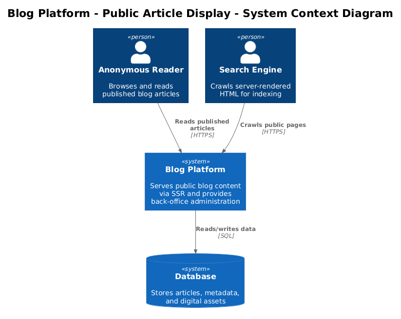
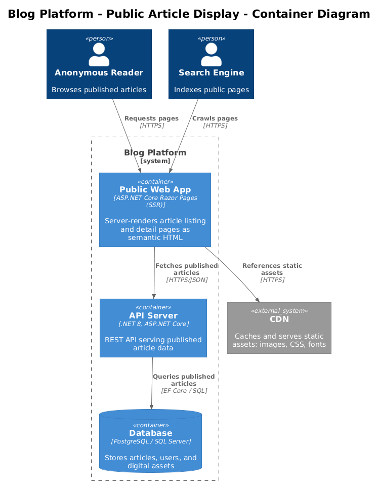
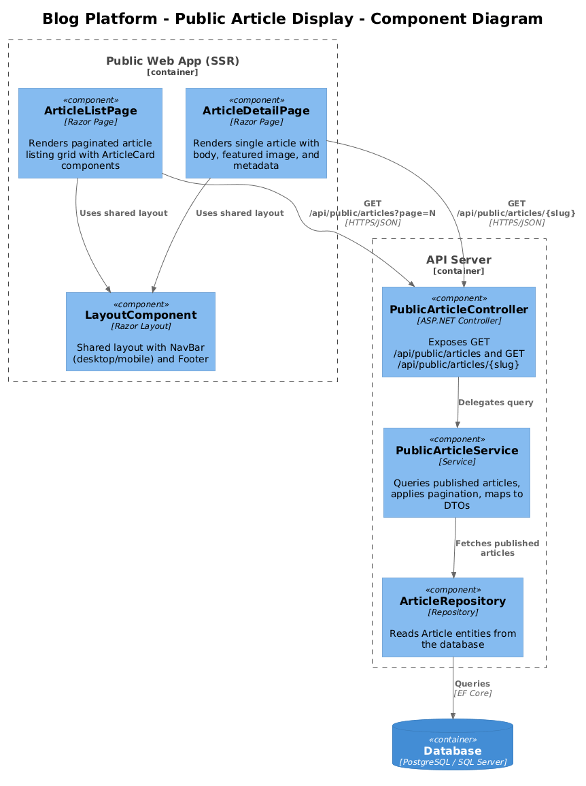
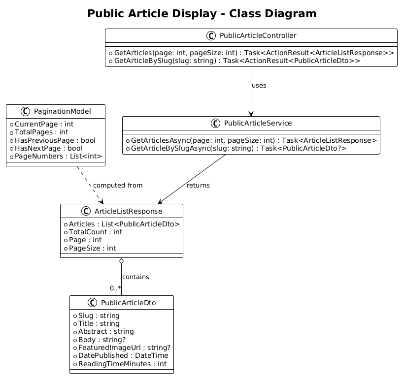
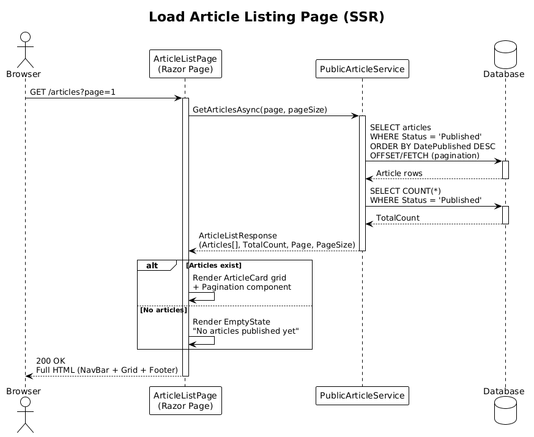
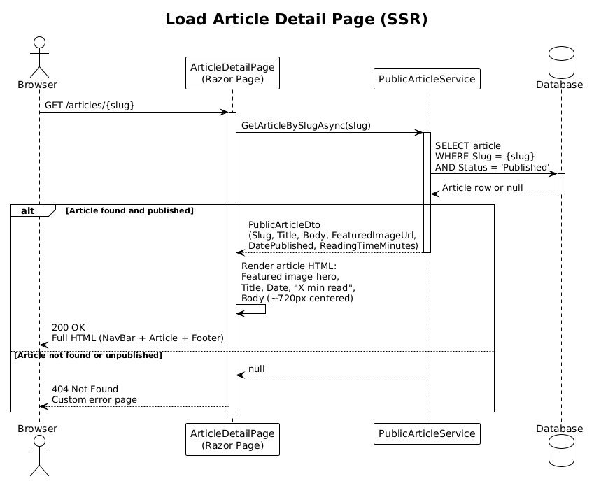

# Feature 03: Public Article Display

## 1. Overview

This feature delivers the public-facing, server-rendered web application that allows anonymous readers to browse and read published blog articles. The experience is built with ASP.NET Core Razor Pages (SSR), producing semantic HTML that is fully indexed by search engines and loads without JavaScript dependencies. The site is responsive across five breakpoints (XS through XL) and meets WCAG 2.1 Level AA accessibility standards.

**Requirements Traceability:**

| Requirement | Description |
|-------------|-------------|
| L1-002 | Present published articles via responsive, server-rendered public web app with exceptional reading experience |
| L1-012 | Fluid responsive layout across 5 breakpoints: XS, SM, MD, LG, XL |
| L2-005 | List published articles with pagination, ordered by datePublished desc |
| L2-006 | View single article at /articles/{slug} with full content and metadata |
| L2-035 | Responsive listing grid: 3-col XL, 2-col MD/LG, 1-col XS/SM |
| L2-036 | Responsive detail: ~70ch max body width centered, full-width with 16px padding on small screens |
| L2-037 | Responsive navigation: horizontal bar >=768px, hamburger menu below |
| L2-038 | Display "X min read" from precomputed reading time value |
| L2-039 | WCAG 2.1 Level AA accessible markup |

Per the UI designs in `docs/ui-design-public-facing.pen`, the public site uses a design system with semantic color tokens ($surface-primary, $foreground-primary, $accent-primary, $border-subtle) applied consistently across all breakpoints.

## 2. Architecture

### 2.1 C4 Context Diagram

The system context shows the Blog Platform serving anonymous readers and search engine crawlers.

- **Anonymous Reader** browses the public site to read published articles.
- **Search Engine** crawls the server-rendered HTML for indexing.
- **Blog Platform** serves the public-facing web application and back-office administration.

### 2.2 C4 Container Diagram

The container diagram shows the deployable units involved in serving public article pages.

- **Public Web App (SSR)** is an ASP.NET Core Razor Pages application that server-renders HTML for every page request. It communicates with the API Server to fetch published article data.
- **API Server (.NET)** provides RESTful endpoints for querying published articles. It applies the publication status filter so that only published articles are returned to the public site.
- **Database** stores all article content, metadata, and digital assets.
- **CDN (optional)** caches and serves static assets (images, CSS) for improved load times.

### 2.3 C4 Component Diagram

The component diagram details the internal structure of the Public Web App and the relevant API Server components.

**Public Web App components:**
- **ArticleListPage** -- Razor Page that renders the paginated article listing grid with ArticleCard components.
- **ArticleDetailPage** -- Razor Page that renders a single article with full body content, featured image, and metadata.
- **LayoutComponent** -- Shared layout containing NavBar (desktop/mobile variants) and Footer.

**API Server components:**
- **PublicArticleController** -- Exposes endpoints for listing and retrieving published articles.
- **PublicArticleService** -- Business logic layer that queries the database for published articles, handles pagination, and maps entities to DTOs.

## 3. Component Details

### 3.1 ArticleListPage

- **Route:** `/` and `/articles` (with optional `?page=N` query parameter)
- **Responsibility:** Renders a paginated grid of published article cards ordered by `DatePublished` descending.
- **Behavior:** Calls `PublicArticleService.GetArticlesAsync(page, pageSize)` during the SSR page model `OnGetAsync`. Renders ArticleCard components in a CSS Grid layout. Displays a Pagination component when total articles exceed the page size. Shows an EmptyState component with a friendly message when no articles exist.
- **UI Reference:** Per the XL (1440px) design, the page shows a hero section with "Latest Articles" heading followed by a 3-column grid of ArticleCard components. The grid adapts to 2 columns at LG/MD and 1 column at SM/XS. A Pagination component appears below the grid. SkeletonCard components are rendered as placeholders during loading states when JavaScript-enhanced progressive loading is enabled.

### 3.2 ArticleDetailPage

- **Route:** `/articles/{slug}`
- **Responsibility:** Renders a single published article with full body content.
- **Behavior:** Calls `PublicArticleService.GetArticleBySlugAsync(slug)` during `OnGetAsync`. If the article is not found or not published, returns a 404 Not Found page. Otherwise, renders the article with title, featured image (full-width hero), publication date, reading time ("X min read"), and body content.
- **UI Reference:** Per the XL design, the featured image spans the full content width as a hero element. The article title and meta information (date, reading time) appear below the image. The body text is constrained to approximately 720px max-width (~70 characters per line) and centered horizontally on large screens. On SM/XS breakpoints, the body fills the viewport width with 16-20px horizontal padding.

### 3.3 NavBar

- **Responsibility:** Provides site-wide navigation with responsive behavior.
- **Behavior:** At viewports >= 768px (MD and above), renders the NavDesktop component: a horizontal navigation bar with "Quinn's Blog" logo/brand on the left and navigation links (Articles, About, RSS) on the right. At viewports < 768px (SM and XS), renders the NavMobile component: a compact bar with logo and a hamburger menu button (44x44px touch target) that toggles a slide-down menu panel with the same navigation links.
- **UI Reference:** The desktop nav uses Component/NavDesktop from the design system. The mobile nav uses Component/NavMobile with a hamburger icon. All interactive elements meet the 44x44px minimum touch target requirement (L2-037).

### 3.4 Footer

- **Responsibility:** Renders site-wide footer content.
- **Behavior:** Displays navigation links (Articles, About, RSS), copyright notice, and optional social links. The footer layout stacks vertically on small screens and spreads horizontally on larger breakpoints.

### 3.5 ArticleCard

- **Responsibility:** Renders a single article preview within the listing grid.
- **UI Reference:** Per the design, each card contains: a featured image placeholder (aspect ratio maintained), a category tag, the article title, an abstract/excerpt, meta information (formatted date and "X min read"), and a "Read more" link. The card uses `$surface-primary` background, `$border-subtle` border, and `$foreground-primary` text color from the design system.
- **Behavior:** The entire card or the "Read more" link navigates to `/articles/{slug}`. Images use `loading="lazy"` for performance. Alt text is derived from the article title when no explicit alt text is provided.

### 3.6 Pagination

- **Responsibility:** Renders page navigation controls for the article listing.
- **Behavior:** Displays previous/next links and page number indicators. Disables the previous link on page 1 and the next link on the last page. Uses `<nav aria-label="Pagination">` for accessibility. Each page link is a standard anchor tag pointing to `?page=N`, supporting SSR without JavaScript.

### 3.7 PublicArticleController

- **Responsibility:** ASP.NET Core API controller exposing published article data.
- **Endpoints:**
  - `GET /api/public/articles?page={page}&pageSize={pageSize}` -- Returns a paginated list of published articles.
  - `GET /api/public/articles/{slug}` -- Returns a single published article by slug.
- **Behavior:** Delegates to `PublicArticleService`. Returns 404 if the article does not exist or is not published. No authentication required.

### 3.8 PublicArticleService

- **Responsibility:** Business logic for querying published articles.
- **Behavior:**
  - `GetArticlesAsync(int page, int pageSize)` -- Queries articles where `Status == Published`, orders by `DatePublished` descending, applies pagination, maps to `PublicArticleDto`, and returns an `ArticleListResponse`.
  - `GetArticleBySlugAsync(string slug)` -- Queries a single article by slug where `Status == Published`. Returns `null` if not found or not published.
- **Dependencies:** `DbContext` (EF Core), maps `Article` entities to `PublicArticleDto`.

## 4. Data Model

### 4.1 Class Diagram

### 4.2 PublicArticleDto

| Field | Type | Description |
|-------|------|-------------|
| Slug | string | URL-friendly identifier for the article |
| Title | string | Article headline |
| Abstract | string | Short summary/excerpt for listing cards |
| Body | string? | Full HTML body content (null in list responses) |
| FeaturedImageUrl | string? | URL to the featured image (served via CDN or static files) |
| DatePublished | DateTime | UTC publication timestamp |
| ReadingTimeMinutes | int | Precomputed reading time in minutes (L2-038) |

### 4.3 ArticleListResponse

| Field | Type | Description |
|-------|------|-------------|
| Articles | List\<PublicArticleDto\> | Page of article DTOs (Body field is null in list context) |
| TotalCount | int | Total number of published articles |
| Page | int | Current page number (1-based) |
| PageSize | int | Number of articles per page |

### 4.4 PaginationModel

| Field | Type | Description |
|-------|------|-------------|
| CurrentPage | int | Active page number |
| TotalPages | int | Computed from TotalCount / PageSize |
| HasPreviousPage | bool | Whether a previous page exists |
| HasNextPage | bool | Whether a next page exists |
| PageNumbers | List\<int\> | List of page numbers to display |

## 5. Key Workflows

### 5.1 Load Article Listing Page (SSR)

1. Browser requests `/articles?page=1` (or `/` for the homepage).
2. The SSR Razor Page `ArticleListPage.OnGetAsync` is invoked by the ASP.NET Core routing middleware.
3. The page model calls `PublicArticleService.GetArticlesAsync(page, pageSize)`.
4. `PublicArticleService` queries the database via EF Core: selects articles where `Status == Published`, orders by `DatePublished` descending, applies `Skip` and `Take` for pagination, and projects to `PublicArticleDto` (excluding the `Body` field).
5. A `COUNT` query determines the total number of published articles for pagination metadata.
6. The service returns an `ArticleListResponse` containing the article DTOs, total count, page, and page size.
7. The Razor Page engine renders the HTML using the layout (NavBar + Footer), ArticleCard partial views for each article, and the Pagination component.
8. If no articles exist, the EmptyState component is rendered with a friendly message (e.g., "No articles published yet. Check back soon!").
9. The fully rendered HTML is returned to the browser as the HTTP response.

### 5.2 Load Article Detail Page (SSR)

1. Browser requests `/articles/{slug}` (e.g., `/articles/building-a-blog-with-dotnet`).
2. The SSR Razor Page `ArticleDetailPage.OnGetAsync` is invoked with the `slug` route parameter.
3. The page model calls `PublicArticleService.GetArticleBySlugAsync(slug)`.
4. `PublicArticleService` queries the database for an article matching the slug where `Status == Published`.
5. **Happy path:** The article is found. The service maps the entity to a `PublicArticleDto` (including the `Body` field) and returns it.
6. The Razor Page renders the article with: featured image (full-width hero), title, publication date (formatted), reading time ("X min read" per L2-038), and the full body content.
7. The fully rendered HTML is returned to the browser.
8. **404 path:** If no published article matches the slug (either the slug does not exist or the article is in draft status), the service returns `null`. The page model returns a 404 Not Found result, and the framework renders the custom 404 error page.

## 6. Responsive Layout

The public site implements a fluid responsive layout across five breakpoints as defined in L1-012 and the UI designs in `docs/ui-design-public-facing.pen`.

### 6.1 Breakpoint Definitions

| Breakpoint | Min Width | Description |
|------------|-----------|-------------|
| XS | < 576px | Mobile portrait (design reference: 375px) |
| SM | >= 576px | Mobile landscape / large phone |
| MD | >= 768px | Tablet portrait |
| LG | >= 992px | Tablet landscape / small desktop |
| XL | >= 1200px | Desktop (design reference: 1440px) |

### 6.2 Article Listing Grid (L2-035)

The article card grid uses CSS Grid with responsive column counts:

| Breakpoint | Columns | Card Layout | Notes |
|------------|---------|-------------|-------|
| XS (< 576px) | 1 | Full-width stack | Compact card variant, reduced padding |
| SM (>= 576px) | 1 | Full-width stack | Cards span full container width |
| MD (>= 768px) | 2 | 2-column grid | Slightly reduced gap and padding vs. LG |
| LG (>= 992px) | 2 | 2-column grid | Standard gap and padding |
| XL (>= 1200px) | 3 | 3-column grid | Maximum content width with centered container |

No horizontal scrollbar appears at any breakpoint. The grid uses `grid-template-columns: repeat(auto-fill, ...)` with appropriate `minmax` values, or explicit column counts via media queries, to prevent overflow.

### 6.3 Article Detail Body Width (L2-036)

| Breakpoint | Body Width | Padding | Typography |
|------------|-----------|---------|------------|
| XS/SM (< 768px) | 100% viewport | 16px horizontal padding | Min 16px font, 1.5 line-height |
| MD (>= 768px) | 100% with increased side padding | 24-32px horizontal padding | 16-18px font, 1.5 line-height |
| LG/XL (>= 992px) | Max ~720px (~70ch), centered | Auto horizontal margins | 18px font, 1.6 line-height |

Images within the article body scale fluidly with `max-width: 100%; height: auto;` to prevent overflow on small screens. The featured image hero spans the full content width at all breakpoints.

### 6.4 Navigation (L2-037)

| Breakpoint | Component | Behavior |
|------------|-----------|----------|
| < 768px (XS, SM) | NavMobile | Hamburger menu icon (44x44px touch target). Tapping toggles a slide-down panel with navigation links (Articles, About, RSS). Logo "Quinn's Blog" remains visible. |
| >= 768px (MD, LG, XL) | NavDesktop | Horizontal navigation bar. Logo on the left, navigation links inline on the right. Standard hover states on links. |

The navigation transition between mobile and desktop variants occurs at the 768px breakpoint, matching the MD threshold. All interactive elements (links, buttons) maintain a minimum 44x44px touch target area per L2-037.

### 6.5 Footer

The footer adapts from a horizontal link layout on desktop to a stacked vertical layout on mobile. Copyright text is always present. Link groups collapse into a single column on XS/SM breakpoints.

## 7. Accessibility (L2-039)

The public site targets WCAG 2.1 Level AA compliance across all pages and breakpoints.

### 7.1 Semantic Markup and ARIA Landmarks

- `<header>` with `role="banner"` wraps the NavBar component.
- `<nav aria-label="Main navigation">` wraps the primary navigation links.
- `<main>` with `role="main"` wraps the page content (listing grid or article body).
- `<footer>` with `role="contentinfo"` wraps the footer.
- `<article>` elements wrap each ArticleCard in the listing and the full article content on the detail page.
- `<nav aria-label="Pagination">` wraps the pagination controls.

### 7.2 Image Accessibility

- All `` elements include descriptive `alt` attributes. Featured images use the article title as alt text if no explicit alt text is stored.
- Decorative images (if any) use `alt=""` and `aria-hidden="true"`.
- Images use `loading="lazy"` for below-the-fold content to improve performance without affecting accessibility.

### 7.3 Color Contrast

- All text-on-background combinations meet the 4.5:1 contrast ratio for normal text and 3:1 for large text.
- The design system tokens ($foreground-primary on $surface-primary, $accent-primary usage) are validated against WCAG AA contrast requirements.
- Interactive elements (links, buttons) have visible focus indicators that meet contrast requirements.

### 7.4 Keyboard Navigation

- All interactive elements (navigation links, pagination controls, hamburger menu, "Read more" links) are reachable and operable via keyboard Tab/Shift+Tab navigation.
- The hamburger menu toggle is a `<button>` element with `aria-expanded` and `aria-controls` attributes that update dynamically.
- Focus order follows the visual reading order (top-to-bottom, left-to-right).
- Skip-to-content link is provided as the first focusable element to bypass navigation.

### 7.5 Typography

- Minimum body font size is 16px at all breakpoints (L2-036).
- Line height is 1.5 or greater for body text to ensure readability.
- Text reflows correctly at up to 200% browser zoom without horizontal scrolling.

## 8. Open Questions

| # | Question | Impact | Status |
|---|----------|--------|--------|
| 1 | Should the Public Web App call the API Server over HTTP, or should it share the same process and call `PublicArticleService` directly (in-process)? The in-process approach reduces latency but couples the deployments. | Architecture, performance, deployment | Open |
| 2 | What is the desired page size for the article listing? Common values are 9 (fills a 3-column grid evenly) or 12. | UX, pagination behavior | Open |
| 3 | Should we implement output caching or response caching for the SSR-rendered pages? If so, what cache duration is acceptable for published content? | Performance, content freshness | Open |
| 4 | Is a CDN required for the initial release, or is serving static assets directly from the application server acceptable? | Infrastructure, performance | Open |
| 5 | Should the article body content be stored as raw HTML, Markdown (rendered at serve time), or a structured format? This affects the rendering pipeline in `ArticleDetailPage`. | Content authoring, rendering complexity | Open |
| 6 | Are category tags on ArticleCards purely visual labels from article metadata, or do they link to a category-filtered listing? The UI designs show category tags but the current requirements do not specify category filtering. | Scope, navigation | Open |
| 7 | Should SkeletonCard loading states be implemented given that SSR delivers fully rendered HTML? They may only be relevant if client-side pagination is added later. | UX, implementation complexity | Open |
