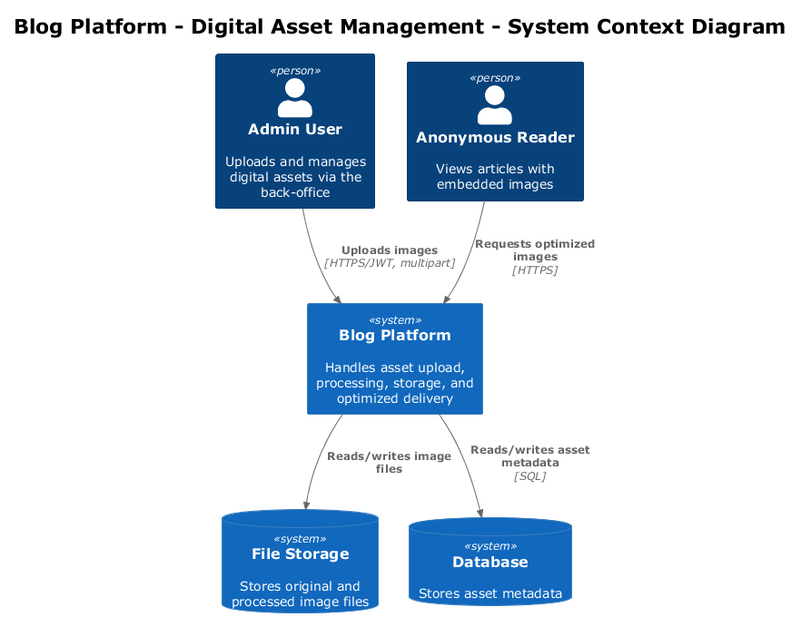
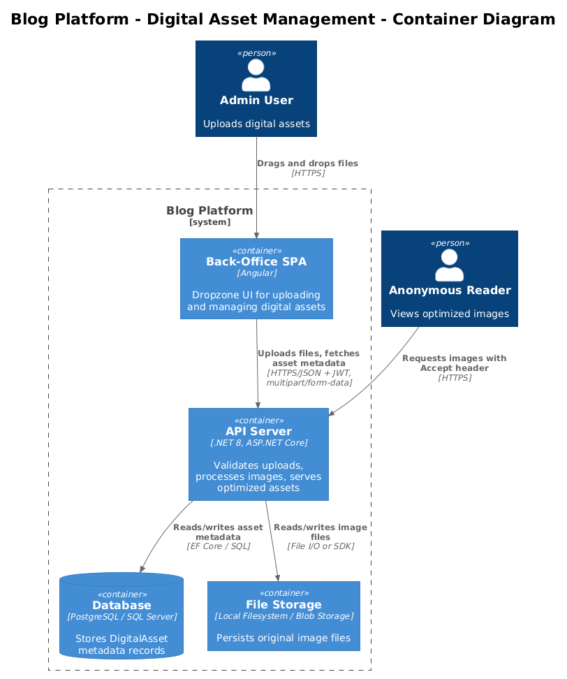
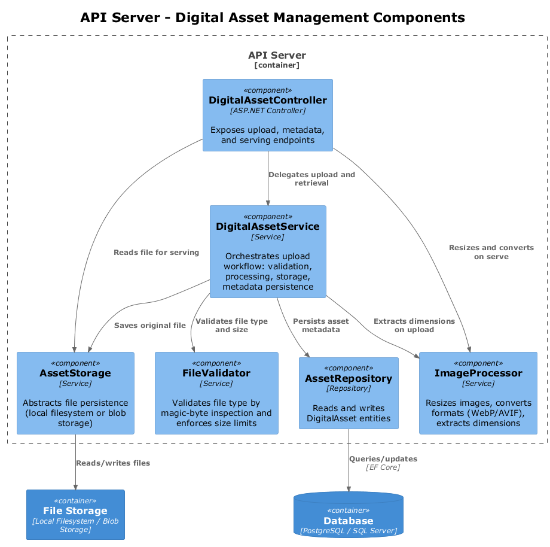
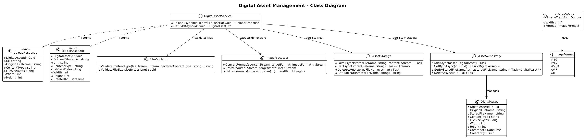
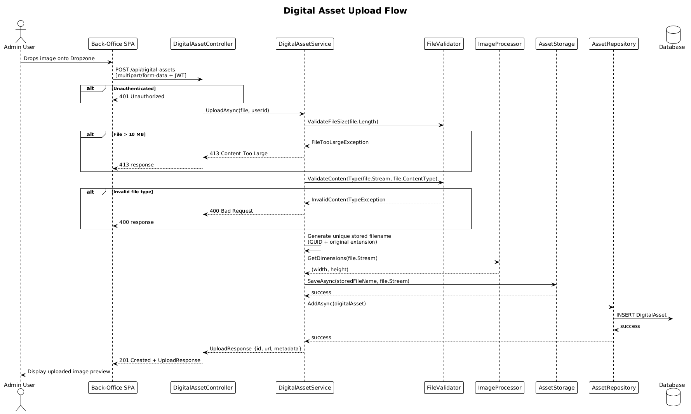
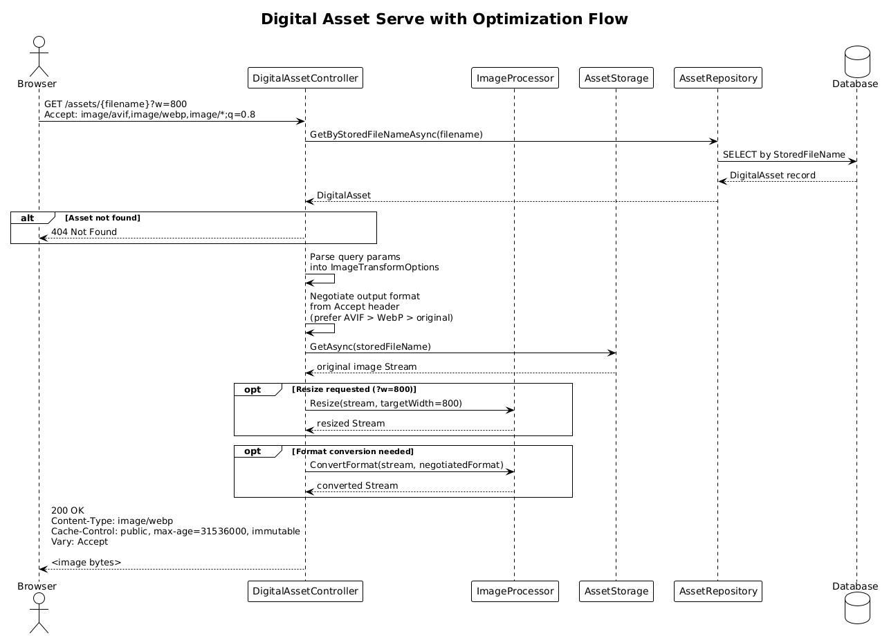

# Feature 04: Digital Asset Management

## 1. Overview

This feature enables authenticated users to upload, store, transform, and serve images and other digital assets used in blog articles. Uploaded assets undergo content-type validation, are assigned unique filenames, and are stored for reliable retrieval. When served to readers, assets are delivered in optimized formats (WebP/AVIF based on browser support), with optional query-parameter resizing and long-lived cache headers for high-performance web delivery.

**Requirements Traceability:**

| Requirement | Description |
|-------------|-------------|
| L1-008 | Upload, store, and serve images/digital assets used in articles, with optimized web delivery |
| L2-028 | Upload digital asset with file type validation by content inspection, unique filename, size limit |
| L2-029 | Serve optimized digital assets with content negotiation, cache headers, and optional resizing |
| L2-020 | Image optimization with modern formats, responsive srcset, and lazy loading |

Per the UI design in `docs/ui-design-back-office.pen`, the upload interface uses a Dropzone component (400x180px rounded rectangle with dashed border, upload icon, and "Drop files here or click to upload" text). The Article Editor includes a "Featured Image" section in the right sidebar that embeds this Dropzone for image upload. Upload progress and errors are displayed within a Modal component (rounded corners, header bar, action buttons).

## 2. Architecture

### 2.1 C4 Context Diagram

The system context shows the Blog Platform in relation to users and file storage.



- **Admin User** uploads digital assets via the back-office Razor Pages application.
- **Anonymous Reader** requests optimized images embedded in published articles.
- **File Storage** persists the original and processed image files.

### 2.2 C4 Container Diagram

The container diagram shows the major deployable units involved in digital asset management.



- **Back-Office Web App (ASP.NET Core Razor Pages)** provides the Dropzone UI for uploading and managing assets.
- **API Server (.NET)** handles upload validation, image processing, storage orchestration, and optimized serving.
- **Database** stores asset metadata (filename, content type, dimensions, ownership).
- **File Storage** holds the binary asset files (local filesystem or cloud blob storage).

### 2.3 C4 Component Diagram

The component diagram details the digital-asset-related components inside the API server.



## 3. Component Details

### 3.1 DigitalAssetController

- **Responsibility:** Exposes HTTP endpoints for uploading and retrieving digital assets.
- **Endpoints:** `POST /api/digital-assets`, `GET /api/digital-assets/{id}`, `GET /assets/{filename}`
- **Behavior:** Requires `[Authorize]` on upload. Delegates validation and processing to `DigitalAssetService`. Returns asset URL on successful upload. Returns 400 for invalid file type, 413 for oversized files, 401 for unauthenticated upload attempts. Serving endpoints are public and apply cache headers.

### 3.2 DigitalAssetService

- **Responsibility:** Orchestrates the upload workflow -- validates the file, generates a unique stored filename, triggers image processing, persists to storage, and saves metadata to the database.
- **Dependencies:** `FileValidator`, `ImageProcessor`, `AssetStorage`, `AssetRepository`
- **Behavior:** Returns an `UploadResponse` DTO containing the asset ID and public URL. Coordinates format conversion and thumbnail generation as needed.

### 3.3 FileValidator

- **Responsibility:** Validates uploaded files by inspecting content (magic bytes), not just file extension.
- **Supported Types:** JPEG (`FF D8 FF`), PNG (`89 50 4E 47`), WebP (`52 49 46 46...57 45 42 50`), GIF (`47 49 46 38`), AVIF (ISOBMFF with `ftypavif`).
- **Behavior:**
  - `ValidateContentType(Stream fileStream, string declaredContentType)` -- reads the first bytes of the stream to determine the actual file type, compares against the allowed list, and returns a validated `ContentType` or throws a validation exception.
  - `ValidateFileSize(long sizeBytes)` -- returns `true` if the file is under 10 MB (10,485,760 bytes); throws a `FileTooLargeException` otherwise.
  - `ValidateDimensions(int width, int height)` -- rejects images whose dimensions exceed 8192x8192 or whose total pixel count exceeds 40 megapixels, preventing decompression-bomb style abuse.

### 3.4 ImageProcessor

- **Responsibility:** Performs image transformations including format conversion (to WebP/AVIF) and resizing.
- **Behavior:**
  - `ConvertFormat(Stream source, ImageFormat targetFormat)` -- converts the source image to the specified format and returns the result stream.
  - `Resize(Stream source, int targetWidth)` -- resizes the image proportionally to the target width, preserving aspect ratio.
  - `GetDimensions(Stream source)` -- reads image metadata to extract width and height without fully decoding the image.
- **Library:** Uses an image processing library (see Open Questions) such as ImageSharp or SkiaSharp.

### 3.5 AssetStorage

- **Responsibility:** Abstracts file persistence. Provides a consistent interface regardless of whether the backing store is a local filesystem directory or a cloud blob storage service.
- **Behavior:**
  - `SaveAsync(string storedFileName, Stream content)` -- writes the file to storage.
  - `GetAsync(string storedFileName)` -- returns a readable stream for the file.
  - `DeleteAsync(string storedFileName)` -- removes the file from storage.
  - `GetPublicUrl(string storedFileName)` -- returns the publicly accessible URL for the file.
- **Implementations:** `LocalFileAssetStorage` (writes to a configured directory on disk) and `BlobAssetStorage` (future, writes to Azure Blob Storage or S3).

### 3.6 AssetRepository

- **Responsibility:** Reads and writes `DigitalAsset` entity records in the database via Entity Framework Core.
- **Behavior:**
  - `AddAsync(DigitalAsset asset)` -- persists a new asset record.
  - `GetByIdAsync(Guid id)` -- retrieves an asset by its primary key.
  - `GetByStoredFileNameAsync(string storedFileName)` -- retrieves an asset by its stored filename (used during serve).
  - `DeleteAsync(Guid id)` -- removes the asset record.

## 4. Data Model

### 4.1 DigitalAsset Entity



| Field | Type | Constraints |
|-------|------|-------------|
| DigitalAssetId | Guid | PK, auto-generated |
| OriginalFileName | string | Required, max 256 chars |
| StoredFileName | string | Required, unique, max 256 chars |
| ContentType | string | Required, max 128 chars (e.g., "image/png") |
| FileSizeBytes | long | Required |
| Width | int | Required, set after image processing |
| Height | int | Required, set after image processing |
| CreatedAt | DateTime | UTC, set on creation |
| CreatedBy | Guid | FK to User.UserId, required |

### 4.2 DTOs

**UploadResponse:**

| Field | Type | Description |
|-------|------|-------------|
| DigitalAssetId | Guid | ID of the created asset |
| Url | string | Public URL for the asset |
| OriginalFileName | string | Original uploaded filename |
| ContentType | string | Validated content type |
| FileSizeBytes | long | File size in bytes |
| Width | int | Image width in pixels |
| Height | int | Image height in pixels |

**ImageTransformOptions:**

| Field | Type | Description |
|-------|------|-------------|
| Width | int? | Target width in pixels (aspect ratio preserved) |
| Format | ImageFormat? | Target format (WebP, AVIF, JPEG, PNG) |

**DigitalAssetDto:**

| Field | Type | Description |
|-------|------|-------------|
| DigitalAssetId | Guid | Asset identifier |
| OriginalFileName | string | Original uploaded filename |
| Url | string | Public serving URL |
| ContentType | string | MIME content type |
| FileSizeBytes | long | Size in bytes |
| Width | int | Width in pixels |
| Height | int | Height in pixels |
| CreatedAt | DateTime | Upload timestamp |

## 5. Key Workflows

### 5.1 Upload Flow



1. Admin user drags an image onto the Dropzone component in the back-office web app.
2. The back-office web app sends `POST /api/digital-assets` as `multipart/form-data` with the `Authorization: Bearer <token>` header.
3. `DigitalAssetController` checks authentication. If unauthenticated, returns 401.
4. Controller extracts the file from the multipart request and delegates to `DigitalAssetService`.
5. `DigitalAssetService` calls `FileValidator.ValidateFileSize()`. If >10 MB, returns 413.
6. `DigitalAssetService` calls `FileValidator.ValidateContentType()` to inspect file magic bytes. If invalid type, returns 400.
7. `DigitalAssetService` generates a unique stored filename (GUID-based with original extension).
8. `DigitalAssetService` calls `ImageProcessor.GetDimensions()` to extract width and height.
9. `DigitalAssetService` calls `FileValidator.ValidateDimensions()` to reject oversized or abusive images.
10. `DigitalAssetService` calls `AssetStorage.SaveAsync()` to persist the original file.
11. `DigitalAssetService` creates a `DigitalAsset` entity and calls `AssetRepository.AddAsync()` to save metadata.
12. `DigitalAssetController` returns 201 Created with the `UploadResponse` containing the asset ID and public URL.

### 5.2 Serve with Optimization Flow



1. Browser requests `GET /assets/{filename}?w=800` with an `Accept` header indicating format support (e.g., `image/avif,image/webp,image/*`).
2. `DigitalAssetController` parses query parameters into `ImageTransformOptions`.
3. Controller reads the `Accept` header to determine the best output format via content negotiation.
4. Controller calls `AssetStorage.GetAsync()` to retrieve the original file stream.
5. If resizing is requested (`?w=800`), controller calls `ImageProcessor.Resize()`.
6. If format conversion is needed (browser supports WebP/AVIF and the original is not in that format), controller calls `ImageProcessor.ConvertFormat()`.
7. Controller sets response headers:
   - `Cache-Control: public, max-age=31536000, immutable`
   - `Content-Type` matching the negotiated format
   - `Vary: Accept` to indicate content-negotiated responses
8. Controller streams the processed image to the client.

## 6. API Contracts

### 6.1 POST /api/digital-assets

Upload a new digital asset. Requires authentication.

**Request:**

```http
POST /api/digital-assets
Authorization: Bearer <token>
Content-Type: multipart/form-data; boundary=----FormBoundary

------FormBoundary
Content-Disposition: form-data; name="file"; filename="hero-image.jpg"
Content-Type: image/jpeg

<binary data>
------FormBoundary--
```

**Success Response (201 Created):**

```json
{
  "data": {
    "digitalAssetId": "a1b2c3d4-e5f6-7890-abcd-ef1234567890",
    "url": "/assets/a1b2c3d4-e5f6-7890-abcd-ef1234567890.jpg",
    "originalFileName": "hero-image.jpg",
    "contentType": "image/jpeg",
    "fileSizeBytes": 245760,
    "width": 1920,
    "height": 1080
  },
  "timestamp": "2026-04-04T10:00:00Z"
}
```

**Error Response (400 Bad Request):**

```json
{
  "type": "https://tools.ietf.org/html/rfc7231#section-6.5.1",
  "title": "Bad Request",
  "status": 400,
  "detail": "File type not allowed. Supported types: JPEG, PNG, WebP, GIF, AVIF."
}
```

**Error Response (413 Content Too Large):**

```json
{
  "type": "https://tools.ietf.org/html/rfc7231#section-6.5.11",
  "title": "Content Too Large",
  "status": 413,
  "detail": "File size exceeds the 10 MB limit."
}
```

**Error Response (401 Unauthorized):**

```json
{
  "type": "https://tools.ietf.org/html/rfc7235#section-3.1",
  "title": "Unauthorized",
  "status": 401,
  "detail": "Authentication is required to upload assets."
}
```

### 6.2 GET /api/digital-assets/{id}

Retrieve asset metadata by ID. Requires authentication.

**Request:**

```http
GET /api/digital-assets/a1b2c3d4-e5f6-7890-abcd-ef1234567890
Authorization: Bearer <token>
```

**Success Response (200):**

```json
{
  "data": {
    "digitalAssetId": "a1b2c3d4-e5f6-7890-abcd-ef1234567890",
    "originalFileName": "hero-image.jpg",
    "url": "/assets/a1b2c3d4-e5f6-7890-abcd-ef1234567890.jpg",
    "contentType": "image/jpeg",
    "fileSizeBytes": 245760,
    "width": 1920,
    "height": 1080,
    "createdAt": "2026-04-04T10:00:00Z"
  },
  "timestamp": "2026-04-04T10:01:00Z"
}
```

**Error Response (404):**

```json
{
  "type": "https://tools.ietf.org/html/rfc7231#section-6.5.4",
  "title": "Not Found",
  "status": 404,
  "detail": "Digital asset not found."
}
```

### 6.3 GET /assets/{filename}

Serve the image file publicly with optional transformation. No authentication required.

**Request:**

```http
GET /assets/a1b2c3d4-e5f6-7890-abcd-ef1234567890.jpg?w=800
Accept: image/avif,image/webp,image/*;q=0.8
```

**Success Response (200):**

```http
HTTP/1.1 200 OK
Content-Type: image/webp
Cache-Control: public, max-age=31536000, immutable
Vary: Accept
Content-Length: 52480

<binary data>
```

**Error Response (404):** Returned if the filename does not match any stored asset.

## 7. Security Considerations

### 7.1 Upload Authentication

- The `POST /api/digital-assets` endpoint requires a valid JWT bearer token (enforced via `[Authorize]`).
- Unauthenticated requests receive a 401 response.
- The `CreatedBy` field is populated from the authenticated user's claims, not from the request body.

### 7.2 File Validation

- File types are validated by reading magic bytes from the file content, not by trusting the file extension or the `Content-Type` header declared by the client.
- Only JPEG, PNG, WebP, GIF, and AVIF are accepted.
- Files exceeding 10 MB are rejected before any processing occurs.
- Images whose dimensions exceed 8192x8192 or whose total pixel count exceeds 40 megapixels are rejected before transformation.
- Uploaded filenames are never used directly in storage; a generated GUID-based filename prevents path traversal and collision attacks.

### 7.3 Public Serving

- Asset serving (`GET /assets/{filename}`) is intentionally public to allow embedding in published articles.
- Long-lived cache headers (`max-age=31536000, immutable`) are safe because stored filenames are unique and content-addressable (a new upload always produces a new filename).
- The `Vary: Accept` header ensures caches distinguish between format-negotiated responses.

### 7.4 Storage Security

- The storage directory (when using local filesystem) must not be directly exposed by the web server; all access goes through the controller to enable transformation and cache header injection.
- Stored files retain no user-supplied path components.

## 8. Open Questions

| # | Question | Impact | Status |
|---|----------|--------|--------|
| 1 | Should we use local filesystem storage or cloud blob storage (Azure Blob Storage / AWS S3) for production? Local is simpler for development; cloud provides scalability and CDN integration. | Deployment architecture, cost, operational complexity | Open |
| 2 | Which image processing library should be used: SixLabors.ImageSharp (pure managed, Apache 2.0 for open source), SkiaSharp (Skia wrapper, good performance), or System.Drawing (Windows-only, not recommended for server)? | Performance, cross-platform support, licensing | Open |
| 3 | Should processed/transformed images (resized, format-converted) be cached on disk or generated on-the-fly per request? Caching avoids repeated processing but increases storage requirements. | Performance vs. storage cost tradeoff | Open |
| 4 | Should we generate responsive image variants (srcset widths) at upload time or on-demand? Pre-generation simplifies serving but increases upload latency and storage. | Upload UX, storage cost, serving performance | Open |
| 5 | What is the maximum allowed image dimension (width/height) to prevent processing abuse? Should we enforce a pixel-count limit in addition to the 10 MB file size limit? | Security, resource consumption | Resolved: 8192x8192 max, 40 megapixels max |
| 6 | Should asset deletion be supported, and if so, should it be a soft delete with a retention period or a hard delete? Articles referencing deleted assets would show broken images. | Data integrity, storage management | Open |
