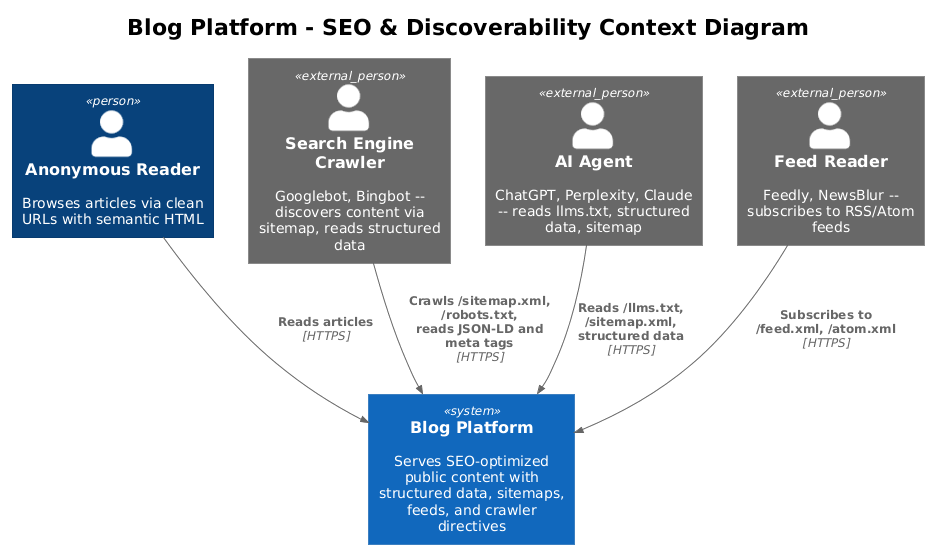
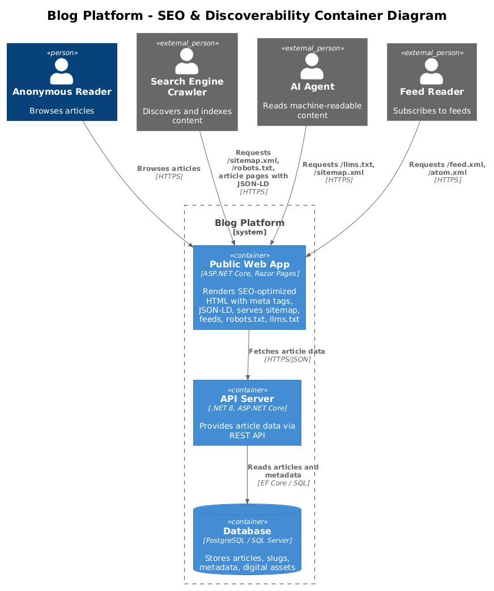
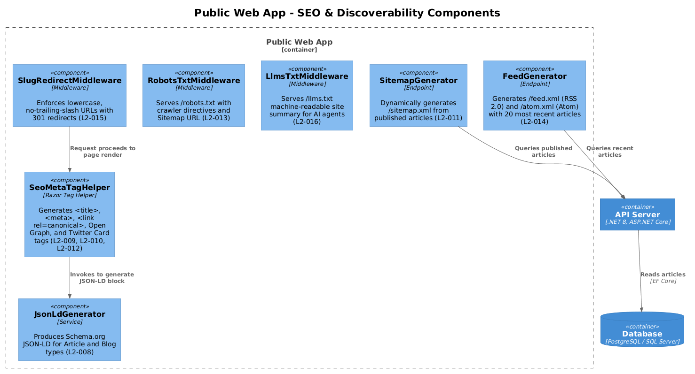
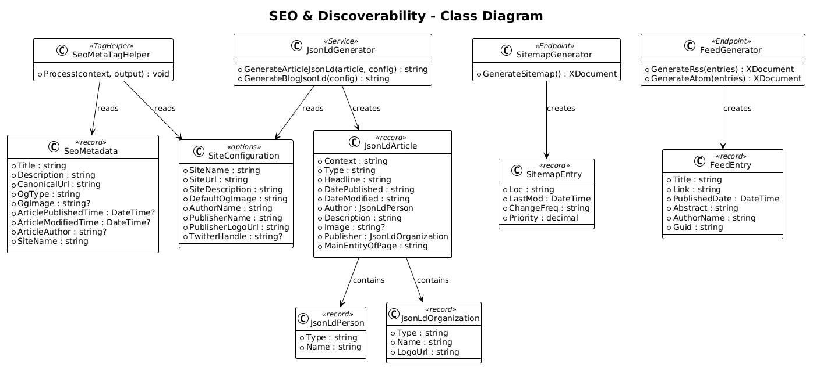
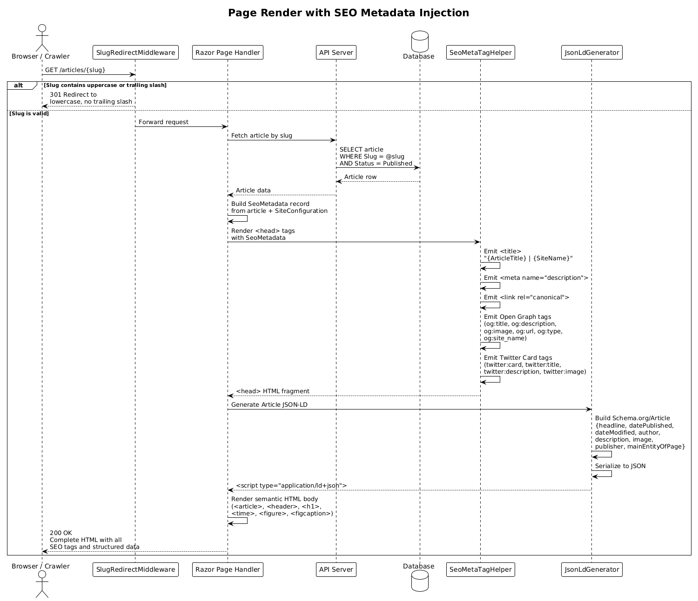
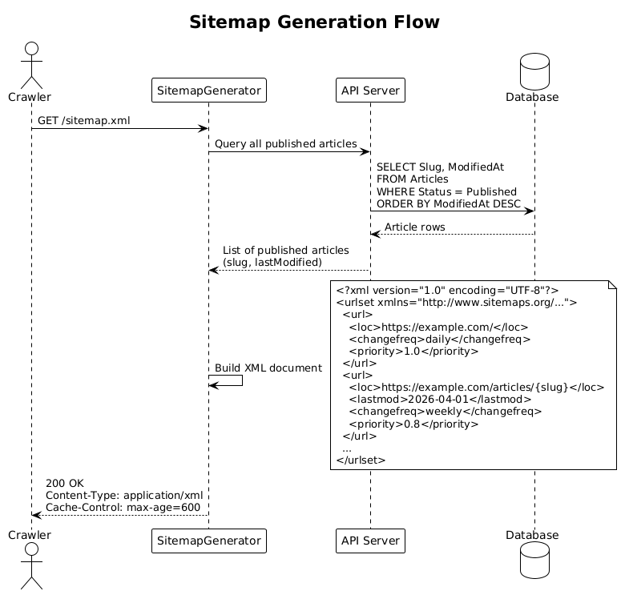

# Feature 05: SEO & Discoverability

## 1. Overview

This feature implements a comprehensive SEO and discoverability strategy for the Blog platform's public-facing site. The goal is to achieve a perfect SEO rating across all automated audit tools while maximizing discoverability by search engine crawlers, AI agents, feed readers, and other bots.

The strategy covers seven areas: semantic HTML structure, structured data via JSON-LD, social sharing metadata (Open Graph and Twitter Cards), canonical URL management, machine-readable feeds (XML sitemap, RSS, Atom), crawler directives (robots.txt), and AI agent discoverability (llms.txt). Every public page is rendered server-side with all metadata embedded in the initial HTML response, requiring no JavaScript execution by crawlers.

**Requirements Traceability:**

| Requirement | Description |
|-------------|-------------|
| L1-003 | Perfect SEO rating -- semantic HTML, structured data, canonical URLs, Open Graph, Twitter Card, XML sitemaps, all metadata |
| L1-004 | Maximally discoverable by crawlers, AI agents, bots -- machine-readable feeds, structured data, robots.txt, clean URLs |
| L2-007 | Semantic HTML -- article, header, main, nav, time, figure, figcaption; H1 for title only |
| L2-008 | Structured Data (JSON-LD) -- Schema.org Article on article pages, Blog on listing |
| L2-009 | Open Graph & Twitter Card metadata on every page |
| L2-010 | Canonical URLs -- absolute, lowercase, no trailing slashes |
| L2-011 | XML Sitemap -- dynamic /sitemap.xml with all published articles |
| L2-012 | Meta Title & Description -- unique per page, title <=60 chars, description <=160 chars |
| L2-013 | robots.txt -- allow public, disallow admin, Sitemap directive |
| L2-014 | RSS/Atom Feed -- /feed.xml (RSS 2.0), /atom.xml (Atom) with 20 most recent articles |
| L2-015 | Clean URL Structure -- /articles/{slug}, lowercase, 301 redirect mixed-case |
| L2-016 | llms.txt -- machine-readable site summary for AI agents |

## 2. Architecture

### 2.1 C4 Context Diagram

The system context shows how external actors interact with the Blog Platform's SEO and discoverability features.



- **Anonymous Reader** browses articles via clean URLs and sees semantic HTML with proper heading hierarchy.
- **Search Engine Crawler** (Googlebot, Bingbot) discovers content via /sitemap.xml, reads structured data (JSON-LD), follows canonical URLs, and respects robots.txt.
- **AI Agent** (ChatGPT, Perplexity, Claude) reads /llms.txt for a machine-readable site summary, consumes structured data, and follows the sitemap.
- **Feed Reader** (Feedly, NewsBlur) subscribes to /feed.xml (RSS 2.0) or /atom.xml (Atom) for article updates.

### 2.2 C4 Container Diagram

The container diagram shows the deployable units involved in serving SEO-optimized content.



- **Public Web App (Razor Pages / MVC)** renders all public pages server-side with embedded SEO metadata, structured data, and social tags. It also serves the sitemap, feeds, robots.txt, and llms.txt endpoints.
- **API Server** provides article data to the public web app for rendering.
- **Database** stores articles, metadata, and slugs used to generate SEO content.

### 2.3 C4 Component Diagram

The component diagram details the SEO-related components inside the Public Web App.



## 3. Component Details

### 3.1 SeoMetaTagHelper

- **Responsibility:** Razor Tag Helper that generates all SEO-related `<meta>` and `<link>` tags in the `<head>` section of every page.
- **Tags Generated:**
  - `<title>` with pattern `{Article Title} | {Site Name}` (L2-012), truncated to 60 characters.
  - `<meta name="description">` with article abstract or page description, truncated to 160 characters (L2-012).
  - `<link rel="canonical">` with absolute, lowercase URL, no trailing slash (L2-010).
  - Open Graph tags: `og:title`, `og:description`, `og:image`, `og:url`, `og:type`, `og:site_name` (L2-009).
  - Twitter Card tags: `twitter:card`, `twitter:title`, `twitter:description`, `twitter:image` (L2-009).
  - `<link rel="alternate" type="application/rss+xml">` pointing to /feed.xml.
  - `<link rel="alternate" type="application/atom+xml">` pointing to /atom.xml.
- **Input:** Receives an `SeoMetadata` record via the page's ViewData or a strongly-typed model property.
- **Behavior:** If any optional field (e.g., image) is null, the corresponding tag is omitted rather than rendered empty.

### 3.2 JsonLdGenerator

- **Responsibility:** Generates Schema.org JSON-LD `<script>` blocks embedded in the page HTML.
- **Article Pages (L2-008):** Produces a `Schema.org/Article` object with: `headline`, `datePublished`, `dateModified`, `author` (Person), `description`, `image`, `publisher` (Organization with logo), `mainEntityOfPage`.
- **Listing Pages (L2-008):** Produces a `Schema.org/Blog` object with a reference to the site and its articles.
- **Behavior:** Serializes the structured data to JSON using `System.Text.Json` with camelCase naming. The output is injected into the page via a Razor section or Tag Helper.

### 3.3 SitemapGenerator

- **Responsibility:** Dynamically generates /sitemap.xml on each request (L2-011).
- **Behavior:**
  - Queries all published articles from the database.
  - Produces an XML document conforming to the Sitemap 0.9 protocol.
  - Each `<url>` entry includes `<loc>` (absolute canonical URL), `<lastmod>` (article's last modified date in W3C format), `<changefreq>` (weekly for articles, daily for the homepage), and `<priority>` (1.0 for homepage, 0.8 for articles).
  - Sets `Content-Type: application/xml` and appropriate cache headers (short TTL, e.g., 10 minutes).
- **Endpoint:** Registered as a minimal API endpoint or middleware at `/sitemap.xml`.

### 3.4 RobotsTxtMiddleware

- **Responsibility:** Serves /robots.txt with crawler directives (L2-013).
- **Output:**
  ```
  User-agent: *
  Allow: /
  Disallow: /admin
  Disallow: /api/
  Sitemap: https://{host}/sitemap.xml
  ```
- **Behavior:** The middleware intercepts requests to `/robots.txt` and returns a plain text response. The `Sitemap` directive uses the request's host to construct the absolute URL.

### 3.5 FeedGenerator

- **Responsibility:** Generates RSS 2.0 (/feed.xml) and Atom (/atom.xml) feeds (L2-014).
- **Behavior:**
  - Queries the 20 most recent published articles.
  - RSS 2.0 feed includes: `<channel>` with title, link, description; each `<item>` has `<title>`, `<link>`, `<pubDate>`, `<description>` (abstract), `<author>`, `<guid>`.
  - Atom feed includes: `<feed>` with title, link, updated; each `<entry>` has `<title>`, `<link>`, `<published>`, `<updated>`, `<summary>`, `<author>`, `<id>`.
  - Sets appropriate `Content-Type` headers (`application/rss+xml` for RSS, `application/atom+xml` for Atom).
  - Uses `System.Xml.Linq` or `System.ServiceModel.Syndication` for XML generation.

### 3.6 LlmsTxtMiddleware

- **Responsibility:** Serves /llms.txt with a machine-readable site summary for AI agents (L2-016).
- **Output:** A plain text document describing the site's purpose, content structure, available endpoints, and how to consume the content programmatically. Includes references to the sitemap, feeds, and structured data.
- **Behavior:** The middleware intercepts requests to `/llms.txt` and returns a `text/plain` response. Content is either statically configured or dynamically assembled from site configuration.

### 3.7 SlugRedirectMiddleware

- **Responsibility:** Enforces clean, lowercase URL structure (L2-015).
- **Behavior:**
  - Intercepts incoming requests to `/articles/{slug}` paths.
  - If the slug contains uppercase characters, issues a 301 redirect to the lowercase version.
  - If the URL has a trailing slash, issues a 301 redirect to the version without it.
  - If the URL contains file extensions or numeric IDs, returns 404 (these patterns are not valid).
  - Runs early in the middleware pipeline, before routing.

## 4. Data Model

### 4.1 Class Diagram



### 4.2 SeoMetadata

A record passed from page handlers to the SeoMetaTagHelper containing all per-page SEO data.

| Field | Type | Description |
|-------|------|-------------|
| Title | string | Page title, max 60 chars (before site name suffix) |
| Description | string | Meta description, max 160 chars |
| CanonicalUrl | string | Absolute canonical URL, lowercase, no trailing slash |
| OgType | string | Open Graph type (e.g., "article", "website") |
| OgImage | string? | Absolute URL to the Open Graph image |
| ArticlePublishedTime | DateTime? | ISO 8601 publish date (for article pages) |
| ArticleModifiedTime | DateTime? | ISO 8601 last modified date (for article pages) |
| ArticleAuthor | string? | Author display name |
| SiteName | string | Site name from configuration |

### 4.3 JsonLdArticle

A model used to serialize the Schema.org Article structured data to JSON-LD.

| Field | Type | Description |
|-------|------|-------------|
| Context | string | Always "https://schema.org" |
| Type | string | "Article" or "Blog" |
| Headline | string | Article title |
| DatePublished | string | ISO 8601 date |
| DateModified | string | ISO 8601 date |
| Author | JsonLdPerson | Author object with @type "Person" and name |
| Description | string | Article abstract |
| Image | string? | Featured image URL |
| Publisher | JsonLdOrganization | Publisher with @type "Organization", name, and logo |
| MainEntityOfPage | string | Canonical URL of the page |

### 4.4 SitemapEntry

A record representing a single URL entry in the XML sitemap.

| Field | Type | Description |
|-------|------|-------------|
| Loc | string | Absolute URL of the page |
| LastMod | DateTime | Last modification date |
| ChangeFreq | string | Change frequency (daily, weekly, monthly) |
| Priority | decimal | Priority value between 0.0 and 1.0 |

### 4.5 FeedEntry

A record representing a single article in an RSS or Atom feed.

| Field | Type | Description |
|-------|------|-------------|
| Title | string | Article title |
| Link | string | Absolute URL to the article |
| PublishedDate | DateTime | Publication date in UTC |
| Abstract | string | Article abstract or summary |
| AuthorName | string | Author display name |
| Guid | string | Globally unique identifier (canonical URL) |

### 4.6 SiteConfiguration

Configuration values used across all SEO components, loaded from `appsettings.json`.

| Field | Type | Description |
|-------|------|-------------|
| SiteName | string | Display name of the blog (e.g., "My Blog") |
| SiteUrl | string | Base URL of the site (e.g., "https://example.com") |
| SiteDescription | string | Default site-level meta description |
| DefaultOgImage | string | Default Open Graph image URL when article has no image |
| AuthorName | string | Default author name |
| PublisherName | string | Organization name for JSON-LD publisher |
| PublisherLogoUrl | string | Logo URL for JSON-LD publisher |
| TwitterHandle | string? | Twitter/X handle for twitter:site tag |

## 5. Key Workflows

### 5.1 Page Render with SEO Metadata Injection



1. A request arrives at `/articles/{slug}`.
2. `SlugRedirectMiddleware` checks if the slug is lowercase and has no trailing slash. If not, it returns a 301 redirect to the corrected URL.
3. If the URL is valid, the request proceeds to the Razor page handler.
4. The page handler fetches the article data from the API/database.
5. The page handler constructs an `SeoMetadata` record from the article data and `SiteConfiguration`.
6. During Razor view rendering, `SeoMetaTagHelper` reads the `SeoMetadata` and emits all `<meta>`, `<link>`, and `<title>` tags into the `<head>`.
7. `JsonLdGenerator` produces a JSON-LD `<script>` block from the article data and injects it into the page.
8. The complete HTML response is returned with semantic HTML structure (article, header, time, figure elements per L2-007), all meta tags, and structured data.

### 5.2 Sitemap Generation



1. A crawler requests `GET /sitemap.xml`.
2. `SitemapGenerator` receives the request.
3. `SitemapGenerator` queries the database for all published articles (slug, last modified date).
4. It constructs the XML document with a `<url>` entry for each article plus the homepage.
5. The XML response is returned with `Content-Type: application/xml` and cache headers.

### 5.3 Feed Generation

1. A feed reader requests `GET /feed.xml` or `GET /atom.xml`.
2. `FeedGenerator` receives the request and determines the format (RSS or Atom) based on the path.
3. It queries the 20 most recent published articles.
4. It constructs the appropriate XML feed document.
5. The response is returned with the correct content type.

### 5.4 Crawler Discovery Flow

1. A crawler first requests `/robots.txt` to learn crawling rules.
2. `RobotsTxtMiddleware` returns directives including the `Sitemap:` URL.
3. The crawler fetches `/sitemap.xml` to discover all article URLs.
4. For each URL, the crawler fetches the page and parses the JSON-LD structured data, canonical URL, and meta tags.

## 6. Implementation Details

### 6.1 Requirement-to-Component Mapping

| Requirement | Component(s) | Implementation Notes |
|-------------|-------------|----------------------|
| L2-007 Semantic HTML | Razor layouts and partials | Use `<article>`, `<header>`, `<main>`, `<nav>`, `<time datetime="...">`, `<figure>`, `<figcaption>`. Enforce single `<h1>` per page for the article title. Sequential heading levels (h1 > h2 > h3). |
| L2-008 Structured Data | JsonLdGenerator | Article pages emit `@type: "Article"` with all required properties. Listing pages emit `@type: "Blog"`. JSON-LD is embedded in a `<script type="application/ld+json">` tag. |
| L2-009 Open Graph & Twitter | SeoMetaTagHelper | All six OG properties and four Twitter Card properties are rendered. `og:type` is "article" for article pages and "website" for other pages. `twitter:card` is "summary_large_image" when an image is present, "summary" otherwise. |
| L2-010 Canonical URLs | SeoMetaTagHelper, SlugRedirectMiddleware | Canonical URL is always absolute, lowercase, no trailing slash. SlugRedirectMiddleware enforces this with 301 redirects. |
| L2-011 XML Sitemap | SitemapGenerator | Dynamic generation on every request with short cache TTL. Includes all published articles. |
| L2-012 Meta Title & Description | SeoMetaTagHelper | Title pattern: `{Article Title} \| {Site Name}`. If combined length exceeds 60 chars, the article title is truncated with ellipsis. Description is truncated at 160 chars at the nearest word boundary. |
| L2-013 robots.txt | RobotsTxtMiddleware | Static content served by middleware. Disallows /admin and /api/ paths. Includes Sitemap directive. |
| L2-014 RSS/Atom Feed | FeedGenerator | Two endpoints: /feed.xml (RSS 2.0) and /atom.xml (Atom). Both serve the 20 most recent published articles. |
| L2-015 Clean URLs | SlugRedirectMiddleware, routing config | Routes are configured as `/articles/{slug}`. Middleware issues 301 for uppercase. No file extensions or IDs in URLs. |
| L2-016 llms.txt | LlmsTxtMiddleware | Serves a plain text summary of the site including available endpoints, content structure, and links to feeds and sitemap. |

### 6.2 Middleware Pipeline Order

The SEO-related middleware must be registered in the correct order in `Program.cs`:

1. `SlugRedirectMiddleware` -- runs before routing to redirect before any processing occurs.
2. `RobotsTxtMiddleware` -- intercepts /robots.txt before it hits the routing middleware.
3. `LlmsTxtMiddleware` -- intercepts /llms.txt similarly.
4. Standard ASP.NET Core middleware (routing, static files, etc.).
5. `SitemapGenerator` and `FeedGenerator` are registered as minimal API endpoints or Razor page handlers within the routing middleware.

### 6.3 Caching Strategy

- **Sitemap:** Cached in memory for 10 minutes. Cache is invalidated when articles are published, unpublished, or modified.
- **Feeds:** Cached in memory for 5 minutes with similar invalidation.
- **robots.txt and llms.txt:** Static content, cached with long TTL (1 hour) or served from configuration.
- **SEO meta tags and JSON-LD:** Generated per-request as part of page rendering (no separate caching needed since pages themselves may be cached).

## 7. Security Considerations

### 7.1 No Sensitive Data in Sitemaps or Feeds

- The sitemap must only include URLs for published, public articles. Draft, scheduled, or deleted articles must never appear.
- RSS and Atom feeds must only expose published articles with their public-facing content (title, abstract, author name). No internal IDs, admin URLs, or unpublished content.
- The llms.txt file must not reveal internal architecture, admin endpoints, API keys, or other sensitive information.

### 7.2 Robots.txt Security

- The `Disallow: /admin` and `Disallow: /api/` directives prevent crawlers from indexing administrative and API endpoints.
- Note that robots.txt is advisory, not enforced. Actual security of admin endpoints relies on authentication (Feature 01), not robots.txt.

### 7.3 Canonical URL Integrity

- Canonical URLs must always point to the correct, authoritative version of the page to prevent SEO poisoning or duplicate content penalties.
- The canonical URL is constructed server-side from the known base URL in configuration, not from the incoming request's Host header, to prevent host header injection.

### 7.4 Feed Content Sanitization

- Article abstracts included in RSS/Atom feeds must be HTML-encoded or served as plain text to prevent XML injection.
- Any user-generated content in feed entries must be sanitized before inclusion.

## 8. Open Questions

| # | Question | Impact | Status |
|---|----------|--------|--------|
| 1 | Should the sitemap be split into multiple files (sitemap index) if the number of articles exceeds 50,000? | Scalability of sitemap generation | Open |
| 2 | Should we support a configurable llms.txt template, or is a static implementation sufficient for launch? | Flexibility vs. simplicity | Open |
| 3 | Should feed entries include the full article HTML content or only the abstract/summary? | Feed reader experience, bandwidth | Open |
| 4 | What is the desired cache TTL for the sitemap and feeds in production? | Freshness vs. performance | Open |
| 5 | Should the sitemap include non-article pages (e.g., about, contact) or only published articles? | Sitemap completeness | Open |
| 6 | Should we implement a WebSub/PubSubHubbub hub for real-time feed notifications, or is polling sufficient? | Feed update latency | Open |
