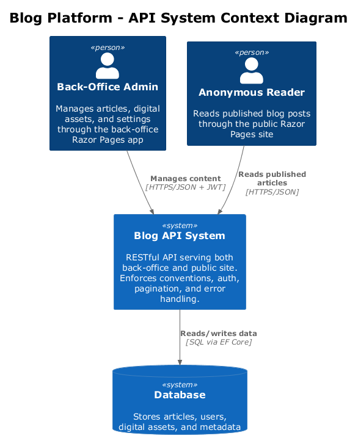
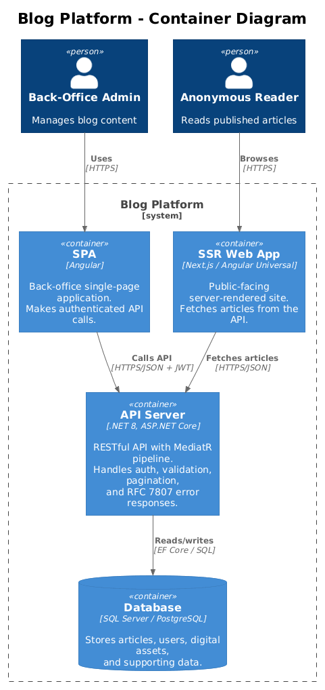
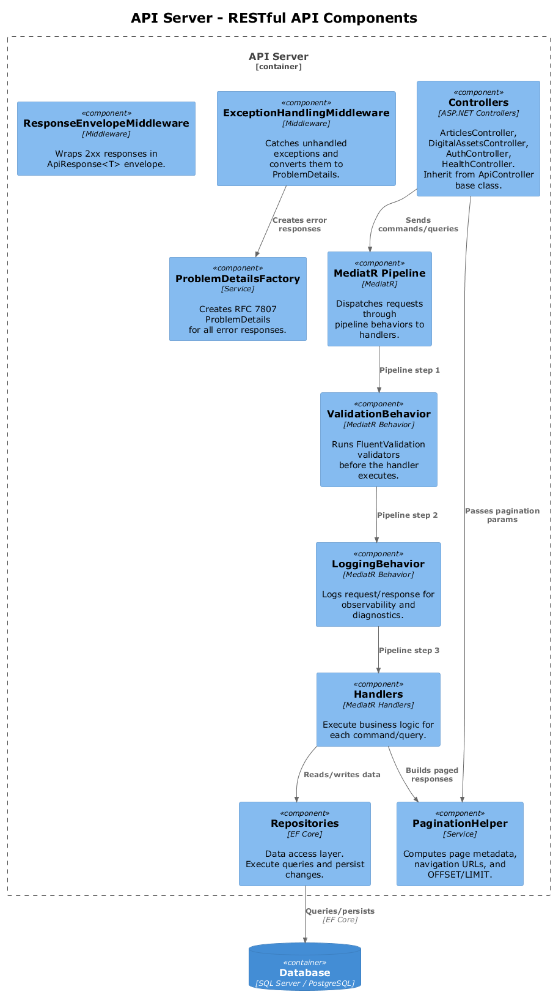
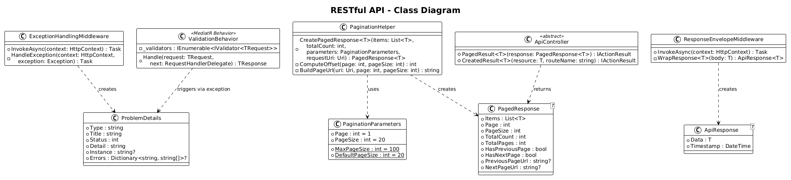
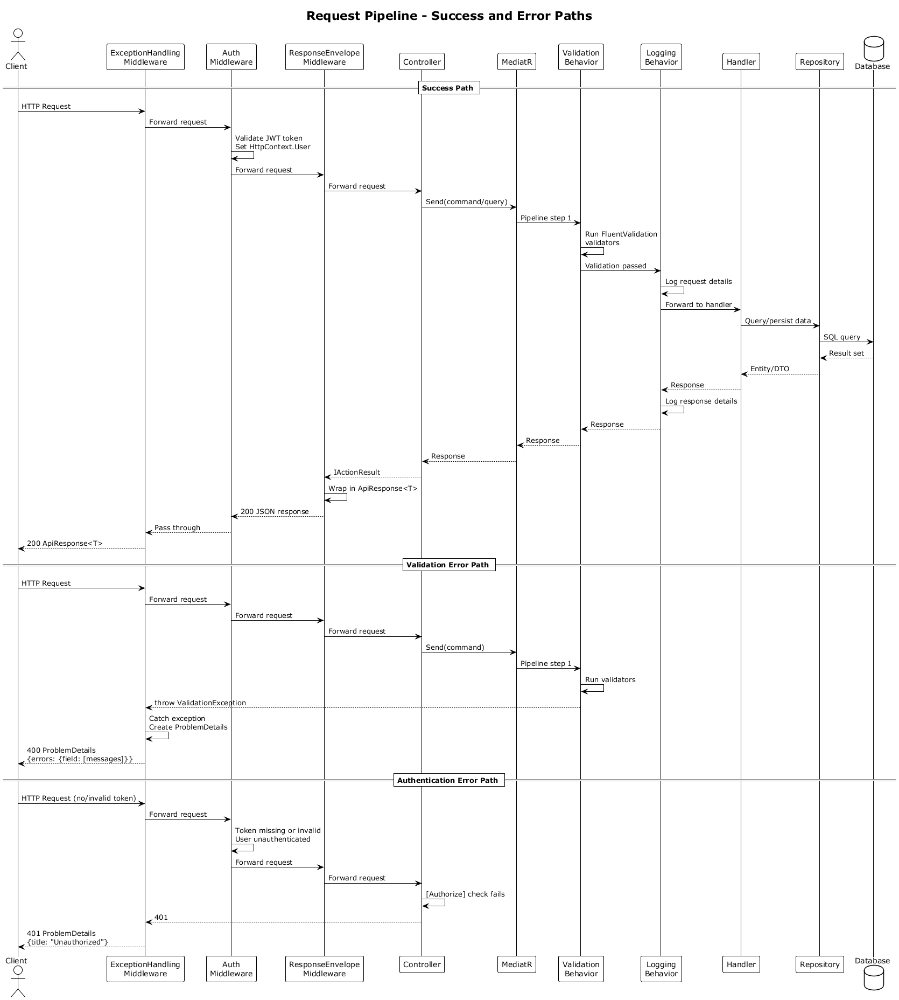
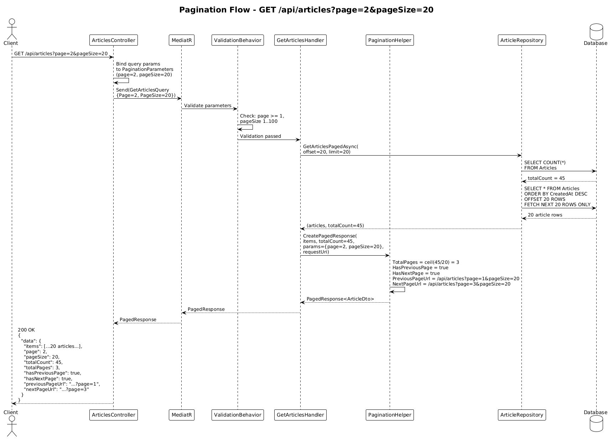

# Feature 06: RESTful API

## 1. Overview

This feature defines the RESTful API design conventions, request pipeline, error handling, and pagination strategy for the Blog platform. The API provides the programmatic HTTP surface behind the Razor Pages-based back-office administration UI and the rest of the platform where HTTP endpoints are required. All endpoints follow consistent naming conventions, use appropriate HTTP semantics, return standardized response envelopes, and report errors using RFC 7807 Problem Details.

**Requirements Traceability:**

| Requirement | Description |
|-------------|-------------|
| L1-009 | Well-designed RESTful API powering both back-office and public site |
| L2-030 | RESTful API conventions: plural nouns, HTTP methods, status codes, JSON envelopes, RFC 7807 errors |
| L2-031 | Offset-based pagination with configurable page size, total count, and navigation links |

**Design Principles:**

- **Plural nouns** for resource collections (`/api/articles`, `/api/digital-assets`).
- **Standard HTTP methods** with correct semantics: GET reads, POST creates, PUT replaces, PATCH partially updates, DELETE removes.
- **Consistent status codes**: 200 OK, 201 Created, 204 No Content, 400 Bad Request, 401 Unauthorized, 404 Not Found, 409 Conflict, 412 Precondition Failed, 413 Payload Too Large, 429 Too Many Requests, 503 Service Unavailable.
- **RFC 7807 Problem Details** for all error responses.
- **Uniform JSON response envelopes** for predictable client-side parsing.

## 2. Architecture

### 2.1 C4 Context Diagram

The system context shows the Blog API in relation to its consumers and backing services.



- **Back-Office Admin** manages content through the back-office Razor Pages application, which calls the Blog API over HTTPS with JWT authentication.
- **Anonymous Reader** consumes published articles through the public Razor Pages web app, which uses the platform's published-content endpoints and services where needed.
- **Blog API System** is the central service exposing all RESTful endpoints.
- **Database** persists articles, users, digital assets, and supporting data.

### 2.2 C4 Container Diagram

The container diagram shows the deployable units and their interactions.



- **Back-Office Web App (ASP.NET Core Razor Pages)** is the administration UI that makes authenticated API calls.
- **Public Web App (ASP.NET Core Razor Pages)** renders the public site and reuses published-content endpoints or shared application services as needed.
- **API Server (.NET)** hosts all RESTful endpoints, middleware, and the MediatR pipeline.
- **Database (SQL Server/PostgreSQL)** stores all persistent data accessed via Entity Framework Core.

### 2.3 C4 Component Diagram

The component diagram details the internal structure of the API server relevant to request processing.



## 3. Component Details

### 3.1 ApiController (Base Class)

- **Responsibility:** Abstract base controller that all API controllers inherit from. Provides shared route prefix (`api/[controller]`), `[ApiController]` attribute, and convenience methods for returning standardized responses.
- **Behavior:**
  - Applies `[ApiController]` for automatic model validation and `[Route("api/[controller]")]` for consistent URL prefixes.
  - Provides `PagedResult<T>(PagedResponse<T>)` helper that sets pagination headers and returns 200.
  - Provides `CreatedResult<T>(T resource, string routeName)` helper that returns 201 with a `Location` header.

### 3.2 ProblemDetailsFactory

- **Responsibility:** Creates RFC 7807-compliant `ProblemDetails` objects for all error responses.
- **Behavior:**
  - Maps exception types to appropriate HTTP status codes and problem detail types.
  - Includes a `errors` extension property for validation failures, containing a dictionary of field-level error messages.
  - Sets the `type` field to a URI reference (e.g., `https://tools.ietf.org/html/rfc7231#section-6.5.1` for 400 errors).
  - Omits stack traces in production; includes them in development.

### 3.3 PaginationHelper

- **Responsibility:** Encapsulates offset-based pagination logic and generates navigation metadata.
- **Behavior:**
  - Accepts `PaginationParameters` (page number, page size) and a total count from the database query.
  - Computes `TotalPages`, `HasPreviousPage`, `HasNextPage`.
  - Generates `NextPageUrl` and `PreviousPageUrl` using ASP.NET Core link generation from route values and configured application URLs rather than blindly echoing raw host headers.
  - Enforces constraints: page size minimum 1, maximum 100, default 9.
  - Calculates SQL OFFSET as `(Page - 1) * PageSize`.

### 3.4 ResponseEnvelopeMiddleware

- **Responsibility:** ASP.NET Core middleware that wraps successful responses in a consistent JSON envelope.
- **Behavior:**
  - Intercepts responses with 2xx status codes and wraps the body in an `ApiResponse<T>` envelope.
  - Passes through non-2xx responses unmodified (error responses use `ProblemDetails` directly).
  - Skips wrapping for streaming responses (e.g., file downloads) and health check endpoints.

### 3.5 ValidationBehavior (MediatR Pipeline)

- **Responsibility:** MediatR pipeline behavior that runs FluentValidation validators before the request reaches the handler.
- **Behavior:**
  - Collects all `IValidator<TRequest>` instances from the DI container.
  - Executes all validators against the request.
  - If any validation errors exist, throws a `ValidationException` containing the list of failures.
  - The global exception handler catches `ValidationException` and returns a 400 ProblemDetails response with field-level errors.

## 4. Data Model

### 4.1 Class Diagram



### 4.2 ProblemDetails

| Field | Type | Description |
|-------|------|-------------|
| Type | string | URI reference identifying the problem type (e.g., RFC section) |
| Title | string | Short human-readable summary (e.g., "Validation Error") |
| Status | int | HTTP status code (e.g., 400, 404, 409) |
| Detail | string | Human-readable explanation specific to this occurrence |
| Instance | string? | URI reference identifying the specific occurrence |
| Errors | Dictionary<string, string[]>? | Field-level validation errors (extension property) |

### 4.3 PagedResponse\<T\>

| Field | Type | Description |
|-------|------|-------------|
| Items | List\<T\> | The page of results |
| Page | int | Current page number (1-based) |
| PageSize | int | Number of items per page |
| TotalCount | int | Total number of items across all pages |
| TotalPages | int | Computed: ceil(TotalCount / PageSize) |
| HasPreviousPage | bool | True if Page > 1 |
| HasNextPage | bool | True if Page < TotalPages |
| PreviousPageUrl | string? | URL for the previous page, null if first page |
| NextPageUrl | string? | URL for the next page, null if last page |

### 4.4 PaginationParameters

| Field | Type | Constraints |
|-------|------|-------------|
| Page | int | Minimum 1, default 1 |
| PageSize | int | Minimum 1, maximum 100, default 9 |

### 4.5 ApiResponse\<T\> (Envelope)

| Field | Type | Description |
|-------|------|-------------|
| Data | T | The response payload |
| Timestamp | DateTime | UTC timestamp of the response |

## 5. Key Workflows

### 5.1 Request Pipeline



1. Client sends an HTTP request to the API.
2. **ExceptionHandlingMiddleware** wraps the entire pipeline in a try-catch. Any unhandled exception is caught and converted to an RFC 7807 ProblemDetails response.
3. **AuthenticationMiddleware** validates the JWT bearer token (if present) and populates `HttpContext.User`.
4. **ResponseEnvelopeMiddleware** prepares to wrap the response on the way out.
5. The request reaches the **Controller**, which is decorated with `[Authorize]` for protected endpoints.
6. The controller sends a **MediatR** request.
7. **ValidationBehavior** runs FluentValidation validators. If validation fails, a `ValidationException` is thrown, caught by the exception middleware, and returned as a 400 ProblemDetails.
8. **LoggingBehavior** logs the request and response for observability.
9. The **Handler** executes the business logic, calling the **Repository** to interact with the database.
10. The response flows back through the pipeline, gets wrapped in the `ApiResponse<T>` envelope by the middleware, and is returned to the client.

### 5.2 Pagination Flow



1. Client sends `GET /api/articles?page=2&pageSize=9`.
2. The controller binds query parameters to `PaginationParameters` and sends a MediatR query.
3. The handler passes `PaginationParameters` to the repository.
4. The repository executes two queries: a `COUNT(*)` for total count and a `SELECT` with `OFFSET 20 ROWS FETCH NEXT 20 ROWS ONLY` for the page data.
5. The handler constructs a `PagedResponse<ArticleDto>` with items, page metadata, and navigation URLs.
6. The controller returns 200 with the paged response.

## 6. API Contracts

### 6.1 POST /api/auth/login

**Request:**

```http
POST /api/auth/login
Content-Type: application/json

{
  "email": "admin@blog.com",
  "password": "secureP@ssw0rd"
}
```

**Success Response (200):**

```json
{
  "data": {
    "token": "eyJhbGciOiJIUzI1NiIsInR5cCI6IkpXVCJ9...",
    "expiresAt": "2026-04-04T14:30:00Z"
  },
  "timestamp": "2026-04-04T13:30:00Z"
}
```

**Error Response (401):**

```json
{
  "type": "https://tools.ietf.org/html/rfc7235#section-3.1",
  "title": "Unauthorized",
  "status": 401,
  "detail": "Invalid email or password."
}
```

### 6.2 GET /api/articles

**Request:**

```http
GET /api/articles?page=1&pageSize=9
Authorization: Bearer <token>
```

**Success Response (200):**

```json
{
  "data": {
    "items": [
      {
        "articleId": "a1b2c3d4-...",
        "title": "Getting Started with .NET",
        "slug": "getting-started-with-dotnet",
        "abstract": "A practical introduction to building and shipping with .NET.",
        "featuredImageId": "b2c3d4e5-...",
        "published": true,
        "datePublished": "2026-03-15T10:00:00Z",
        "readingTimeMinutes": 5,
        "updatedAt": "2026-03-15T10:00:00Z",
        "version": 3
      }
    ],
    "page": 1,
    "pageSize": 20,
    "totalCount": 45,
    "totalPages": 3,
    "hasPreviousPage": false,
    "hasNextPage": true,
    "previousPageUrl": null,
    "nextPageUrl": "/api/articles?page=2&pageSize=9"
  },
  "timestamp": "2026-04-04T13:30:00Z"
}
```

### 6.3 POST /api/articles

**Request:**

```http
POST /api/articles
Content-Type: application/json
Authorization: Bearer <token>

{
  "title": "My New Article",
  "abstract": "A concise summary of the article.",
  "body": "<p>Article content here...</p>",
  "featuredImageId": "b2c3d4e5-..."
}
```

**Success Response (201):**

```http
HTTP/1.1 201 Created
Location: /api/articles/a1b2c3d4-...
ETag: W/"article-a1b2c3d4-v1"

{
  "data": {
    "articleId": "a1b2c3d4-...",
    "title": "My New Article",
    "slug": "my-new-article",
    "abstract": "A concise summary of the article.",
    "featuredImageId": "b2c3d4e5-...",
    "published": false,
    "datePublished": null,
    "readingTimeMinutes": 1,
    "createdAt": "2026-04-04T13:30:00Z",
    "updatedAt": "2026-04-04T13:30:00Z",
    "version": 1
  },
  "timestamp": "2026-04-04T13:30:00Z"
}
```

**Error Response (400 - Validation):**

```json
{
  "type": "https://tools.ietf.org/html/rfc7231#section-6.5.1",
  "title": "Validation Error",
  "status": 400,
  "detail": "One or more validation errors occurred.",
  "errors": {
    "title": ["Title is required.", "Title must not exceed 256 characters."],
    "body": ["Body is required."]
  }
}
```

### 6.4 GET /api/articles/{id}

**Request:**

```http
GET /api/articles/a1b2c3d4-...
Authorization: Bearer <token>
```

**Success Response (200):**

```http
HTTP/1.1 200 OK
ETag: W/"article-a1b2c3d4-v3"

{
  "data": {
    "articleId": "a1b2c3d4-...",
    "title": "Getting Started with .NET",
    "slug": "getting-started-with-dotnet",
    "abstract": "A practical introduction to building and shipping with .NET.",
    "body": "<p>Full article content...</p>",
    "featuredImageId": "b2c3d4e5-...",
    "published": true,
    "datePublished": "2026-03-15T10:00:00Z",
    "readingTimeMinutes": 5,
    "createdAt": "2026-03-10T08:00:00Z",
    "updatedAt": "2026-03-14T16:00:00Z",
    "version": 3
  },
  "timestamp": "2026-04-04T13:30:00Z"
}
```

**Error Response (404):**

```json
{
  "type": "https://tools.ietf.org/html/rfc7231#section-6.5.4",
  "title": "Not Found",
  "status": 404,
  "detail": "Article with ID 'a1b2c3d4-...' was not found."
}
```

### 6.5 PUT /api/articles/{id}

**Request:**

```http
PUT /api/articles/a1b2c3d4-...
Content-Type: application/json
Authorization: Bearer <token>
If-Match: W/"article-a1b2c3d4-v3"

{
  "title": "Updated Article Title",
  "abstract": "An updated summary.",
  "body": "<p>Updated content...</p>",
  "featuredImageId": "b2c3d4e5-..."
}
```

**Success Response (200):**

```http
HTTP/1.1 200 OK
ETag: W/"article-a1b2c3d4-v4"

{
  "data": {
    "articleId": "a1b2c3d4-...",
    "title": "Updated Article Title",
    "slug": "updated-article-title",
    "abstract": "An updated summary.",
    "featuredImageId": "b2c3d4e5-...",
    "published": false,
    "datePublished": null,
    "readingTimeMinutes": 2,
    "updatedAt": "2026-04-04T14:00:00Z",
    "version": 4
  },
  "timestamp": "2026-04-04T14:00:00Z"
}
```

**Error Responses:** 400 (validation), 401 (unauthorized), 404 (not found), 412 (stale `If-Match` token).

### 6.6 DELETE /api/articles/{id}

**Request:**

```http
DELETE /api/articles/a1b2c3d4-...
Authorization: Bearer <token>
If-Match: W/"article-a1b2c3d4-v4"
```

**Success Response (204):** No body.

**Error Responses:** 401 (unauthorized), 404 (not found), 412 (stale `If-Match` token).

### 6.7 PATCH /api/articles/{id}/publish

**Request:**

```http
PATCH /api/articles/a1b2c3d4-.../publish
Authorization: Bearer <token>
If-Match: W/"article-a1b2c3d4-v4"
Content-Type: application/json

{
  "published": true
}
```

**Success Response (200):**

```http
HTTP/1.1 200 OK
ETag: W/"article-a1b2c3d4-v5"

{
  "data": {
    "articleId": "a1b2c3d4-...",
    "published": true,
    "datePublished": "2026-04-04T14:30:00Z",
    "version": 5
  },
  "timestamp": "2026-04-04T14:30:00Z"
}
```

**Error Responses:** 401 (unauthorized), 404 (not found), 412 (stale `If-Match` token).

### 6.8 POST /api/digital-assets

**Request:**

```http
POST /api/digital-assets
Content-Type: multipart/form-data
Authorization: Bearer <token>

[file binary data]
```

**Success Response (201):**

```http
HTTP/1.1 201 Created
Location: /api/digital-assets/b2c3d4e5-...

{
  "data": {
    "digitalAssetId": "b2c3d4e5-...",
    "fileName": "hero-image.jpg",
    "contentType": "image/jpeg",
    "contentLength": 245760,
    "url": "/assets/b2c3d4e5-hero-image.jpg",
    "createdAt": "2026-04-04T13:30:00Z"
  },
  "timestamp": "2026-04-04T13:30:00Z"
}
```

**Error Responses:** 400 (invalid file), 401 (unauthorized), 413 (payload too large).

### 6.9 GET /api/digital-assets/{id}

**Request:**

```http
GET /api/digital-assets/b2c3d4e5-...
Authorization: Bearer <token>
```

**Success Response (200):**

```json
{
  "data": {
    "digitalAssetId": "b2c3d4e5-...",
    "originalFileName": "hero-image.jpg",
    "url": "/assets/b2c3d4e5-hero-image.jpg",
    "contentType": "image/jpeg",
    "fileSizeBytes": 245760,
    "width": 1920,
    "height": 1080,
    "createdAt": "2026-04-04T13:30:00Z"
  },
  "timestamp": "2026-04-04T13:31:00Z"
}
```

**Error Response (404):** Asset not found.

### 6.10 GET /health

**Request:**

```http
GET /health
```

**Success Response (200):**

```json
{
  "status": "healthy"
}
```

**Error Response (503):**

```json
{
  "status": "unhealthy"
}
```

### 6.11 GET /health/ready

**Request:**

```http
GET /health/ready
```

**Success Response (200):**

```json
{
  "status": "healthy",
  "checks": {
    "database": "healthy",
    "diskSpace": "healthy"
  }
}
```

**Error Response (503):**

```json
{
  "status": "unhealthy",
  "checks": {
    "database": "unhealthy",
    "diskSpace": "healthy"
  }
}
```

## 7. Error Handling

### 7.1 RFC 7807 Problem Details

All error responses conform to [RFC 7807](https://tools.ietf.org/html/rfc7807). The standard fields are:

| Field | Required | Description |
|-------|----------|-------------|
| type | Yes | URI reference identifying the problem type |
| title | Yes | Short human-readable summary |
| status | Yes | HTTP status code |
| detail | Yes | Human-readable explanation for this specific occurrence |
| instance | No | URI identifying this specific occurrence |
| errors | No | Extension: dictionary of field-level validation errors |

### 7.2 Validation Errors (400)

Validation errors are surfaced through the `ValidationBehavior` MediatR pipeline behavior. When FluentValidation detects one or more failures, the response includes the `errors` extension property:

```json
{
  "type": "https://tools.ietf.org/html/rfc7231#section-6.5.1",
  "title": "Validation Error",
  "status": 400,
  "detail": "One or more validation errors occurred.",
  "errors": {
    "title": ["Title is required."],
    "pageSize": ["Page size must be between 1 and 100."]
  }
}
```

### 7.3 Global Exception Handler

The `ExceptionHandlingMiddleware` catches all unhandled exceptions and maps them to appropriate ProblemDetails responses:

| Exception Type | Status Code | Title |
|----------------|-------------|-------|
| ValidationException | 400 | Validation Error |
| UnauthorizedAccessException | 401 | Unauthorized |
| NotFoundException | 404 | Not Found |
| ConflictException | 409 | Conflict |
| PreconditionFailedException | 412 | Precondition Failed |
| FileTooLargeException | 413 | Payload Too Large |
| RateLimitExceededException | 429 | Too Many Requests |
| All other exceptions | 500 | Internal Server Error |

In production, 500 responses omit exception details and stack traces. In development, they are included for debugging convenience.

### 7.4 Status Code Summary

| Code | Meaning | Used When |
|------|---------|-----------|
| 200 | OK | Successful GET, PUT, PATCH |
| 201 | Created | Successful POST that creates a resource |
| 204 | No Content | Successful DELETE |
| 400 | Bad Request | Validation failure or malformed request |
| 401 | Unauthorized | Missing or invalid authentication token |
| 404 | Not Found | Requested resource does not exist |
| 409 | Conflict | State conflict (e.g., duplicate slug) |
| 412 | Precondition Failed | Optimistic concurrency token is stale |
| 413 | Payload Too Large | Uploaded file exceeds size limit |
| 429 | Too Many Requests | Rate limit exceeded |
| 503 | Service Unavailable | Health or readiness dependency failure |
| 500 | Internal Server Error | Unexpected server-side error |

## 8. Open Questions

| # | Question | Impact | Status |
|---|----------|--------|--------|
| 1 | ~~Should the response envelope middleware be opt-in or opt-out?~~ **Resolved: Opt-out via `[RawResponse]` attribute.** Envelope wrapping applies by default. Endpoints that need raw responses (file downloads, health checks, asset serving) annotate with `[RawResponse]` to skip wrapping. | API consistency vs. flexibility | Resolved |
| 2 | ~~Should pagination use cursor-based approach?~~ **Resolved: Offset-based only.** A personal blog will not have high-volume datasets where cursor-based pagination provides meaningful benefit. Offset-based is simpler and sufficient. | Performance at scale, API complexity | Resolved |
| 3 | ~~Should the API support content negotiation or always return JSON?~~ **Resolved: JSON only.** All API endpoints return `application/json`. Content negotiation for images is handled separately by the asset serving endpoint (Feature 04). Simplest approach. | API flexibility, implementation complexity | Resolved |
| 4 | ~~What is the maximum request body size for non-file-upload endpoints?~~ **Resolved: 1 MB.** Enforced via Kestrel's `MaxRequestBodySize`. File upload endpoints override this to 10 MB. Prevents abuse without restricting normal article content. | Security, server resource constraints | Resolved |
| 5 | ~~Should API versioning be introduced from the start?~~ **Resolved: Deferred.** No versioning prefix for v1. When a breaking change is needed, URL path versioning (`/api/v2/...`) will be adopted as the simplest and most explicit approach. Documented so consumers can prepare. | Long-term API evolution, URL design | Resolved |
| 6 | Should ETag-based caching headers be generated for GET responses to support conditional requests (If-None-Match)? | Performance, caching strategy | Resolved: weak validators on cacheable GET responses |
