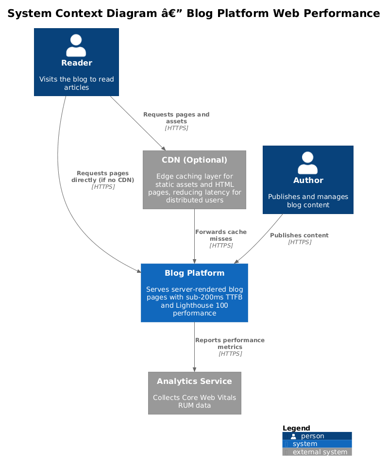
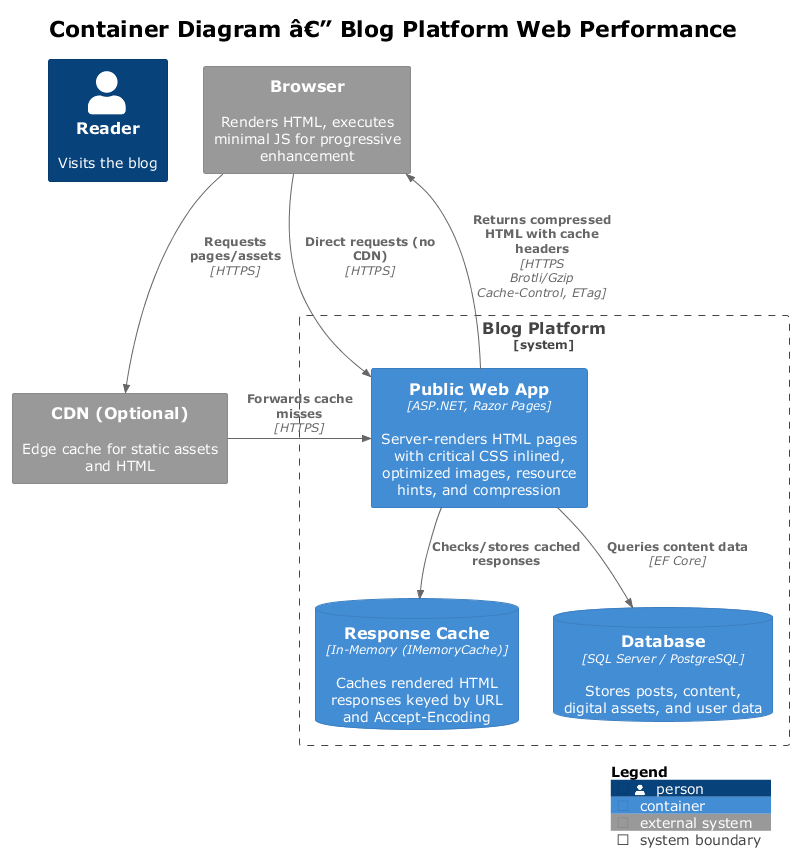
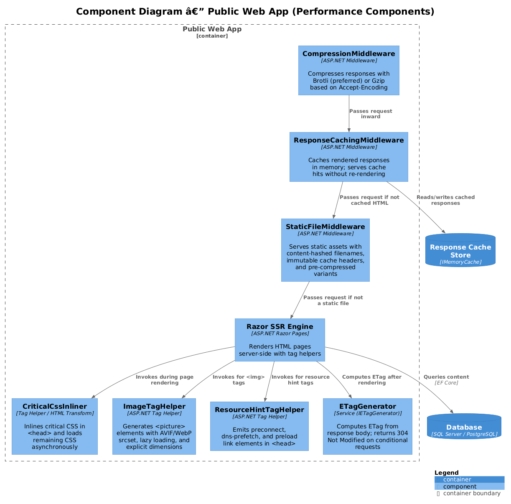
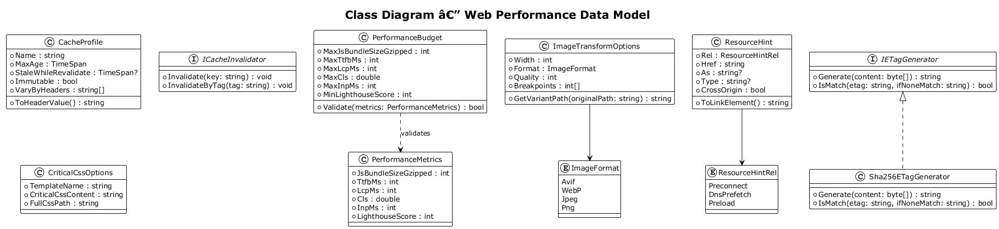
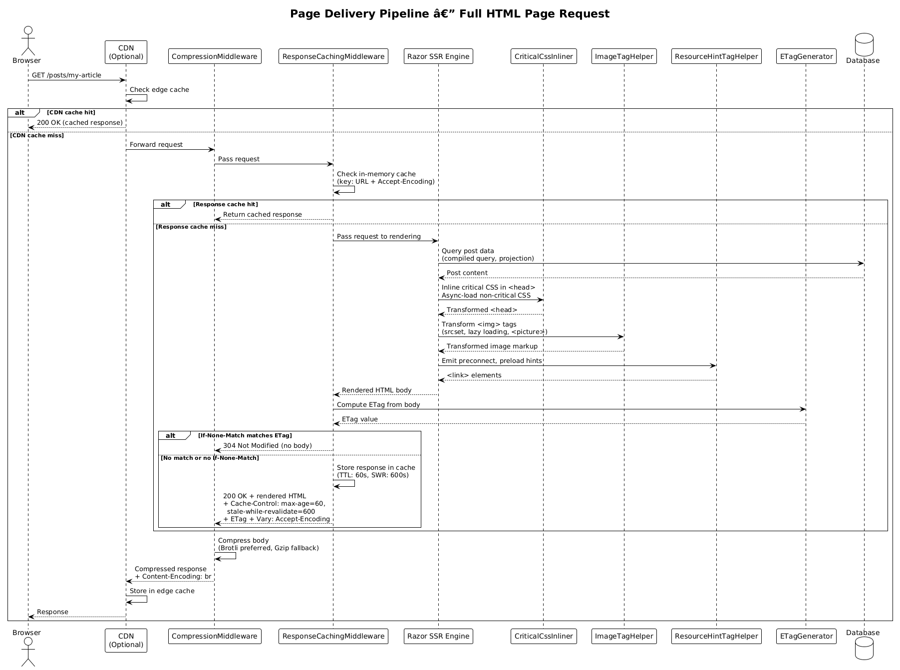
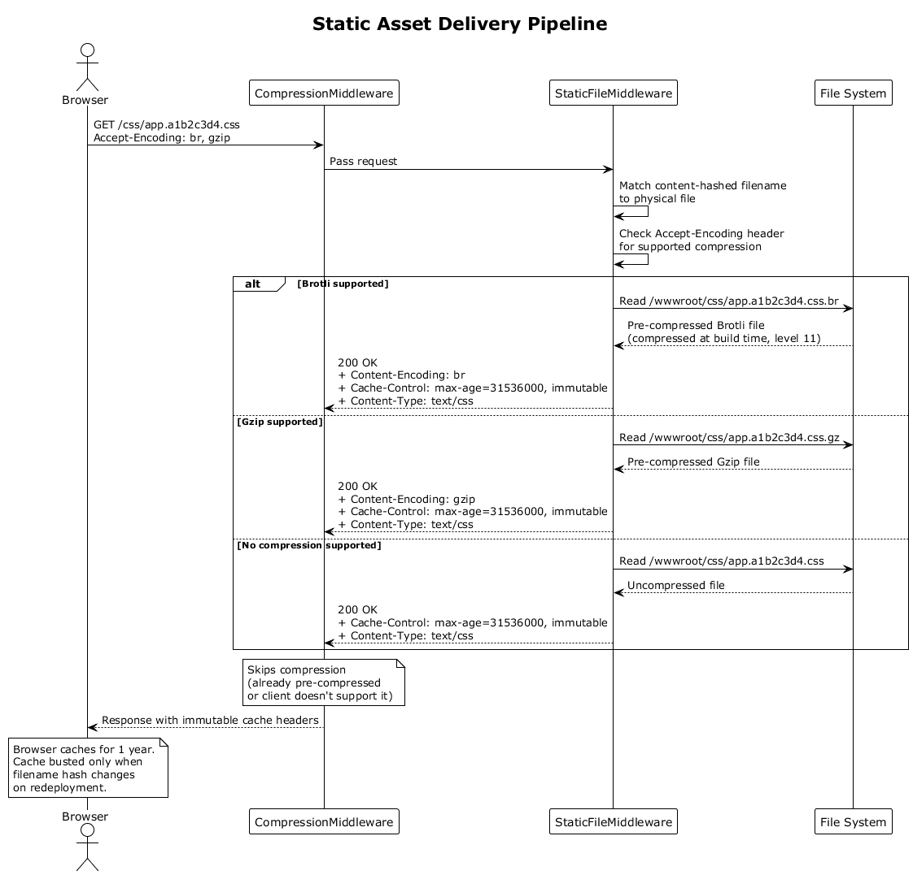

# Feature 07: Web Performance — Detailed Design

## 1. Overview

This document describes the performance architecture for the Blog platform, targeting sub-200ms Time-To-First-Byte (TTFB) at P95 under normal load and a Lighthouse mobile Performance score that trends to 100 on key pages. The strategy centers on server-side rendering with minimal client-side JavaScript, aggressive HTTP caching, Brotli/Gzip compression, critical CSS inlining, and optimized image delivery.

### Goals

- **TTFB < 200ms** at P95 under normal load (L2-018).
- **Lighthouse mobile Performance target of 100 on key pages** (L2-022), with a non-flaky automated regression floor.
- **Total JS bundle <= 50KB gzipped** — JavaScript is used only for progressive enhancement, never for content display (L2-017).
- **Core Web Vitals compliance** — LCP < 2.5s, INP < 200ms, CLS < 0.1 (L2-022).

### Non-Goals

- Client-side rendering or SPA frameworks.
- Build-time static site generation (evaluated but deferred; see Open Questions).
- CDN configuration (evaluated but deferred; see Open Questions).

---

## 2. Architecture

The delivery pipeline is structured as a series of middleware layers that each contribute to performance. Every HTML response is server-rendered, compressed, and served with precise cache headers.

### 2.1 C4 Context Diagram

Shows the Blog platform in its environment: a browser requesting pages, the platform serving them, and an optional CDN sitting between.



### 2.2 C4 Container Diagram

Shows the internal containers: the Public Web App (ASP.NET, SSR), Response Cache (in-memory), Database, and the optional CDN layer.



### 2.3 C4 Component Diagram

Shows the middleware and tag helper components inside the Public Web App that collaborate to deliver optimized responses.



---

## 3. Component Details

### 3.1 ResponseCachingMiddleware

**Purpose:** Caches complete rendered responses in memory, keyed by URL and Vary headers, to serve repeat requests without re-rendering.

| Aspect | Detail |
|---|---|
| Type | ASP.NET middleware |
| Cache store | In-memory (`IMemoryCache`) |
| Key strategy | URL path + normalized query string |
| Invalidation | Time-based expiry; explicit purge via `ICacheInvalidator` on content update |
| Headers emitted | `Cache-Control`, `Age` |

The cache stores the canonical **uncompressed HTML representation**. Compression runs after cache retrieval so the same cached page can be served as Brotli, Gzip, or identity without cache duplication.

Cache profiles are applied per-route:

- **Article pages:** `max-age=60, stale-while-revalidate=600`
- **Home / listing pages:** `max-age=60, stale-while-revalidate=600`
- **Static assets:** handled separately by `StaticFileMiddleware`

### 3.2 CompressionMiddleware

**Purpose:** Compresses response bodies using Brotli (preferred) or Gzip based on the client's `Accept-Encoding` header.

| Aspect | Detail |
|---|---|
| Type | ASP.NET Response Compression middleware |
| Brotli level | `CompressionLevel.Optimal` (level 4) for dynamic; pre-compressed at level 11 for static |
| Gzip level | `CompressionLevel.Fastest` (fallback only) |
| Min response size | 860 bytes (below this, compression overhead exceeds savings) |
| MIME types | `text/html`, `text/css`, `application/javascript`, `application/json`, `image/svg+xml` |

Configuration:

```csharp
builder.Services.AddResponseCompression(options =>
{
    options.EnableForHttps = true;
    options.Providers.Add<BrotliCompressionProvider>();
    options.Providers.Add<GzipCompressionProvider>();
});

builder.Services.Configure<BrotliCompressionProviderOptions>(options =>
{
    options.Level = CompressionLevel.Optimal;
});
```

### 3.3 StaticFileMiddleware

**Purpose:** Serves static assets (CSS, JS, images, fonts) with content-hashed filenames and immutable cache headers.

| Aspect | Detail |
|---|---|
| Filename strategy | `app.a1b2c3d4.css` — hash derived from file content at build time |
| Cache-Control | `max-age=31536000, immutable` |
| Pre-compression | `.br` and `.gz` variants generated at build time, served via `Accept-Encoding` negotiation |
| Pipeline position | Early in the middleware pipeline, before HTML response caching and routing |

The build process generates content-hashed filenames and corresponding `.br`/`.gz` pre-compressed variants. The middleware maps requests to the correct variant.

### 3.4 CriticalCssInliner

**Purpose:** Extracts and inlines critical (above-the-fold) CSS directly into the `<head>` of each HTML response, loading remaining CSS asynchronously to eliminate render-blocking resources.

| Aspect | Detail |
|---|---|
| Type | Razor tag helper / HTML transform |
| Critical CSS source | Per-template critical CSS files generated at build time |
| Non-critical loading | `<link rel="preload" as="style" onload="this.rel='stylesheet'">` with `<noscript>` fallback |
| Cache | Critical CSS fragments cached in memory keyed by template name |

Output structure:

```html
<head>
    <style>/* critical CSS inlined here */</style>
    <link rel="preload" href="/css/app.a1b2c3d4.css" as="style"
          onload="this.rel='stylesheet'">
    <noscript>
        <link rel="stylesheet" href="/css/app.a1b2c3d4.css">
    </noscript>
</head>
```

### 3.5 ImageTagHelper

**Purpose:** Transforms `` tags to include responsive `srcset` attributes, modern format sources (`<picture>` with WebP/AVIF), and lazy loading attributes for below-fold images.

| Aspect | Detail |
|---|---|
| Type | ASP.NET Tag Helper |
| Formats | AVIF (preferred), WebP (fallback), original format (final fallback) |
| Widths | Configurable breakpoints: 320, 640, 960, 1280, 1920 |
| Lazy loading | `loading="lazy"` and `decoding="async"` on below-fold images |
| Above-fold | `loading="eager"`, `fetchpriority="high"`, and a `<link rel="preload">` hint |

Output structure:

```html
<picture>
    <source type="image/avif"
            srcset="/img/hero.320.avif 320w, /img/hero.640.avif 640w, ..."
            sizes="(max-width: 640px) 100vw, 960px">
    <source type="image/webp"
            srcset="/img/hero.320.webp 320w, /img/hero.640.webp 640w, ..."
            sizes="(max-width: 640px) 100vw, 960px">
    
</picture>
```

### 3.6 ResourceHintTagHelper

**Purpose:** Emits `<link>` resource hints in the `<head>` — `preconnect`, `dns-prefetch`, and `preload` — to accelerate discovery of critical resources.

| Aspect | Detail |
|---|---|
| Type | ASP.NET Tag Helper |
| `preconnect` | Explicitly approved first-party asset origins only (for example, a first-party CDN) |
| `dns-prefetch` | Fallback for browsers without `preconnect` support |
| `preload` | Critical fonts (`as="font"`, `crossorigin`), above-fold hero images (`as="image"`) |

Output:

```html
<link rel="preload" href="/fonts/public-sans-regular.woff2" as="font" type="font/woff2">
<link rel="preload" href="/img/hero.640.webp" as="image" type="image/webp">
```

### 3.7 ETagGenerator

**Purpose:** Computes and applies `ETag` headers to article pages, enabling conditional requests (`If-None-Match`) to return `304 Not Modified` when content has not changed.

| Aspect | Detail |
|---|---|
| Type | Service (`IETagGenerator`) injected into the response pipeline |
| Algorithm | Version-based weak validator derived from stable page metadata (for example `ArticleId` + `Version` for article pages) |
| Scope | Cacheable HTML pages whose content version can be determined without hashing the compressed representation |
| Weak vs Strong | Weak ETag (`W/`) so compressed and uncompressed representations can share the same validator |

Flow:

1. After rendering, determine the page version from the underlying content metadata.
2. Compare against `If-None-Match` request header.
3. If match, return `304 Not Modified` with no body.
4. If no match, set `ETag` response header and send full body.

---

## 4. Data Model

### 4.1 Class Diagram



### 4.2 CacheProfile

Defines caching behavior for a category of responses.

| Property | Type | Description |
|---|---|---|
| `Name` | `string` | Profile identifier (e.g., `"ArticlePage"`, `"StaticAsset"`) |
| `MaxAge` | `TimeSpan` | `Cache-Control: max-age` value |
| `StaleWhileRevalidate` | `TimeSpan?` | `stale-while-revalidate` extension; null if not applicable |
| `Immutable` | `bool` | Whether to add `immutable` directive |
| `VaryByHeaders` | `string[]` | Headers to include in the cache key when content genuinely varies by request metadata |

Predefined profiles:

| Profile | MaxAge | StaleWhileRevalidate | Immutable |
|---|---|---|---|
| `HtmlPage` | 60s | 600s | false |
| `StaticAsset` | 31536000s (1 year) | null | true |
| `ApiResponse` | 0s | null | false |

### 4.3 ImageTransformOptions

Configures image processing for responsive delivery.

| Property | Type | Description |
|---|---|---|
| `Width` | `int` | Target width in pixels |
| `Format` | `ImageFormat` | `Avif`, `WebP`, `Jpeg`, `Png` |
| `Quality` | `int` | Compression quality (1-100); default 80 for WebP, 65 for AVIF |
| `Breakpoints` | `int[]` | Responsive widths for `srcset` generation |

### 4.4 ResourceHint

Represents a single resource hint to be rendered in `<head>`.

| Property | Type | Description |
|---|---|---|
| `Rel` | `ResourceHintRel` | `Preconnect`, `DnsPrefetch`, `Preload` |
| `Href` | `string` | URL or origin |
| `As` | `string?` | Resource type for `preload` (`font`, `image`, `style`, `script`) |
| `Type` | `string?` | MIME type (e.g., `font/woff2`, `image/webp`) |
| `CrossOrigin` | `bool` | Whether to include `crossorigin` attribute |

### 4.5 PerformanceBudget

Defines measurable limits enforced in CI.

| Property | Type | Target |
|---|---|---|
| `MaxJsBundleSizeGzipped` | `int` (bytes) | 51200 (50KB) |
| `MaxTtfbMs` | `int` | 200 |
| `MaxLcpMs` | `int` | 2500 |
| `MaxCls` | `double` | 0.1 |
| `MaxInpMs` | `int` | 200 |
| `MinLighthouseScore` | `int` | 95 |
| `TargetLighthouseScore` | `int` | 100 |

---

## 5. Key Workflows

### 5.1 Full Page Delivery Pipeline

This is the primary workflow for an HTML page request, from browser to response.



**Steps:**

1. **Browser** sends GET request for a page (e.g., `/articles/my-article`).
2. **(Optional CDN)** checks its cache; if hit, returns cached response immediately.
3. **StaticFileMiddleware** first determines whether this is a static-asset request and short-circuits if so.
4. **ResponseCachingMiddleware** checks the in-memory cache for a valid cached HTML response.
   - **Cache hit:** Returns the cached response directly (skip to step 8).
   - **Cache miss:** Continues to rendering.
5. **Razor SSR Engine** renders the page template with data from the database. Queries are optimized (projections, no N+1, indexed lookups).
6. **CriticalCssInliner** injects above-the-fold CSS into the `<head>` and rewrites remaining `<link>` tags for async loading.
7. **ImageTagHelper** and **ResourceHintTagHelper** transform image tags and emit resource hints during rendering.
8. **ETagGenerator** computes a weak validator from the page version metadata. If `If-None-Match` matches, short-circuits with `304 Not Modified`.
9. **ResponseCachingMiddleware** stores the canonical uncompressed HTML representation.
10. **CompressionMiddleware** compresses the response body with Brotli (or Gzip fallback) based on `Accept-Encoding`.
11. **Cache headers** are set: `Cache-Control: max-age=60, stale-while-revalidate=600`, `ETag`, `Vary: Accept-Encoding`.
12. **Response** is sent to the browser.

### 5.2 Static Asset Delivery



**Steps:**

1. **Browser** requests a static asset (e.g., `/css/app.a1b2c3d4.css`).
2. **StaticFileMiddleware** intercepts the request early in the pipeline.
3. Middleware checks for a pre-compressed variant (`.br` or `.gz`) matching the `Accept-Encoding` header.
4. Serves the file with headers: `Cache-Control: max-age=31536000, immutable`, `Content-Encoding: br`.
5. **Response** is sent. Browser caches the asset indefinitely; cache busting occurs via filename hash change on redeployment.

---

## 6. Performance Budget

All budgets are enforced in CI via Lighthouse CI and custom checks.

| Metric | Budget | Requirement | Enforcement |
|---|---|---|---|
| Total JS (gzipped) | <= 50KB | L2-017 | Build step: fail if exceeded |
| TTFB (P95) | < 200ms | L2-018 | Load test in CI (k6 or similar) |
| LCP | < 2.5s | L2-022 | Lighthouse CI assertion |
| CLS | < 0.1 | L2-022 | Lighthouse CI assertion |
| INP | < 200ms | L2-022 | Lighthouse CI assertion |
| Lighthouse Performance (mobile) | >= 95 CI floor, 100 release target | L2-022 | Lighthouse CI assertion + release checklist |
| Render-blocking resources | 0 | L2-021 | Lighthouse CI audit pass |
| HTML content without JS | 100% of content | L2-017 | Manual review + automated check |

### Budget Monitoring

- **CI Pipeline:** Every PR runs Lighthouse CI against a staging deployment. Budget violations fail the build.
- **Production:** Synthetic monitoring (scheduled Lighthouse runs) tracks regressions post-deployment.
- **RUM (Real User Monitoring):** Core Web Vitals collected via the `web-vitals` library (< 1KB) and reported to an analytics endpoint.

---

## 7. Implementation Strategy

### 7.1 Server-Side Rendering Approach

The platform uses **ASP.NET Razor Pages** for server-side rendering. All content is rendered to complete HTML on the server. No client-side framework (React, Blazor WASM, etc.) is used.

- **Razor Pages** serve as the view layer, producing fully-formed HTML.
- **Tag Helpers** (`ImageTagHelper`, `ResourceHintTagHelper`) transform markup during server rendering.
- **Minimal JS** is limited to progressive enhancement: theme toggle, mobile nav, and analytics. This JS is loaded with `defer` and totals under 50KB gzipped.

### 7.2 Caching Strategy

Caching is layered for maximum effectiveness:

| Layer | What | TTL | Invalidation |
|---|---|---|---|
| Browser cache | HTML pages | 60s + SWR 600s | Expires naturally |
| Browser cache | Static assets | 1 year, immutable | Content-hashed filenames |
| Response cache (in-memory) | Canonical uncompressed rendered HTML | 60s | Time-based + explicit purge on publish |
| Database query cache | EF Core compiled queries | Per-request | N/A (no query result caching) |

**Invalidation on content publish:** When an author publishes or updates a post, the `ICacheInvalidator` service evicts the relevant entries from the in-memory response cache. The next request triggers a fresh render, which is then cached.

### 7.3 Compression Configuration

- **Static assets:** Pre-compressed at build time with Brotli (level 11, maximum compression) and Gzip. Stored as `.br` and `.gz` files alongside originals.
- **Dynamic responses:** Compressed on-the-fly by ASP.NET Response Compression middleware. Brotli at level 4 (balancing speed and ratio). Gzip as fallback.
- **Accept-Encoding negotiation:** Brotli preferred when the client supports it; Gzip otherwise. Uncompressed only if neither is accepted.

### 7.4 Image Pipeline

Images uploaded through the CMS are processed at build/upload time:

1. Original image is stored.
2. Variants are generated: multiple widths (320, 640, 960, 1280, 1920) in AVIF, WebP, and original format.
3. `ImageTagHelper` emits `<picture>` elements with `<source>` for AVIF and WebP, plus `` fallback.
4. Width and height attributes are always set to prevent CLS.
5. Below-fold images get `loading="lazy"` and `decoding="async"`.

### 7.5 Middleware Pipeline Order

Order matters for correctness and performance:

```
1. CompressionMiddleware          // Outermost: compresses outgoing dynamic responses
2. StaticFileMiddleware           // Short-circuits for static files and serves pre-compressed variants
3. ResponseCachingMiddleware      // Caches canonical uncompressed HTML responses
4. RoutingMiddleware
5. AuthenticationMiddleware       // If needed
6. EndpointMiddleware (Razor)     // Renders pages with tag helpers
```

---

## 8. Open Questions

| ID | Question | Impact | Status |
|---|---|---|---|
| OQ-1 | **SSG vs SSR:** Should article pages be statically generated at publish time rather than server-rendered on each request? SSG would eliminate TTFB variability entirely for article pages but adds build complexity and a publish pipeline. | High — could simplify caching and improve P99 TTFB | Open |
| OQ-2 | **CDN strategy:** Should a CDN (e.g., Cloudflare, Azure Front Door) sit in front of the origin? This would offload static assets and potentially cache HTML at edge PoPs, reducing TTFB for geographically distributed users. | Medium — depends on target audience geography | Open |
| OQ-3 | **Image processing location:** Should image variants be generated at upload time (eager) or on first request (lazy with caching)? Eager is simpler but increases storage; lazy reduces storage but adds first-request latency. | Low — either approach meets performance targets | Open |
| OQ-4 | **Critical CSS tooling:** Should critical CSS be extracted automatically (e.g., via a headless browser at build time) or maintained manually per template? Automatic extraction is more maintainable but adds build complexity. | Low — manual is viable given the small number of templates | Open |
| OQ-5 | **RUM analytics endpoint:** Should Core Web Vitals data be sent to a first-party analytics endpoint or a third-party service? First-party avoids additional third-party connections but requires storage and dashboarding. | Low — does not affect user-facing performance | Open |
