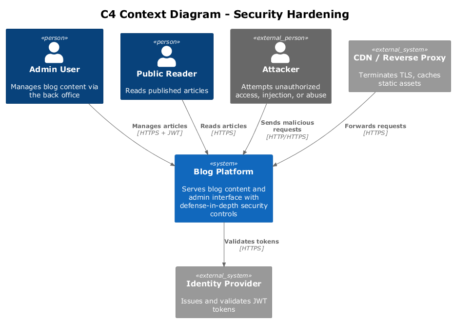
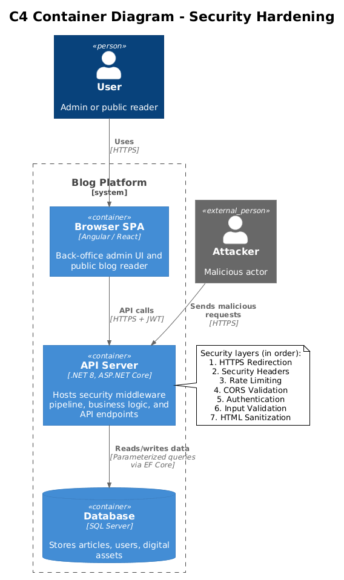
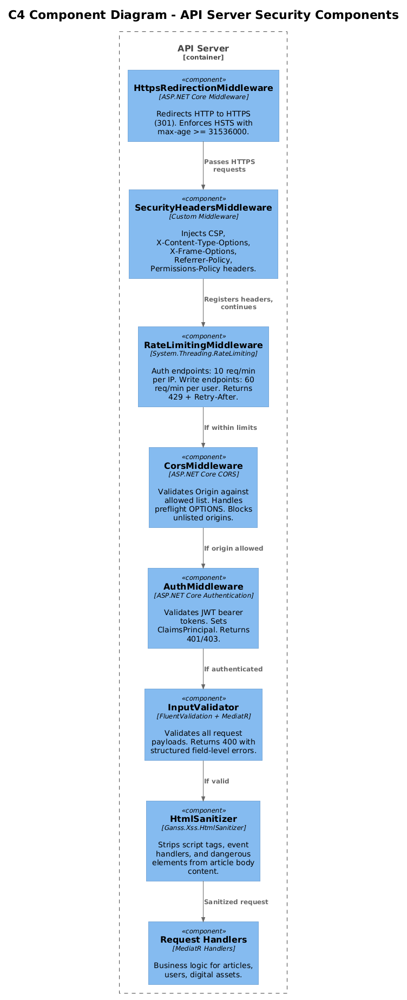
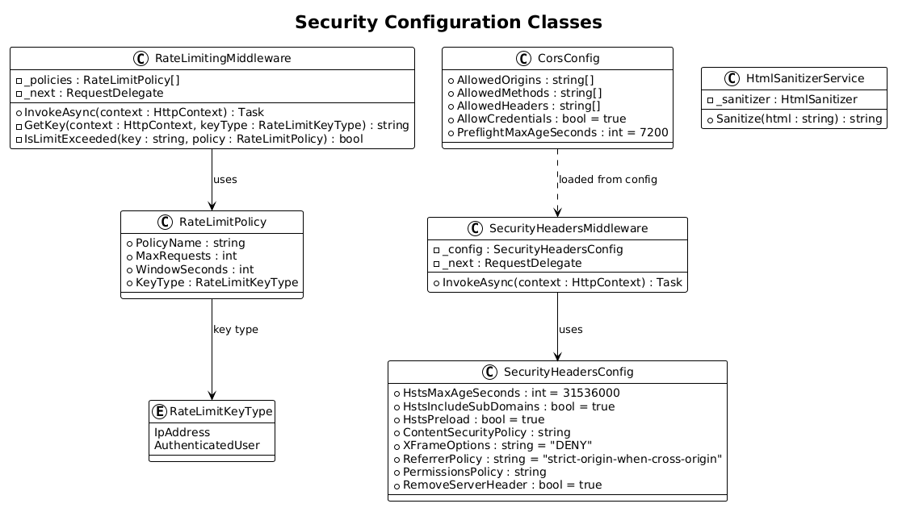
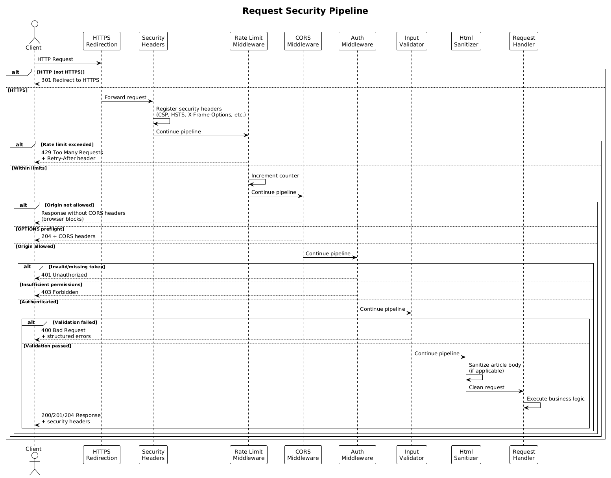
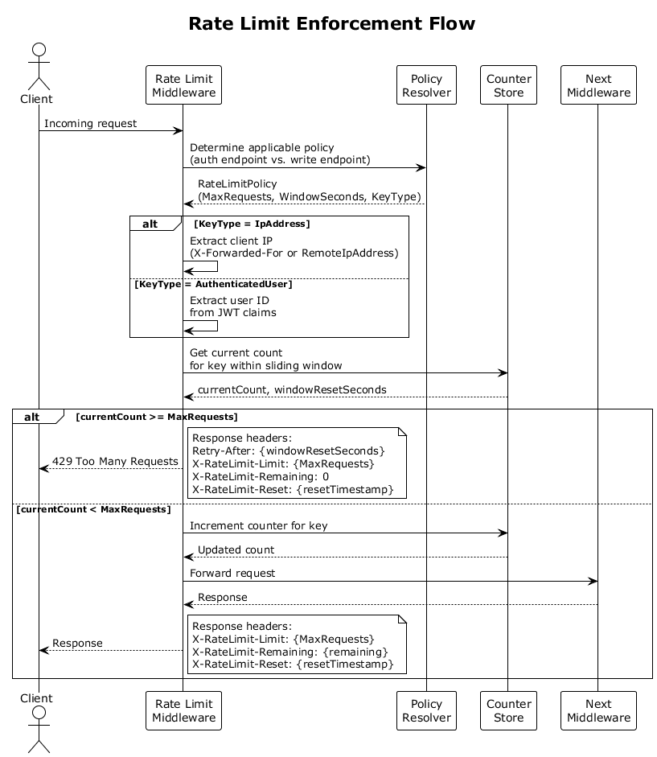

# Feature 08: Security Hardening

## 1. Overview

This feature applies a defense-in-depth security strategy to the blog platform, addressing the OWASP Top 10 risks through multiple reinforcing layers. Security controls are implemented as ASP.NET Core middleware components that form a request pipeline, ensuring every inbound request passes through HTTPS enforcement, security header injection, rate limiting, CORS validation, authentication, and input validation before reaching any application logic.

Article body content is sanitized at write time to prevent stored cross-site scripting (XSS). All database access uses parameterized queries via Entity Framework Core to eliminate SQL injection. Rate limiting protects authentication and write endpoints from abuse. Strict CORS policy restricts cross-origin access to explicitly configured origins.

### Requirements Traceability

| Requirement | Description |
|-------------|-------------|
| L1-007 | Hardened against OWASP Top 10, input validation, data protection, least privilege |
| L2-025 | Input Validation & Sanitization |
| L2-026 | HTTPS & Security Headers |
| L2-027 | Rate Limiting |
| L2-042 | CORS Policy |

## 2. Architecture

### 2.1 C4 Context Diagram

The blog platform receives requests from legitimate users and potential attackers. Security layers protect the system boundary.



**Source:** [diagrams/c4_context.puml](diagrams/c4_context.puml)

### 2.2 C4 Container Diagram

The API server enforces all security controls in its middleware pipeline before requests reach the application layer or database.



**Source:** [diagrams/c4_container.puml](diagrams/c4_container.puml)

### 2.3 C4 Component Diagram

Within the API server, security is implemented as a series of middleware components that execute in a defined order.



**Source:** [diagrams/c4_component.puml](diagrams/c4_component.puml)

## 3. Component Details

### 3.1 HttpsRedirectionMiddleware

- **Responsibility:** Ensures all communication occurs over TLS by redirecting HTTP requests to HTTPS.
- **Behavior:** Issues a 301 Permanent Redirect from `http://` to `https://` for all requests. Configured via ASP.NET Core's built-in `UseHttpsRedirection()` with HSTS preload support.
- **Configuration:** HSTS max-age set to a minimum of 31,536,000 seconds (one year) with `includeSubDomains` enabled.

### 3.2 SecurityHeadersMiddleware

- **Responsibility:** Injects security-related HTTP response headers on every response.
- **Headers applied:**
  - `Strict-Transport-Security: max-age=31536000; includeSubDomains; preload`
  - `Content-Security-Policy: default-src 'self'; script-src 'self'; style-src 'self' 'unsafe-inline'; img-src 'self' data:; font-src 'self'; frame-ancestors 'none'; object-src 'none'; base-uri 'self'; form-action 'self'`
  - `X-Content-Type-Options: nosniff`
  - `X-Frame-Options: DENY`
  - `Referrer-Policy: strict-origin-when-cross-origin`
  - `Permissions-Policy: camera=(), microphone=(), geolocation=(), payment=()`
- **Behavior:** Runs early in the pipeline so headers are present even on error responses. Removes the `Server` header to prevent information disclosure.

### 3.3 RateLimitingMiddleware

- **Responsibility:** Throttles requests to prevent brute-force attacks and abuse.
- **Policies:**
  - **Authentication endpoints** (`/api/auth/*`): Maximum 10 requests per minute per client IP address **and** 5 requests per 15 minutes per normalized email address.
  - **Write endpoints** (POST, PUT, PATCH, DELETE): Maximum 60 requests per minute per authenticated user.
- **Behavior:** Uses a sliding window counter. When the limit is exceeded, returns HTTP 429 Too Many Requests with a `Retry-After` header indicating the number of seconds until the window resets.
- **Implementation:** Built on ASP.NET Core's `System.Threading.RateLimiting` with the `SlidingWindowRateLimiter`.

### 3.4 CorsMiddleware

- **Responsibility:** Enforces a strict Cross-Origin Resource Sharing policy.
- **Behavior:** Only origins explicitly listed in configuration are allowed. Preflight (OPTIONS) requests receive correct `Access-Control-Allow-Origin`, `Access-Control-Allow-Methods`, and `Access-Control-Allow-Headers` responses. Credentialed CORS is disabled by default because bearer tokens sent in the `Authorization` header do not require browser credential mode. Requests from unlisted origins receive no CORS headers, causing the browser to block the response.
- **Configuration:** Allowed origins are loaded from `appsettings.json` under `Cors:AllowedOrigins`. Same-origin requests are unaffected by CORS and proceed normally.

### 3.5 AuthMiddleware

- **Responsibility:** Validates JWT bearer tokens on protected endpoints.
- **Behavior:** Extracts and validates the token from the `Authorization` header. Sets the `ClaimsPrincipal` on `HttpContext.User`. Returns 401 for missing or invalid tokens, 403 for insufficient permissions. Works in conjunction with ASP.NET Core's `[Authorize]` attribute.

### 3.6 InputValidator (FluentValidation)

- **Responsibility:** Validates all inbound request payloads at the API boundary before business logic executes.
- **Behavior:** Implemented as a MediatR pipeline behavior (`ValidationBehavior<TRequest, TResponse>`). Runs all registered `IValidator<TRequest>` instances against the request. On failure, throws a `ValidationException` containing structured, field-level error details. The exception-handling middleware maps this to an HTTP 400 response with a standardized error body.
- **Error format:**
  ```json
  {
    "type": "https://tools.ietf.org/html/rfc7231#section-6.5.1",
    "title": "One or more validation errors occurred.",
    "status": 400,
    "errors": {
      "title": ["Title is required."],
      "body": ["Body must not exceed 100000 characters."]
    }
  }
  ```

### 3.7 HtmlSanitizer

- **Responsibility:** Sanitizes article body HTML content to prevent stored XSS attacks.
- **Behavior:** Strips or escapes dangerous elements (`<script>`, `<iframe>`, `<object>`, `<embed>`, event handler attributes such as `onclick`, `onerror`) while preserving safe formatting tags (`<p>`, `<h1>`-`<h6>`, `<a>`, ``, `<ul>`, `<ol>`, `<li>`, `<strong>`, `<em>`, `<code>`, `<pre>`, `<blockquote>`, `<figure>`, `<figcaption>`). Runs at write time (create and update article) so that stored content is always safe.
- **Implementation:** Uses the `HtmlSanitizer` NuGet package (Ganss.Xss) with a configured allow-list of tags and attributes.

### 3.8 AntiforgeryMiddleware

- **Responsibility:** Protects state-changing operations from Cross-Site Request Forgery (CSRF) attacks.
- **Behavior:** Razor Pages forms and same-origin browser POSTs validate antiforgery tokens by default. Bearer-token API clients do not rely on ambient browser credentials, so CSRF protection is not required for pure `Authorization: Bearer` calls. This component remains part of the baseline because the platform uses Razor Pages forms for back-office interactions.

## 4. Data Model

### 4.1 Configuration Classes



**Source:** [diagrams/class_diagram.puml](diagrams/class_diagram.puml)

### 4.2 SecurityHeadersConfig

| Property | Type | Description |
|----------|------|-------------|
| HstsMaxAgeSeconds | `int` | HSTS max-age value. Default: 31536000 |
| HstsIncludeSubDomains | `bool` | Include subdomains in HSTS. Default: true |
| HstsPreload | `bool` | Enable HSTS preload. Default: true |
| ContentSecurityPolicy | `string` | CSP header value |
| XFrameOptions | `string` | Frame embedding policy. Default: "DENY" |
| ReferrerPolicy | `string` | Referrer policy. Default: "strict-origin-when-cross-origin" |
| PermissionsPolicy | `string` | Permissions policy directives |
| RemoveServerHeader | `bool` | Strip the Server header. Default: true |

### 4.3 RateLimitPolicy

| Property | Type | Description |
|----------|------|-------------|
| PolicyName | `string` | Identifier for the policy (e.g., "AuthEndpoints", "WriteEndpoints") |
| MaxRequests | `int` | Maximum number of requests allowed within the window |
| WindowSeconds | `int` | Duration of the sliding window in seconds |
| KeyType | `RateLimitKeyType` | Enum: `IpAddress` or `AuthenticatedUser` |

### 4.4 CorsConfig

| Property | Type | Description |
|----------|------|-------------|
| AllowedOrigins | `string[]` | List of permitted origins (e.g., `["https://blog.example.com"]`) |
| AllowedMethods | `string[]` | Permitted HTTP methods. Default: `["GET", "POST", "PUT", "PATCH", "DELETE", "OPTIONS"]` |
| AllowedHeaders | `string[]` | Permitted request headers. Default: `["Authorization", "Content-Type"]` |
| AllowCredentials | `bool` | Whether to allow credentials. Default: false |
| PreflightMaxAgeSeconds | `int` | Cache duration for preflight responses. Default: 7200 |

### 4.5 RateLimitKeyType Enum

| Value | Description |
|-------|-------------|
| IpAddress | Rate limit keyed by client IP address (for unauthenticated endpoints) |
| AuthenticatedUser | Rate limit keyed by authenticated user identifier |

## 5. Key Workflows

### 5.1 Request Security Pipeline

Every inbound request traverses the full middleware pipeline in order. Each layer can short-circuit the request with an appropriate error response.



**Source:** [diagrams/sequence_security_pipeline.puml](diagrams/sequence_security_pipeline.puml)

1. Request arrives at the server.
2. **HTTPS Redirection:** If the request is HTTP, return 301 redirect to HTTPS. Pipeline stops.
3. **Security Headers:** Response headers are registered to be appended on response completion.
4. **Rate Limiting:** The middleware checks the request counter for the applicable policy (IP-based for auth endpoints, user-based for write endpoints). If the limit is exceeded, return 429 with `Retry-After`. Pipeline stops.
5. **CORS:** If the request includes an `Origin` header, validate it against the allowed origins list. For preflight (OPTIONS), return the CORS headers and 204. For disallowed origins, omit CORS headers (browser blocks the response).
6. **Authentication:** Validate the JWT bearer token. If invalid or missing on a protected endpoint, return 401. If insufficient permissions, return 403.
7. **Input Validation:** FluentValidation validators run against the deserialized request model. If validation fails, return 400 with structured errors.
8. **HTML Sanitization:** For article create/update operations, the `HtmlSanitizer` cleans the article body before persistence.
9. **Handler:** Business logic executes and returns the response.
10. **Response:** Security headers are written to the outgoing response.

### 5.2 Input Validation Flow

1. Controller deserializes the request body into a command/query object.
2. MediatR dispatches the request through the pipeline.
3. `ValidationBehavior` resolves all `IValidator<TRequest>` from the DI container.
4. Each validator runs its rules against the request.
5. If any validation errors exist, a `ValidationException` is thrown.
6. The exception-handling middleware catches the exception and returns 400 with the structured error body.
7. If validation passes, the request proceeds to the next pipeline behavior or handler.

### 5.3 Rate Limit Enforcement



**Source:** [diagrams/sequence_rate_limit.puml](diagrams/sequence_rate_limit.puml)

1. Request arrives at `RateLimitingMiddleware`.
2. Middleware determines the applicable policy based on the endpoint (auth vs. write).
3. Middleware extracts the rate limit key (client IP for auth endpoints, user ID for write endpoints).
4. Middleware checks the sliding window counter for the key.
5. If the counter exceeds `MaxRequests`, the middleware returns 429 with `Retry-After` set to the remaining seconds until the oldest request in the window expires.
6. If the counter is within limits, the middleware increments the counter and passes the request to the next middleware.

## 6. OWASP Top 10 Mapping

| OWASP Risk | Mitigation |
|------------|------------|
| A01: Broken Access Control | JWT authentication on all protected endpoints. Role-based authorization via `[Authorize]` attributes. X-Frame-Options: DENY prevents clickjacking. CORS restricts cross-origin access. |
| A02: Cryptographic Failures | HTTPS enforced with HSTS. Passwords hashed with PBKDF2-SHA256. JWT secrets stored in environment variables, not in code. |
| A03: Injection | All database queries parameterized via Entity Framework Core. Article body sanitized with HtmlSanitizer to prevent stored XSS. FluentValidation rejects malformed input at the boundary. |
| A04: Insecure Design | Security middleware pipeline enforces controls regardless of application code. Defense-in-depth with multiple independent layers. |
| A05: Security Misconfiguration | Security headers set by default via middleware. Server header removed. Permissions-Policy disables unused browser features. Strict CSP policy. |
| A06: Vulnerable and Outdated Components | Dependency scanning via `dotnet list package --vulnerable`. NuGet packages pinned to reviewed versions. |
| A07: Identification and Authentication Failures | Rate limiting on auth endpoints (10 req/min per IP) prevents brute-force. JWT tokens have short expiration. Password complexity enforced by validation. |
| A08: Software and Data Integrity Failures | JWT signature validation ensures token integrity. Input validation prevents tampered data from reaching business logic. |
| A09: Security Logging and Monitoring Failures | Failed authentication attempts are logged. Rate limit violations are logged. Security header violations are observable via CSP reporting. (Detailed logging covered in Feature 09: Observability.) |
| A10: Server-Side Request Forgery (SSRF) | No server-side URL fetching from user input. Digital asset uploads are processed locally without following redirects. |

## 7. Security Headers Reference

| Header | Value | Rationale |
|--------|-------|-----------|
| Strict-Transport-Security | `max-age=31536000; includeSubDomains; preload` | Forces browsers to use HTTPS for one year. Prevents protocol downgrade attacks and cookie hijacking. |
| Content-Security-Policy | `default-src 'self'; script-src 'self'; style-src 'self' 'unsafe-inline'; img-src 'self' data:; font-src 'self'; frame-ancestors 'none'; object-src 'none'; base-uri 'self'; form-action 'self'` | Restricts resource loading to same origin. Prevents inline script execution (XSS). Blocks framing and embedded plugin content. `unsafe-inline` for styles is a pragmatic concession for server-rendered critical CSS and small inline style fragments emitted by Razor Pages. |
| X-Content-Type-Options | `nosniff` | Prevents browsers from MIME-sniffing responses, which can lead to XSS via content type confusion. |
| X-Frame-Options | `DENY` | Prevents the page from being embedded in frames or iframes. Defense against clickjacking. Supplements `frame-ancestors 'none'` in CSP for older browsers. |
| Referrer-Policy | `strict-origin-when-cross-origin` | Sends the full URL as referrer for same-origin requests but only the origin for cross-origin requests. Balances analytics needs with privacy. |
| Permissions-Policy | `camera=(), microphone=(), geolocation=(), payment=()` | Explicitly disables browser features the blog does not use. Reduces attack surface from compromised third-party scripts. |

## 8. Open Questions

1. **CSP policy strictness:** ~~Should `style-src 'unsafe-inline'` be replaced with nonce-based style injection?~~ **Resolved: Nonce-based CSP for v1.** Since critical CSS is extracted automatically at build time (see Feature 07, OQ-4), each inlined `<style>` block can be tagged with a per-request nonce generated by middleware. The CSP header becomes `style-src 'self' 'nonce-{random}'`, eliminating `'unsafe-inline'`. This prioritizes security with minimal runtime cost (one random nonce per request).

2. **Rate limit storage:** Should rate limit counters be stored in-memory (`MemoryCache`) or in a distributed store (Redis)? In-memory is simpler but does not work across multiple server instances. Redis provides consistency in a scaled deployment but adds an infrastructure dependency.

3. **CSP report-uri / report-to:** Should the CSP header include a `report-uri` directive to collect violation reports? This requires a reporting endpoint or third-party service and is valuable for monitoring but adds complexity.

4. **CORS origin management:** Should allowed origins be managed via configuration files only, or should there be an admin API to add/remove origins at runtime without redeployment?

5. **Rate limit bypass for admin:** Should administrative users be exempt from write-endpoint rate limits, or should all users be subject to the same limits?

6. **HtmlSanitizer allow-list scope:** Should the sanitizer allow `<table>` elements and data attributes for rich content, or should the allow-list remain minimal? A broader allow-list improves content authoring flexibility but increases the XSS attack surface.
