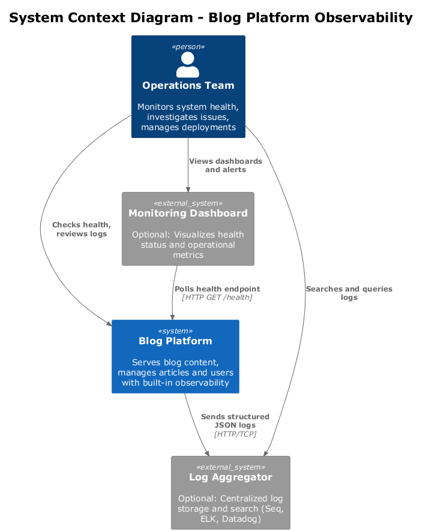
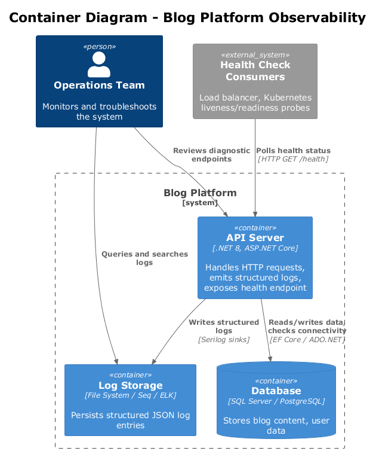
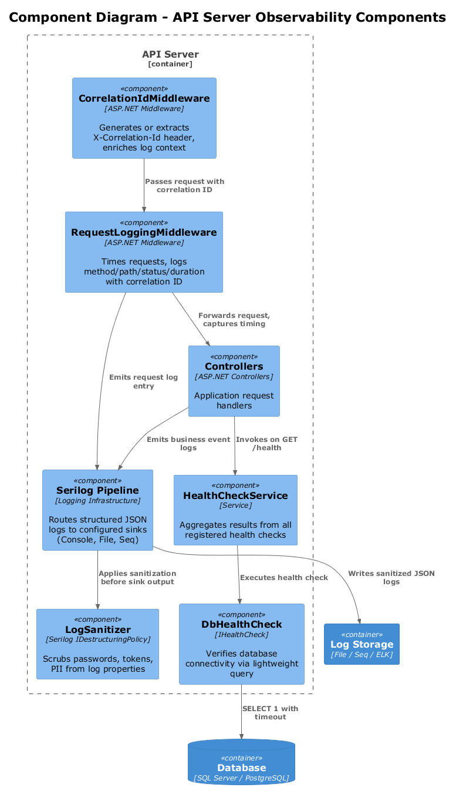
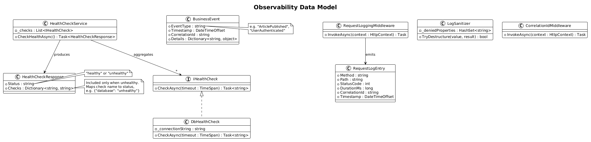
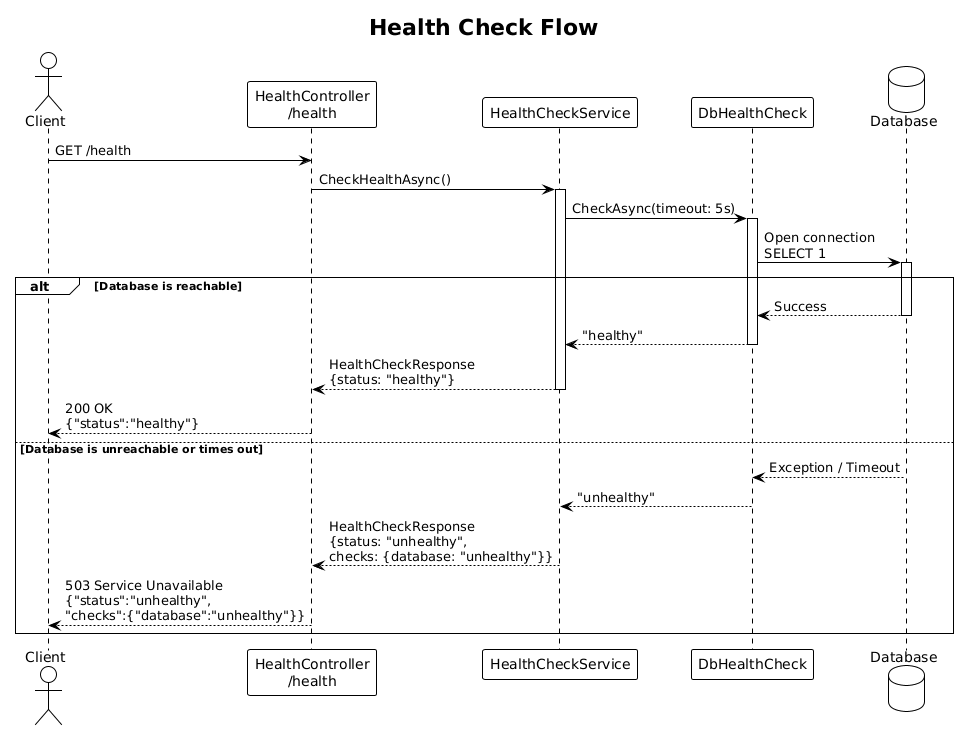
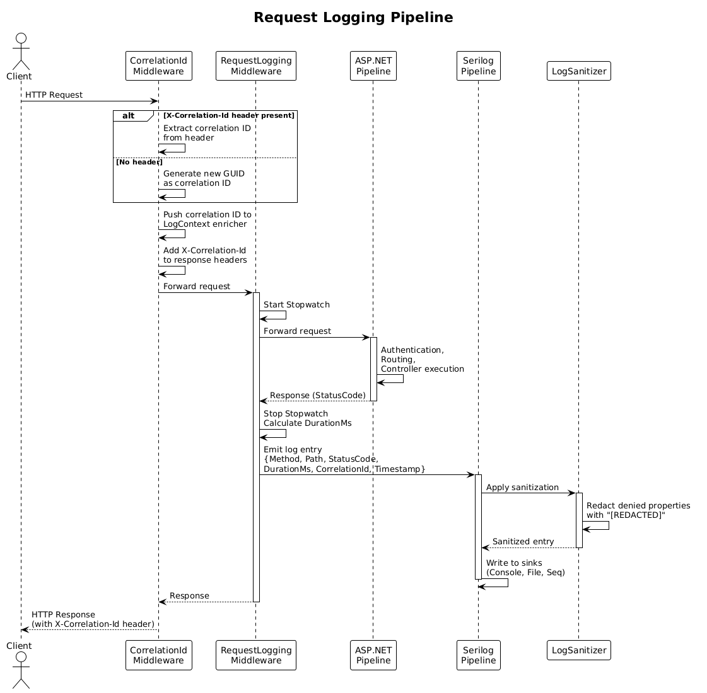

# Feature 09: Observability - Detailed Design

## 1. Overview

This document describes the observability strategy for the Blog platform, covering structured logging, health checks, and diagnostic capabilities required for production operations. The goal is to provide operators and developers with clear, actionable insight into system behavior, enabling quick issue detection, root-cause analysis, and confident deployments.

The design addresses requirements **L1-010** (structured logging, health checks, diagnostic endpoints), **L2-032** (health check endpoint), and **L2-033** (structured logging with PII/secret scrubbing).

### Goals

- Expose a minimal public `/health` endpoint without authentication and a more detailed `/health/ready` readiness endpoint for internal operators and deployment infrastructure.
- Emit all logs in structured JSON format with correlation IDs for request tracing.
- Log every API request with method, path, status code, and duration.
- Log errors with full stack traces and business events with contextual detail.
- Never log secrets, passwords, tokens, or PII.

### Non-Goals

- Distributed tracing across multiple services (single-service deployment for now).
- Metrics collection and dashboarding (deferred to a future iteration).
- Centralized log aggregation platform selection (captured as an open question).

---

## 2. Architecture

### 2.1 C4 Context Diagram

The Blog platform is operated by an Operations Team. Optionally, logs flow to an external Log Aggregator and a Monitoring Dashboard consumes the health endpoint.



### 2.2 C4 Container Diagram

Within the system boundary, the API Server handles requests and emits logs to Log Storage. Health Check Consumers (load balancers, Kubernetes probes) poll the health endpoint. The API Server connects to the Database, whose health is verified as part of the health check.



### 2.3 C4 Component Diagram

Inside the API Server, the observability components form a pipeline: incoming requests pass through `CorrelationIdMiddleware`, then `RequestLoggingMiddleware`, before reaching application handlers. The `HealthCheckService` orchestrates dependency checks via `DbHealthCheck`. All log output passes through `LogSanitizer` before reaching the Serilog pipeline.



---

## 3. Component Details

### 3.1 CorrelationIdMiddleware

**Responsibility:** Ensure every request has a unique correlation ID for end-to-end tracing.

**Behavior:**
- On each incoming request, check for an `X-Correlation-Id` header.
- If present, accept it only when it matches a safe character set (`A-Z`, `a-z`, `0-9`, `-`, `_`) and length limit (64 chars). Otherwise, discard it and generate a new value.
- Store the correlation ID in `HttpContext.Items` and push it onto the Serilog `LogContext` as an enricher.
- Add the correlation ID to the response headers so callers can reference it.

**Location:** `src/Blog.Api/Middleware/CorrelationIdMiddleware.cs`

### 3.2 RequestLoggingMiddleware

**Responsibility:** Log every HTTP request with method, path, status code, duration, and correlation ID.

**Behavior:**
- Start a `Stopwatch` before calling `next(context)`.
- After the response completes, compute elapsed milliseconds.
- Emit a structured log entry at `Information` level for 2xx/3xx responses, `Warning` for 4xx, and `Error` for 5xx.
- The log entry includes: `Method`, `Path`, `StatusCode`, `DurationMs`, `CorrelationId`, `Timestamp`.

**Location:** `src/Blog.Api/Middleware/RequestLoggingMiddleware.cs`

### 3.3 HealthCheckService

**Responsibility:** Aggregate results from all registered health checks and produce a `HealthCheckResponse`.

**Behavior:**
- Implements `IHealthCheckService` with a single method `CheckHealthAsync()`.
- Iterates over all registered `IHealthCheck` implementations (initially only `DbHealthCheck`).
- Returns a `HealthCheckResponse` with an overall `Status` and a dictionary of individual check results.
- Overall status is `"healthy"` only if all individual checks pass; otherwise `"unhealthy"`.

**Location:** `src/Blog.Api/Features/Health/HealthCheckService.cs`

### 3.4 DbHealthCheck

**Responsibility:** Verify database connectivity.

**Behavior:**
- Implements `IHealthCheck`.
- Attempts to open a connection to the database and execute a lightweight query (e.g., `SELECT 1`).
- Returns `"healthy"` on success, `"unhealthy"` on any exception.
- Applies a timeout of 5 seconds to prevent hanging.

**Location:** `src/Blog.Api/Features/Health/DbHealthCheck.cs`

### 3.5 LogSanitizer

**Responsibility:** Scrub sensitive data from log output before it reaches sinks.

**Behavior:**
- Implemented as a Serilog `IDestructuringPolicy` and a custom enricher.
- Request and response bodies are not logged by default, and authorization headers are never logged verbatim.
- Maintains a deny-list of property names: `Password`, `Token`, `Secret`, `Authorization`, `Cookie`, `CreditCard`, `SSN`, `Email` (configurable).
- Any property matching the deny-list is replaced with `"[REDACTED]"`.
- Applied globally via Serilog configuration so no log sink ever receives raw sensitive data.

**Location:** `src/Blog.Api/Core/LogSanitizer.cs`

---

## 4. Data Model

### 4.1 Class Diagram



### 4.2 HealthCheckResponse

| Property | Type | Description |
|----------|------|-------------|
| `Status` | `string` | `"healthy"` or `"unhealthy"` |
| `Checks` | `Dictionary<string, string>` | Individual check names mapped to their status |

**Serialization example (healthy):**
```json
{
  "status": "healthy"
}
```

**Serialization example (unhealthy):**
```json
{
  "status": "unhealthy",
  "checks": {
    "database": "unhealthy"
  }
}
```

Note: The public `/health` response remains minimal (`{"status":"healthy"}` or `{"status":"unhealthy"}`). Detailed dependency results belong to `/health/ready`, keeping the public endpoint low-information.

### 4.3 RequestLogEntry

| Property | Type | Description |
|----------|------|-------------|
| `Method` | `string` | HTTP method (GET, POST, etc.) |
| `Path` | `string` | Request path |
| `StatusCode` | `int` | HTTP response status code |
| `DurationMs` | `long` | Request duration in milliseconds |
| `CorrelationId` | `string` | Unique request correlation identifier |
| `Timestamp` | `DateTimeOffset` | UTC timestamp of the log entry |

### 4.4 BusinessEvent

| Property | Type | Description |
|----------|------|-------------|
| `EventType` | `string` | Event category (e.g., `"ArticlePublished"`, `"UserAuthenticated"`) |
| `Timestamp` | `DateTimeOffset` | UTC timestamp of the event |
| `CorrelationId` | `string` | Correlation ID from the originating request |
| `Details` | `Dictionary<string, object>` | Event-specific key-value pairs (e.g., `{"articleId": 42}`) |

---

## 5. Key Workflows

### 5.1 Health Check Flow



1. A client (load balancer, Kubernetes liveness probe, or operator) sends `GET /health` for a minimal status check, or an internal readiness probe sends `GET /health/ready` for detailed dependency results.
2. The `HealthController` invokes `HealthCheckService.CheckHealthAsync()`.
3. `HealthCheckService` iterates registered checks. For each check (currently `DbHealthCheck`):
   - `DbHealthCheck` attempts to open a database connection and execute `SELECT 1`.
   - On success, returns `"healthy"`. On failure or timeout, returns `"unhealthy"`.
4. `HealthCheckService` aggregates results into a `HealthCheckResponse`.
5. The controller returns:
   - **200 OK** with `{"status":"healthy"}` if all checks pass.
   - **503 Service Unavailable** with `{"status":"unhealthy"}` on the public `/health` endpoint if any check fails.
   - **200/503** with the `checks` dictionary on `/health/ready` for internal diagnostics.
6. `/health` requires no authentication. `/health/ready` should be restricted to internal infrastructure or authenticated operators.

### 5.2 Request Logging Pipeline



1. An HTTP request arrives at the API Server.
2. `CorrelationIdMiddleware` checks for an `X-Correlation-Id` header.
   - If present, uses the provided value.
   - If absent, generates a new GUID.
   - Pushes the correlation ID onto the Serilog `LogContext` and adds it to the response headers.
3. `RequestLoggingMiddleware` starts a `Stopwatch` and invokes the next middleware.
4. The request flows through the remaining pipeline (authentication, routing, controller execution).
5. The response propagates back through the pipeline.
6. `RequestLoggingMiddleware` stops the timer and emits a structured log entry containing `Method`, `Path`, `StatusCode`, `DurationMs`, `CorrelationId`, and `Timestamp`.
7. The Serilog pipeline passes the entry through `LogSanitizer` to redact any sensitive properties before writing to configured sinks.

---

## 6. Logging Standards

### 6.1 Format

All logs are emitted in **JSON format** via Serilog's `CompactJsonFormatter` (or `RenderedCompactJsonFormatter` for human-readable messages alongside structured data).

Example log entry:

```json
{
  "@t": "2026-04-04T14:30:00.1234567Z",
  "@l": "Information",
  "@mt": "HTTP {Method} {Path} responded {StatusCode} in {DurationMs}ms",
  "Method": "GET",
  "Path": "/api/articles",
  "StatusCode": 200,
  "DurationMs": 42,
  "CorrelationId": "abc-123-def-456"
}
```

### 6.2 Required Fields

Every log entry must include:

| Field | Source |
|-------|--------|
| `@t` (Timestamp) | Serilog (automatic, UTC) |
| `@l` (Level) | Serilog (automatic) |
| `@mt` (Message Template) | Developer-authored |
| `CorrelationId` | `CorrelationIdMiddleware` enricher |

### 6.3 Log Levels

| Level | Usage |
|-------|-------|
| `Debug` | Detailed diagnostic info, disabled in production by default |
| `Information` | Normal operations: request completed, business events |
| `Warning` | Client errors (4xx), degraded conditions |
| `Error` | Server errors (5xx), unhandled exceptions with stack traces |
| `Fatal` | Application startup failures, unrecoverable errors |

### 6.4 Business Events

Business events are logged at `Information` level using a consistent structure:

```csharp
Log.Information("Business event {EventType} occurred: {@Details}",
    "ArticlePublished", new { ArticleId = article.Id, AuthorId = article.AuthorId });
```

Required business events:
- `ArticlePublished` - When a post is published or updated.
- `UserAuthenticated` - When a user successfully logs in.
- `UserAuthenticationFailed` - When a login attempt fails (no PII in details).

### 6.5 Forbidden Fields

The following must **never** appear in logs:

| Category | Examples |
|----------|----------|
| Passwords | `Password`, `PasswordHash`, `NewPassword` |
| Tokens | `Token`, `AccessToken`, `RefreshToken`, `Authorization` header values |
| PII | `Email`, `SSN`, `CreditCard`, `PhoneNumber` |
| Secrets | `Secret`, `ApiKey`, `ConnectionString` |

The `LogSanitizer` enforces this by replacing any matching property value with `"[REDACTED]"`, but the primary control is to avoid capturing sensitive request payloads in the first place.

---

## 7. Configuration

### 7.1 Serilog Sinks

| Sink | Environment | Purpose |
|------|-------------|---------|
| **Console** | All | Structured JSON to stdout for container log drivers |
| **File** | Development, Staging | Rolling file logs in `logs/` directory, 50 MB limit, 7-day retention |
| **Seq** (optional) | Staging, Production | Centralized structured log server for querying and dashboards |
| **Elasticsearch** (optional) | Production | ELK stack integration for large-scale log aggregation |

### 7.2 appsettings.json Configuration

```json
{
  "Serilog": {
    "MinimumLevel": {
      "Default": "Information",
      "Override": {
        "Microsoft": "Warning",
        "Microsoft.Hosting.Lifetime": "Information",
        "System": "Warning"
      }
    },
    "WriteTo": [
      {
        "Name": "Console",
        "Args": {
          "formatter": "Serilog.Formatting.Compact.CompactJsonFormatter, Serilog.Formatting.Compact"
        }
      },
      {
        "Name": "File",
        "Args": {
          "path": "logs/blog-.log",
          "rollingInterval": "Day",
          "fileSizeLimitBytes": 52428800,
          "retainedFileCountLimit": 7,
          "formatter": "Serilog.Formatting.Compact.CompactJsonFormatter, Serilog.Formatting.Compact"
        }
      }
    ],
    "Enrich": ["FromLogContext", "WithMachineName", "WithThreadId"]
  },
  "HealthChecks": {
    "DatabaseTimeoutSeconds": 5
  }
}
```

### 7.3 NuGet Packages

| Package | Purpose |
|---------|---------|
| `Serilog.AspNetCore` | ASP.NET Core integration and request logging |
| `Serilog.Formatting.Compact` | Compact JSON log formatter |
| `Serilog.Enrichers.Environment` | Machine name enrichment |
| `Serilog.Enrichers.Thread` | Thread ID enrichment |
| `Serilog.Sinks.File` | Rolling file sink |
| `Serilog.Sinks.Seq` (optional) | Seq log server sink |
| `Microsoft.Extensions.Diagnostics.HealthChecks` | Health check framework |
| `Microsoft.Extensions.Diagnostics.HealthChecks.EntityFrameworkCore` | EF Core database health check |

### 7.4 Middleware Registration Order

```csharp
app.UseCorrelationId();          // 1. Assign/extract correlation ID first
app.UseSerilogRequestLogging();  // 2. Start request timing
app.UseAuthentication();         // 3. Standard pipeline continues
app.UseAuthorization();
app.MapControllers();
app.MapHealthChecks("/health");        // 4. Public minimal health endpoint (no auth)
app.MapHealthChecks("/health/ready");  // 5. Detailed readiness endpoint (internal only)
```

---

## 8. Open Questions

| # | Question | Impact | Status |
|---|----------|--------|--------|
| 1 | Which log aggregation platform should be adopted (Seq, ELK, Datadog, Azure Monitor)? | Determines sink configuration and operational tooling. | Open |
| 2 | What alerting strategy should be used for unhealthy status or error rate spikes? | Determines integration with PagerDuty, Opsgenie, or similar. | Open |
| 3 | Should the health endpoint include a detailed mode for operator diagnostics vs. a simple mode for load balancers? | Affects response schema and potential information exposure. | Resolved: separate `/health` and `/health/ready` endpoints |
| 4 | What is the log retention policy for production? | Affects storage costs and compliance. | Open |
| 5 | Should OpenTelemetry be adopted from the start for future distributed tracing readiness? | Affects library choices and instrumentation approach. | Open |
