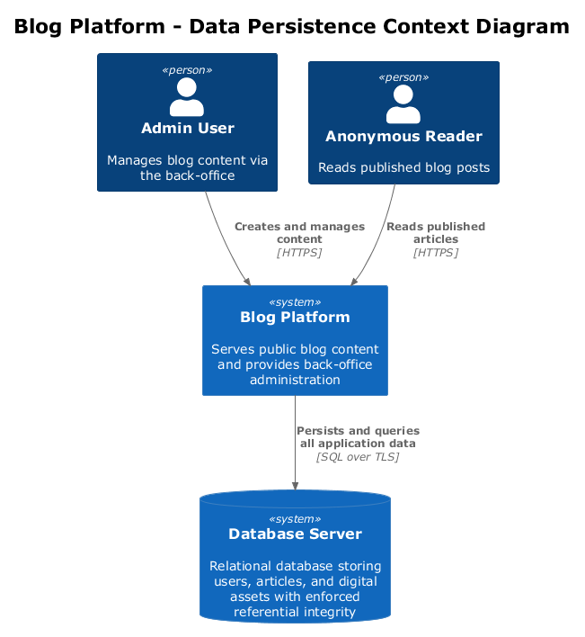
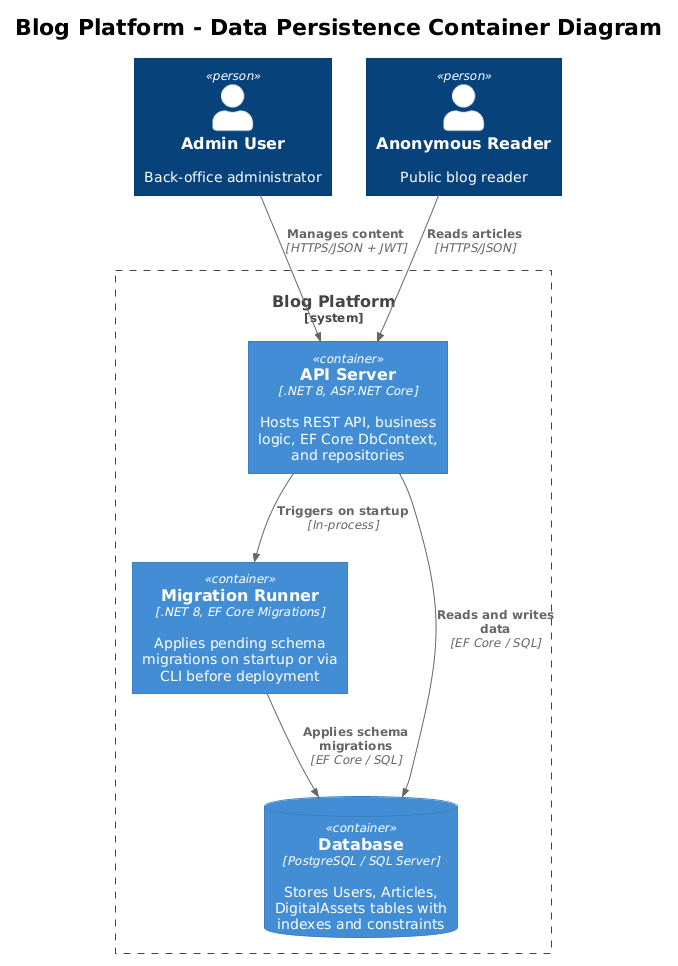
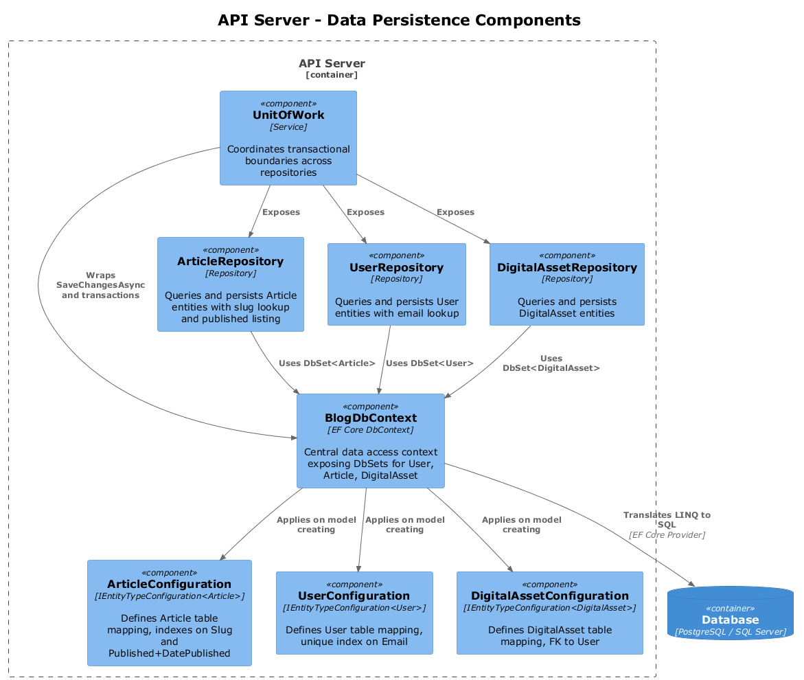
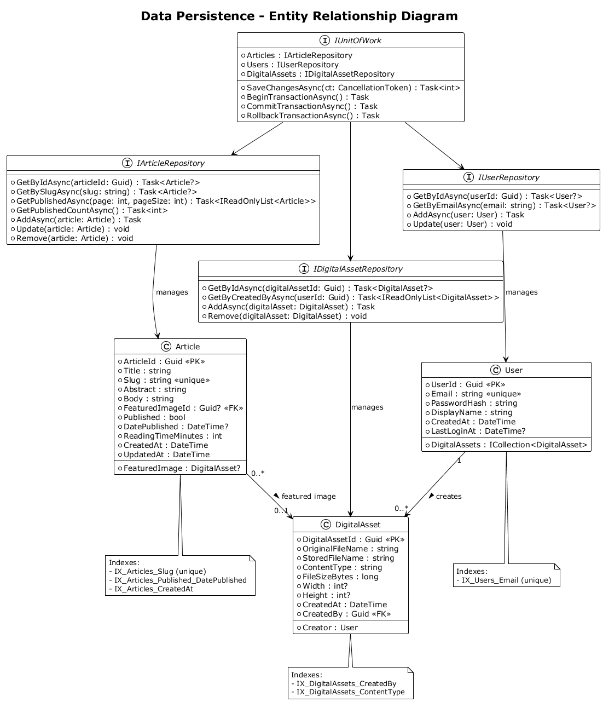
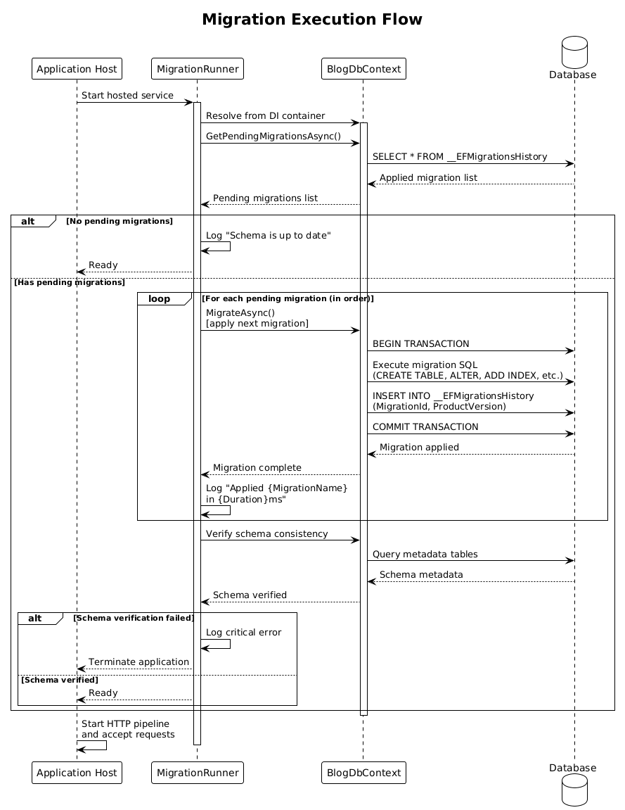
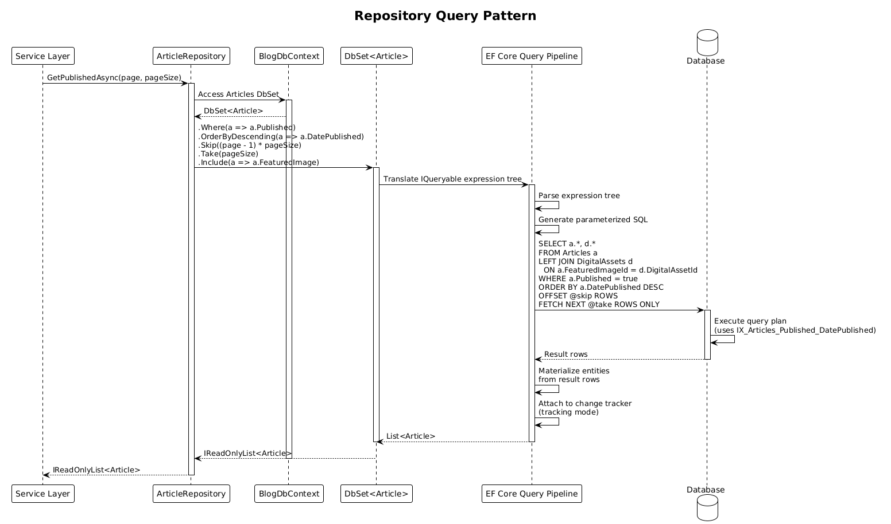

# Feature 10: Data Persistence

## 1. Overview

This feature establishes the data persistence strategy for the Blog platform using Entity Framework Core with a code-first approach and versioned migrations. All domain entities (User, Article, DigitalAsset) are persisted to a relational database with enforced referential integrity, optimized indexes, and a safe schema evolution process through forward-only, idempotent migrations.

**Requirements Traceability:**

| Requirement | Description |
|-------------|-------------|
| L1-011 | Persist all data reliably, enforce referential integrity, support safe schema evolution through versioned migrations |
| L2-034 | All schema changes via EF Core migrations; forward-only in production; idempotent; sequential, timestamped names |

## 2. Architecture

### 2.1 C4 Context Diagram

The system context shows the Blog Platform and its relationship to the database server.



- **Admin User** manages content through the back-office, which persists data to the database.
- **Anonymous Reader** reads published content served from the database.
- **Database Server** stores all application state: users, articles, and digital assets.

### 2.2 C4 Container Diagram

The container diagram shows the deployable units involved in data persistence.



- **API Server (.NET 8)** hosts the application logic, EF Core DbContext, and repository implementations.
- **Database** is SQL Server, the relational store that holds all tables, indexes, and constraints.
- **Migration Runner** is a startup component (or CLI tool) that applies pending EF Core migrations before the application accepts traffic.

### 2.3 C4 Component Diagram

The component diagram details the persistence-related components inside the API server.



- **BlogDbContext** is the central EF Core DbContext that exposes DbSets for all entities and applies entity configurations.
- **Entity Configurations** (ArticleConfiguration, UserConfiguration, DigitalAssetConfiguration) implement `IEntityTypeConfiguration<T>` to define table mappings, constraints, and indexes.
- **Repositories** (ArticleRepository, UserRepository, DigitalAssetRepository) encapsulate query logic and provide domain-specific data access methods.
- **UnitOfWork** coordinates transactional boundaries across multiple repository operations.

## 3. Component Details

### 3.1 BlogDbContext

- **Responsibility:** Central EF Core DbContext for the Blog platform. Registers all entity configurations and exposes DbSet properties.
- **DbSets:** `DbSet<User> Users`, `DbSet<Article> Articles`, `DbSet<DigitalAsset> DigitalAssets`
- **Behavior:**
  - Applies all `IEntityTypeConfiguration<T>` implementations via `OnModelCreating` using `modelBuilder.ApplyConfigurationsFromAssembly()`.
  - Overrides `SaveChangesAsync` to automatically set `CreatedAt` and `UpdatedAt` timestamps on tracked entities.
  - Increments the article `Version` concurrency token on successful article updates so API `ETag` validators remain monotonic.
  - Registered as a scoped service in the DI container.

### 3.2 Entity Configurations

Each entity has a dedicated configuration class implementing `IEntityTypeConfiguration<T>`:

**ArticleConfiguration:**
- Maps to `Articles` table.
- Configures `ArticleId` as PK with `ValueGeneratedOnAdd`.
- `Title`: required, max length 256.
- `Slug`: required, max length 256, unique index.
- `Abstract`: required, max length 512.
- `Body`: required, Markdown source, no max length (nvarchar(max) / text).
  - `BodyHtml`: required, pre-rendered HTML, no max length (nvarchar(max) / text).
- `FeaturedImageId`: optional FK to `DigitalAssets`.
- `ReadingTimeMinutes`: required, default 1, minimum 1.
- `Version`: required concurrency token, default 1.
- Composite index on `(Published, DatePublished)` for listing queries.
- Index on `CreatedAt` for chronological ordering.

**UserConfiguration:**
- Maps to `Users` table.
- Configures `UserId` as PK with `ValueGeneratedOnAdd`.
- `Email`: required, max length 256, unique index.
- `PasswordHash`: required, max length 512.
- `DisplayName`: required, max length 128.
- Has-many relationship to `DigitalAsset` via `CreatedBy` FK.

**DigitalAssetConfiguration:**
- Maps to `DigitalAssets` table.
- Configures `DigitalAssetId` as PK with `ValueGeneratedOnAdd`.
- `OriginalFileName`: required, max length 256.
- `StoredFileName`: required, max length 256.
- `ContentType`: required, max length 128.
- `CreatedBy`: required FK to `Users`, with `DeleteBehavior.Restrict`.
- Index on `ContentType` for filtered queries.

### 3.3 Repository Pattern

Repositories provide a domain-oriented abstraction over EF Core DbSets. Each repository interface defines query and mutation methods specific to its entity.

**IArticleRepository:**
- `Task<Article?> GetByIdAsync(Guid articleId)`
- `Task<Article?> GetBySlugAsync(string slug)`
- `Task<IReadOnlyList<Article>> GetPublishedAsync(int page, int pageSize)`
- `Task<int> GetPublishedCountAsync()`
- `Task AddAsync(Article article)`
- `void Update(Article article)`
- `void Remove(Article article)`

**IUserRepository:**
- `Task<User?> GetByIdAsync(Guid userId)`
- `Task<User?> GetByEmailAsync(string email)`
- `Task AddAsync(User user)`
- `void Update(User user)`

**IDigitalAssetRepository:**
- `Task<DigitalAsset?> GetByIdAsync(Guid digitalAssetId)`
- `Task<IReadOnlyList<DigitalAsset>> GetByCreatedByAsync(Guid userId)`
- `Task AddAsync(DigitalAsset digitalAsset)`
- `void Remove(DigitalAsset digitalAsset)`

### 3.4 UnitOfWork

- **Responsibility:** Coordinates save operations across multiple repositories within a single database transaction.
- **Interface:**
  - `IArticleRepository Articles { get; }`
  - `IUserRepository Users { get; }`
  - `IDigitalAssetRepository DigitalAssets { get; }`
  - `Task<int> SaveChangesAsync(CancellationToken cancellationToken = default)`
  - `Task BeginTransactionAsync()`
  - `Task CommitTransactionAsync()`
  - `Task RollbackTransactionAsync()`
- **Behavior:** Wraps `BlogDbContext.SaveChangesAsync()` and exposes `IDbContextTransaction` management for multi-step operations that require explicit transaction control.

### 3.5 Migration Runner

- **Responsibility:** Applies pending EF Core migrations at application startup to ensure the database schema is current before the application begins serving requests.
- **Behavior:**
  - On startup, calls `context.Database.GetPendingMigrationsAsync()` to identify unapplied migrations.
  - Applies migrations in order via `context.Database.MigrateAsync()`.
  - Logs each migration applied, including name and duration.
  - If migration fails, the application terminates with a clear error message rather than starting with an inconsistent schema.
  - In production, migrations can alternatively be applied via a separate CLI step in the CI/CD pipeline before deployment.

## 4. Data Model

### 4.1 Entity Relationship Diagram



### 4.2 User Entity

| Field | Type | Constraints |
|-------|------|-------------|
| UserId | Guid | PK, auto-generated |
| Email | string | Required, unique, max 256 chars |
| PasswordHash | string | Required, max 512 chars |
| DisplayName | string | Required, max 128 chars |
| CreatedAt | DateTime | UTC, set on creation |
| LastLoginAt | DateTime? | UTC, updated on each successful login |

### 4.3 Article Entity

| Field | Type | Constraints |
|-------|------|-------------|
| ArticleId | Guid | PK, auto-generated |
| Title | string | Required, max 256 chars |
| Slug | string | Required, unique, max 256 chars |
| Abstract | string | Required, max 512 chars |
| Body | string | Required, Markdown source, max length unlimited |
| BodyHtml | string | Required, pre-rendered HTML from Body, max length unlimited |
| FeaturedImageId | Guid? | FK to DigitalAssets (nullable) |
| Published | bool | Required, default false |
| DatePublished | DateTime? | UTC, set when published |
| ReadingTimeMinutes | int | Required, default 1 |
| Version | int | Required concurrency token, default 1 |
| CreatedAt | DateTime | UTC, set on creation |
| UpdatedAt | DateTime | UTC, updated on each save |

### 4.4 DigitalAsset Entity

| Field | Type | Constraints |
|-------|------|-------------|
| DigitalAssetId | Guid | PK, auto-generated |
| OriginalFileName | string | Required, max 256 chars |
| StoredFileName | string | Required, max 256 chars |
| ContentType | string | Required, max 128 chars |
| FileSizeBytes | long | Required |
| Width | int? | Nullable (non-image assets) |
| Height | int? | Nullable (non-image assets) |
| CreatedAt | DateTime | UTC, set on creation |
| CreatedBy | Guid | FK to Users, required |

### 4.5 Relationships

| Relationship | From | To | Cardinality | FK Column | Delete Behavior |
|-------------|------|-----|-------------|-----------|-----------------|
| Article featured image | Article | DigitalAsset | Many-to-one (optional) | FeaturedImageId | SetNull |
| Asset creator | DigitalAsset | User | Many-to-one (required) | CreatedBy | Restrict |

### 4.6 Indexes

| Table | Index Name | Columns | Unique | Purpose |
|-------|-----------|---------|--------|---------|
| Articles | IX_Articles_Slug | Slug | Yes | Lookup articles by URL slug |
| Articles | IX_Articles_Published_DatePublished | Published, DatePublished | No | Efficient listing of published articles by date |
| Articles | IX_Articles_CreatedAt | CreatedAt | No | Chronological ordering |
| Users | IX_Users_Email | Email | Yes | Lookup users by email, enforce uniqueness |
| DigitalAssets | IX_DigitalAssets_CreatedBy | CreatedBy | No | List assets by creator |
| DigitalAssets | IX_DigitalAssets_ContentType | ContentType | No | Filter assets by type |

## 5. Key Workflows

### 5.1 Migration Execution



1. Application starts and the host builder creates the DI container.
2. The `MigrationRunner` hosted service is invoked before the HTTP pipeline starts.
3. `MigrationRunner` resolves `BlogDbContext` from the service provider.
4. It calls `GetPendingMigrationsAsync()` to check for unapplied migrations.
5. If pending migrations exist, it calls `MigrateAsync()` to apply them sequentially.
6. Each migration is logged with its name and execution time.
7. After all migrations are applied, the runner calls a schema verification step.
8. If any migration fails, the application logs the error and terminates.
9. On success, the application signals readiness and begins accepting HTTP requests.

### 5.2 Repository Query Pattern



1. A service layer (e.g., `ArticleService`) calls a repository method such as `GetPublishedAsync(page, pageSize)`.
2. The repository composes an IQueryable using the DbContext's DbSet with `Where`, `OrderBy`, `Skip`, and `Take` clauses.
3. EF Core's query translation pipeline converts the IQueryable expression tree into a parameterized SQL query.
4. The SQL query is sent to the database via the `Microsoft.EntityFrameworkCore.SqlServer` provider.
5. The database executes the query and returns result rows.
6. EF Core materializes the rows into entity objects, applying change tracking.
7. The repository returns the entities to the service layer.

## 6. Database Design

### 6.1 Table Definitions

**Users Table:**

```sql
CREATE TABLE Users (
    UserId          UNIQUEIDENTIFIER    PRIMARY KEY DEFAULT NEWSEQUENTIALID(),
    Email           NVARCHAR(256)       NOT NULL,
    PasswordHash    NVARCHAR(512)       NOT NULL,
    DisplayName     NVARCHAR(128)       NOT NULL,
    CreatedAt       DATETIME2           NOT NULL DEFAULT SYSUTCDATETIME(),
    LastLoginAt     DATETIME2           NULL,
    CONSTRAINT UQ_Users_Email UNIQUE (Email)
);
```

**Articles Table:**

```sql
CREATE TABLE Articles (
    ArticleId           UNIQUEIDENTIFIER    PRIMARY KEY DEFAULT NEWSEQUENTIALID(),
    Title               NVARCHAR(256)       NOT NULL,
    Slug                NVARCHAR(256)       NOT NULL,
    Abstract            NVARCHAR(512)       NOT NULL,
    Body                NVARCHAR(MAX)       NOT NULL,
    BodyHtml            NVARCHAR(MAX)       NOT NULL,
    FeaturedImageId     UNIQUEIDENTIFIER    NULL,
    Published           BIT                 NOT NULL DEFAULT 0,
    DatePublished       DATETIME2           NULL,
    ReadingTimeMinutes  INT                 NOT NULL DEFAULT 1,
    Version             INT                 NOT NULL DEFAULT 1,
    CreatedAt           DATETIME2           NOT NULL DEFAULT SYSUTCDATETIME(),
    UpdatedAt           DATETIME2           NOT NULL DEFAULT SYSUTCDATETIME(),
    CONSTRAINT UQ_Articles_Slug UNIQUE (Slug),
    CONSTRAINT FK_Articles_FeaturedImage
        FOREIGN KEY (FeaturedImageId) REFERENCES DigitalAssets(DigitalAssetId)
        ON DELETE SET NULL
);

CREATE INDEX IX_Articles_Published_DatePublished
    ON Articles (Published, DatePublished DESC);
CREATE INDEX IX_Articles_CreatedAt
    ON Articles (CreatedAt DESC);
```

**DigitalAssets Table:**

```sql
CREATE TABLE DigitalAssets (
    DigitalAssetId  UNIQUEIDENTIFIER    PRIMARY KEY DEFAULT NEWSEQUENTIALID(),
    OriginalFileName NVARCHAR(256)      NOT NULL,
    StoredFileName  NVARCHAR(256)       NOT NULL,
    ContentType     NVARCHAR(128)       NOT NULL,
    FileSizeBytes   BIGINT              NOT NULL,
    Width           INT                 NULL,
    Height          INT                 NULL,
    CreatedAt       DATETIME2           NOT NULL DEFAULT SYSUTCDATETIME(),
    CreatedBy       UNIQUEIDENTIFIER    NOT NULL,
    CONSTRAINT FK_DigitalAssets_CreatedBy
        FOREIGN KEY (CreatedBy) REFERENCES Users(UserId)
        ON DELETE NO ACTION
);

CREATE INDEX IX_DigitalAssets_CreatedBy ON DigitalAssets (CreatedBy);
CREATE INDEX IX_DigitalAssets_ContentType ON DigitalAssets (ContentType);
```

### 6.2 Constraints Summary

| Constraint Type | Table | Constraint | Description |
|----------------|-------|------------|-------------|
| Primary Key | Users | PK on UserId | Clustered unique identifier |
| Primary Key | Articles | PK on ArticleId | Clustered unique identifier |
| Primary Key | DigitalAssets | PK on DigitalAssetId | Clustered unique identifier |
| Unique | Users | UQ_Users_Email | One account per email |
| Unique | Articles | UQ_Articles_Slug | Slugs must be unique for URL routing |
| Foreign Key | Articles | FK_Articles_FeaturedImage | Optional reference to a digital asset |
| Foreign Key | DigitalAssets | FK_DigitalAssets_CreatedBy | Required reference to the uploading user |

### 6.3 Seed Data Strategy

- Seed data is applied via EF Core's `HasData()` only for non-privileged reference data if such data is later introduced.
- No privileged accounts are seeded through migrations.
- The first admin user is provisioned via a deployment-time bootstrap command or one-time administrative setup workflow that reads secrets from the deployment environment.
- No sample articles or digital assets are seeded in production migrations.
- A separate `SeedDevelopmentData` method (called only in Development environment) populates sample articles and assets for local development.

## 7. Migration Strategy

### 7.1 Naming Convention

All migrations follow a sequential, timestamped naming pattern:

```
YYYYMMDDHHMMSS_DescriptiveName
```

Examples:
- `20260404120000_InitialCreate`
- `20260410093000_AddArticleReadingTime`
- `20260415140000_AddDigitalAssetWidthHeight`

Migrations are generated using the EF Core CLI:

```bash
dotnet ef migrations add 20260404120000_InitialCreate --project src/Blog.Api
```

### 7.2 Forward-Only Policy

- Migrations are forward-only in production. The `Down()` method is implemented for development rollback convenience but is never executed in production.
- To fix a problematic migration in production, a new corrective migration is created rather than rolling back.
- The `__EFMigrationsHistory` table tracks all applied migrations.

### 7.3 Migration Rules

| Rule | Description |
|------|-------------|
| Idempotent | Migrations must be safe to re-run. EF Core's migration infrastructure handles this via the history table. |
| Additive | Prefer adding columns with defaults or nullable columns over modifying existing columns. |
| No data loss | Destructive changes (dropping columns/tables) require a multi-step migration: (1) add new column, (2) migrate data, (3) drop old column in a subsequent migration. |
| Fresh database | The full migration chain must apply cleanly to an empty database. This is verified in CI. |
| Sequential | Timestamps prevent ordering conflicts when multiple developers create migrations concurrently. |

### 7.4 CI/CD Integration

1. **Build pipeline:** Runs `dotnet ef migrations script --idempotent` to generate a SQL script. The script is stored as a build artifact.
2. **Test pipeline:** Applies all migrations to a fresh database (Docker container) and runs integration tests.
3. **Staging deployment:** The migration runner applies pending migrations automatically on startup.
4. **Production deployment:** Migrations are applied as a separate step before the new application version is deployed. This ensures the database schema is updated before any new code runs against it.

```
[Build] --> [Generate SQL Script] --> [Test on Fresh DB] --> [Staging: Auto-Migrate] --> [Prod: Migrate Then Deploy]
```

## 8. Open Questions

| # | Question | Impact | Status |
|---|----------|--------|--------|
| 1 | ~~Should the primary database be PostgreSQL or SQL Server?~~ **Resolved: SQL Server.** Tighter .NET ecosystem integration, first-class Azure support, and familiar tooling for the team. EF Core provider: `Microsoft.EntityFrameworkCore.SqlServer`. | Infrastructure cost, feature availability, hosting options | Resolved |
| 2 | What connection pooling strategy should be used? Options include EF Core's default pooling or Azure SQL elastic pools. | Performance under load, resource utilization | Open |
| 3 | Should read replicas be introduced for public-facing read queries to offload the primary database? | Scalability, complexity, consistency model | Open |
| 4 | Should the migration runner be an IHostedService that runs on app startup, or a separate CLI tool executed in the CI/CD pipeline before deployment? | Deployment strategy, zero-downtime deployments | Open |
| 5 | What is the data retention policy for soft-deleted records (if soft delete is adopted)? | Storage growth, GDPR compliance | Open |
| 6 | Should the `Body` column use a full-text search index for content search, or should a dedicated search service (e.g., Elasticsearch) be introduced later? | Search performance, infrastructure complexity | Open |
