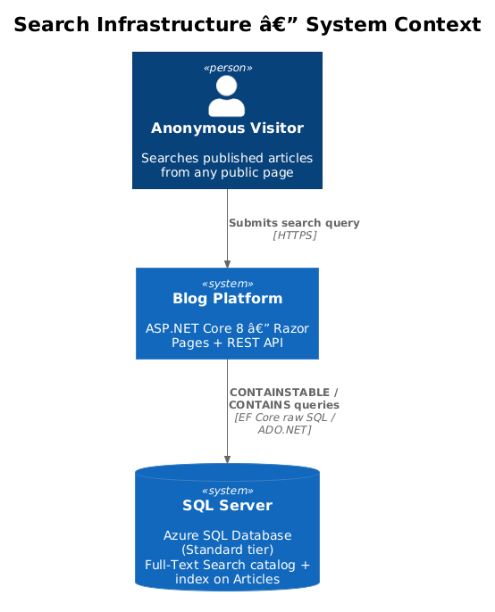
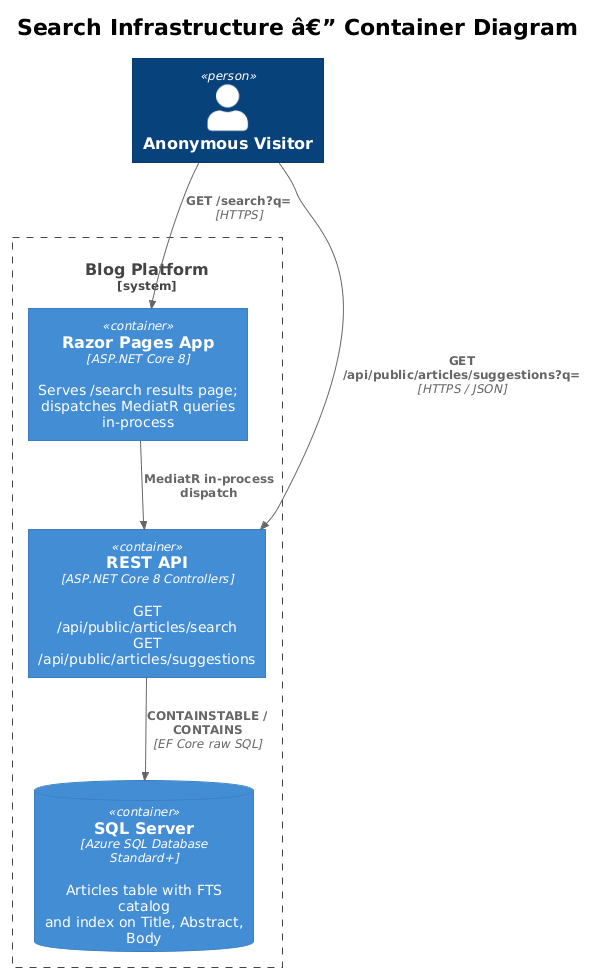
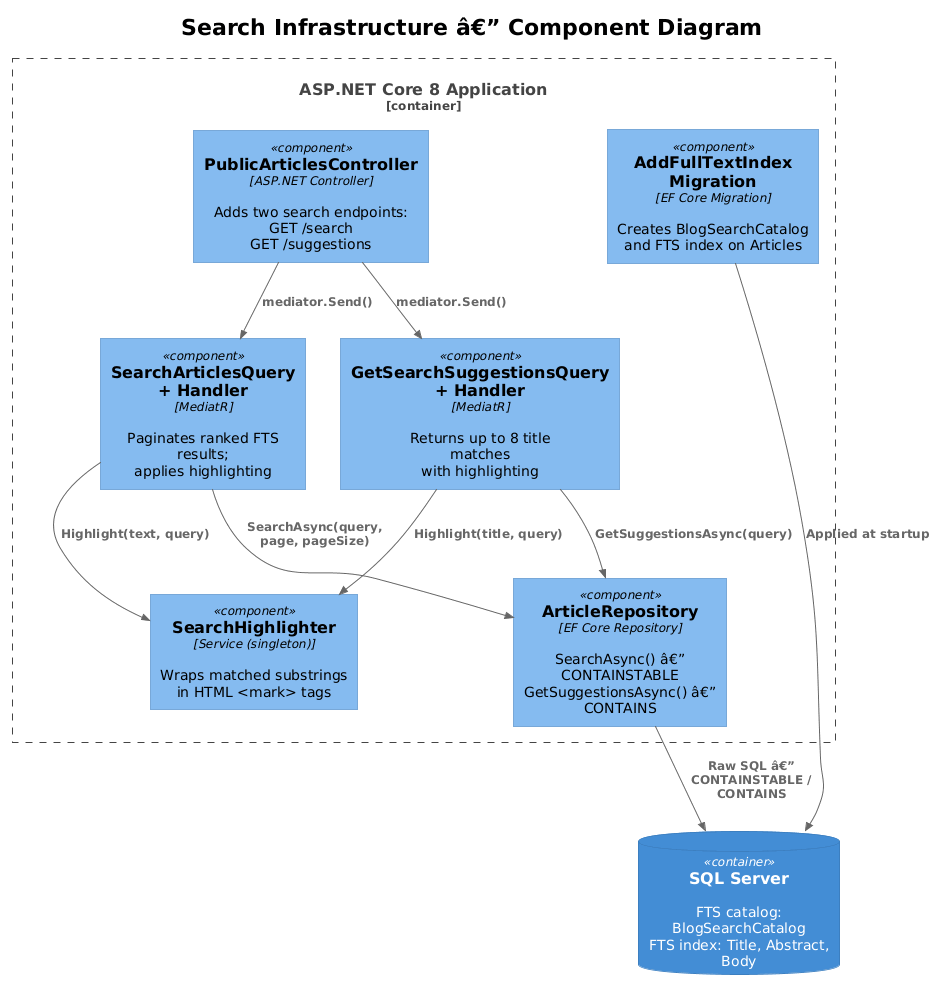
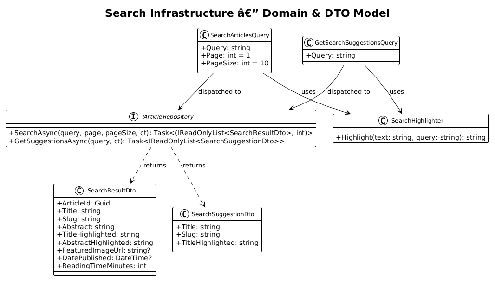
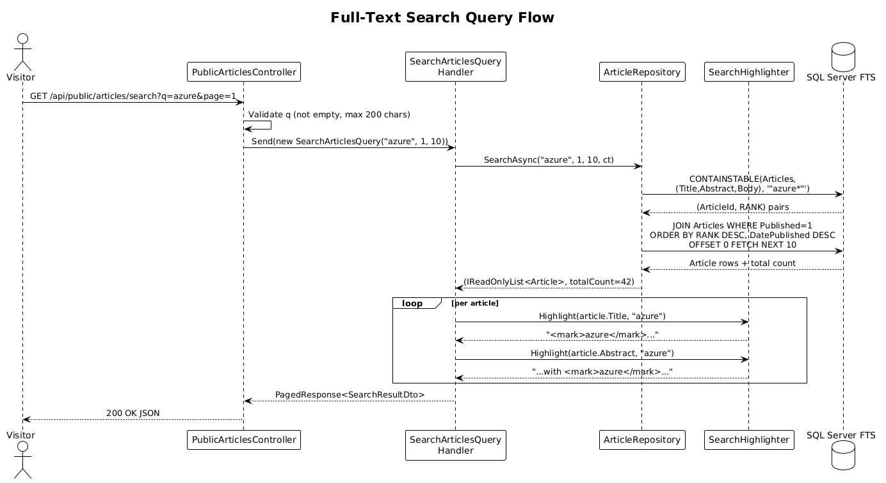
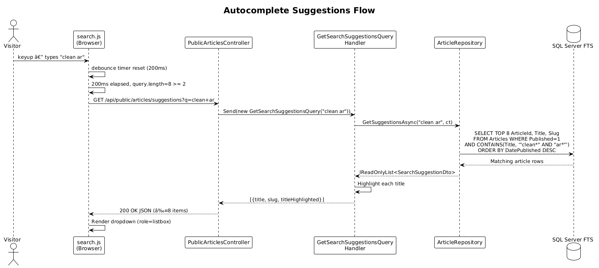

# Search Infrastructure — Detailed Design

**Traces to:** L1-013, L2-043–L2-053

## 1. Overview

This design covers the server-side infrastructure that powers full-text article search on the public site. The feature adds two new API endpoints to `PublicArticlesController`, two MediatR query handlers, extensions to `IArticleRepository` / `ArticleRepository`, a `SearchHighlighter` service, and an EF Core migration that enables SQL Server Full-Text Search (FTS).

**Why SQL Server FTS, not Azure AI Search?**
The blog runs on Azure SQL Database (Standard tier or above), which includes SQL Server's built-in Full-Text Search engine at no additional cost. Azure AI Search starts at ~$25/month and provides capabilities (multi-tenant indexes, semantic ranking, faceting across millions of documents) that are unnecessary for a single-author blog with at most a few thousand articles. SQL Server FTS delivers sub-100 ms suggestion queries and sub-300 ms result queries at this scale, meeting L2-052 without added infrastructure cost or operational complexity.

**Actors:**
- Anonymous visitors — submit search queries via the public site
- The Razor Pages app — dispatches MediatR queries in-process; no HTTP hop between the page and the search handlers

**Scope boundary:** This design covers only the server-side query path and the FTS index. The header input component and the results page UI are covered in designs 12 and 13 respectively.

## 2. Architecture

### 2.1 C4 Context Diagram



### 2.2 C4 Container Diagram



### 2.3 C4 Component Diagram



## 3. Component Details

### 3.1 SQL Server Full-Text Search Index

**Responsibility:** Provides ranked keyword matching over article text fields.

**Setup — EF Core migration (raw SQL):**

```sql
-- Migration: AddFullTextSearchIndex
IF NOT EXISTS (
    SELECT 1 FROM sys.fulltext_catalogs WHERE name = 'BlogSearchCatalog'
)
BEGIN
    CREATE FULLTEXT CATALOG BlogSearchCatalog AS DEFAULT;
END

IF NOT EXISTS (
    SELECT 1 FROM sys.fulltext_indexes WHERE object_id = OBJECT_ID('Articles')
)
BEGIN
    CREATE FULLTEXT INDEX ON Articles(Title, Abstract, Body)
        KEY INDEX PK_Articles
        ON BlogSearchCatalog
        WITH CHANGE_TRACKING AUTO;
END
```

**Index columns and weight strategy:**
| Column | Weight reasoning |
|--------|-----------------|
| `Title` | Highest signal — a title match is a direct match |
| `Abstract` | Medium signal — the author's own summary |
| `Body` | Lowest signal — broad keyword context |

The FTS engine populates the index asynchronously after `CHANGE_TRACKING AUTO` is set. Because the blog has low write volume, population lag is negligible.

**Azure SQL Database note:** Full-Text Search is available on Azure SQL Database Standard (S1+) and Premium tiers. It is **not** available on the Basic tier. The connection string configuration must target a Standard-or-above database.

### 3.2 `IArticleRepository` Extensions

Two new methods are added to the existing interface:

```csharp
// Returns ranked search results and total count for pagination.
Task<(IReadOnlyList<Article> Articles, int TotalCount)> SearchAsync(
    string query, int page, int pageSize,
    CancellationToken cancellationToken = default);

// Returns up to 8 title matches for autocomplete.
Task<IReadOnlyList<Article>> GetSuggestionsAsync(
    string query,
    CancellationToken cancellationToken = default);
```

### 3.3 `ArticleRepository` — `SearchAsync`

```csharp
public async Task<(IReadOnlyList<Article>, int)> SearchAsync(
    string query, int page, int pageSize, CancellationToken ct)
{
    var ftsQuery = BuildFtsQuery(query); // "term1*" AND "term2*"
    var offset = (page - 1) * pageSize;

    var sql = @"
        SELECT a.ArticleId, a.Title, a.Slug, a.Abstract,
               a.FeaturedImageId, a.Published, a.DatePublished,
               a.ReadingTimeMinutes, a.CreatedAt, a.UpdatedAt, a.Version,
               a.Body, a.BodyHtml,
               KEY_TBL.RANK
        FROM Articles a
        INNER JOIN CONTAINSTABLE(Articles, (Title, Abstract, Body), {0})
            AS KEY_TBL ON a.ArticleId = KEY_TBL.[KEY]
        WHERE a.Published = 1
        ORDER BY KEY_TBL.RANK DESC, a.DatePublished DESC
        OFFSET {1} ROWS FETCH NEXT {2} ROWS ONLY";

    var countSql = @"
        SELECT COUNT(*)
        FROM Articles a
        INNER JOIN CONTAINSTABLE(Articles, (Title, Abstract, Body), {0})
            AS KEY_TBL ON a.ArticleId = KEY_TBL.[KEY]
        WHERE a.Published = 1";

    var articles = await context.Articles
        .FromSqlRaw(sql, ftsQuery, offset, pageSize)
        .Include(a => a.FeaturedImage)
        .AsNoTracking()
        .ToListAsync(ct);

    var total = await context.Database
        .ExecuteSqlRawAsync(countSql, ftsQuery, ct); // returns int via SqlQueryRaw

    return (articles, total);
}
```

`BuildFtsQuery` converts a raw user string into a safe FTS predicate:
```csharp
private static string BuildFtsQuery(string raw)
{
    var terms = raw.Split(' ', StringSplitOptions.RemoveEmptyEntries)
                   .Select(t => $'"{t.Replace("\"", "")}*"');
    return string.Join(" AND ", terms);
}
```

This approach:
- Avoids SQL injection — parameterised via `FromSqlRaw` placeholders
- Applies prefix matching (`*`) so partial words match
- Requires all terms to be present (AND semantics)

### 3.4 `ArticleRepository` — `GetSuggestionsAsync`

```csharp
public async Task<IReadOnlyList<Article>> GetSuggestionsAsync(
    string query, CancellationToken ct)
{
    var ftsQuery = $'"{query.Trim().Replace("\"", "")}*"';
    return await context.Articles
        .FromSqlRaw(@"
            SELECT TOP 8 ArticleId, Title, Slug,
                   Abstract, FeaturedImageId, Published,
                   DatePublished, ReadingTimeMinutes,
                   CreatedAt, UpdatedAt, Version, Body, BodyHtml
            FROM Articles
            WHERE Published = 1
              AND CONTAINS(Title, {0})
            ORDER BY DatePublished DESC",
            ftsQuery)
        .AsNoTracking()
        .ToListAsync(ct);
}
```

Only `Title` is searched for suggestions (not `Abstract`/`Body`) to keep results intent-aligned — suggestions should match what users expect when they see a title, not surface articles where the term appears only in the body.

### 3.5 `SearchHighlighter`

**Responsibility:** Wraps matched query substrings in `<mark>` elements for display in the UI.

```csharp
public class SearchHighlighter : ISearchHighlighter
{
    public string Highlight(string text, string query)
    {
        if (string.IsNullOrWhiteSpace(text) || string.IsNullOrWhiteSpace(query))
            return HtmlEncoder.Default.Encode(text);

        var encoded = HtmlEncoder.Default.Encode(text);
        foreach (var term in query.Split(' ', StringSplitOptions.RemoveEmptyEntries))
        {
            var escapedTerm = Regex.Escape(HtmlEncoder.Default.Encode(term));
            encoded = Regex.Replace(
                encoded,
                $@"(?i){escapedTerm}",
                m => $"<mark>{m.Value}</mark>");
        }
        return encoded;
    }
}
```

**Security note:** The input `text` is HTML-encoded *before* the regex replacement, so no existing HTML in titles or abstracts can break out of context. The `<mark>` tag itself is safe — it carries no `src`, `href`, or event attributes.

`SearchHighlighter` is registered as a `Singleton` in `Program.cs`.

### 3.6 `SearchArticlesQuery` and Handler

```csharp
public record SearchArticlesQuery(string Query, int Page = 1, int PageSize = 10)
    : IRequest<PagedResponse<SearchResultDto>>;

public class SearchArticlesHandler(
    IArticleRepository articles,
    ISearchHighlighter highlighter,
    IConfiguration config) : IRequestHandler<SearchArticlesQuery, PagedResponse<SearchResultDto>>
{
    public async Task<PagedResponse<SearchResultDto>> Handle(
        SearchArticlesQuery request, CancellationToken ct)
    {
        var (items, total) = await articles.SearchAsync(
            request.Query, request.Page, request.PageSize, ct);

        var baseUrl = config["Site:BaseUrl"] ?? "";
        var dtos = items.Select(a => new SearchResultDto(
            a.ArticleId, a.Title, a.Slug,
            Truncate(a.Abstract, 160),
            highlighter.Highlight(a.Title, request.Query),
            highlighter.Highlight(Truncate(a.Abstract, 160), request.Query),
            a.FeaturedImage != null ? $"{baseUrl}/assets/{a.FeaturedImage.StoredFileName}" : null,
            a.DatePublished, a.ReadingTimeMinutes)).ToList();

        return new PagedResponse<SearchResultDto>
        {
            Items = dtos, Page = request.Page,
            PageSize = request.PageSize, TotalCount = total
        };
    }

    private static string Truncate(string s, int max) =>
        s.Length <= max ? s : s[..max].TrimEnd() + "…";
}
```

### 3.7 `GetSearchSuggestionsQuery` and Handler

```csharp
public record GetSearchSuggestionsQuery(string Query)
    : IRequest<IReadOnlyList<SearchSuggestionDto>>;

public class GetSearchSuggestionsHandler(
    IArticleRepository articles,
    ISearchHighlighter highlighter)
    : IRequestHandler<GetSearchSuggestionsQuery, IReadOnlyList<SearchSuggestionDto>>
{
    public async Task<IReadOnlyList<SearchSuggestionDto>> Handle(
        GetSearchSuggestionsQuery request, CancellationToken ct)
    {
        var items = await articles.GetSuggestionsAsync(request.Query, ct);
        return items.Select(a => new SearchSuggestionDto(
            a.Title, a.Slug,
            highlighter.Highlight(a.Title, request.Query))).ToList();
    }
}
```

### 3.8 API Endpoints — `PublicArticlesController` additions

```csharp
// GET /api/public/articles/search?q=azure&page=1
[HttpGet("search")]
public async Task<IActionResult> Search(
    [FromQuery] string q, [FromQuery] int page = 1, CancellationToken ct = default)
{
    if (string.IsNullOrWhiteSpace(q)) return BadRequest("q is required");
    if (q.Length > 200) return BadRequest("q must not exceed 200 characters");
    var result = await Mediator.Send(new SearchArticlesQuery(q.Trim(), page, 10), ct);
    return PagedResult(result);
}

// GET /api/public/articles/suggestions?q=azure
[HttpGet("suggestions")]
public async Task<IActionResult> Suggestions(
    [FromQuery] string q, CancellationToken ct = default)
{
    if (string.IsNullOrWhiteSpace(q) || q.Length < 2) return Ok(Array.Empty<object>());
    if (q.Length > 200) return BadRequest("q must not exceed 200 characters");
    var result = await Mediator.Send(new GetSearchSuggestionsQuery(q.Trim()), ct);
    return Ok(result);
}
```

## 4. Data Model

### 4.1 Class Diagram



### 4.2 Entity Descriptions

**`SearchResultDto`** — returned by the search endpoint and consumed by `SearchIndexModel` (design 13). The `TitleHighlighted` and `AbstractHighlighted` fields contain HTML with `<mark>` tags and are rendered raw (`Html.Raw`) in the Razor view — they are safe because `SearchHighlighter` HTML-encodes the input before inserting `<mark>`.

**`SearchSuggestionDto`** — returned by the suggestions endpoint and consumed by `search.js` (design 12). The `titleHighlighted` field is inserted into the DOM via `innerHTML` of a pre-validated container element with no other dynamic content.

## 5. Key Workflows

### 5.1 Full-Text Search Query



### 5.2 Autocomplete Suggestions



## 6. API Contracts

### `GET /api/public/articles/search`

| Parameter | Type | Constraints | Description |
|-----------|------|-------------|-------------|
| `q` | string | required, 1–200 chars | Search query |
| `page` | int | default 1, min 1 | Page number |

**Response 200 OK:**
```json
{
  "items": [
    {
      "articleId": "guid",
      "title": "Clean Architecture in .NET",
      "slug": "clean-architecture-dotnet",
      "abstract": "A practical guide to...",
      "titleHighlighted": "<mark>Clean</mark> Architecture in .NET",
      "abstractHighlighted": "A practical guide to <mark>clean</mark>...",
      "featuredImageUrl": "/assets/abc123.webp",
      "datePublished": "2026-01-15T00:00:00Z",
      "readingTimeMinutes": 8
    }
  ],
  "page": 1,
  "pageSize": 10,
  "totalCount": 42,
  "totalPages": 5
}
```

**Error responses:**
- `400 Bad Request` — `q` missing or > 200 chars

### `GET /api/public/articles/suggestions`

| Parameter | Type | Constraints | Description |
|-----------|------|-------------|-------------|
| `q` | string | 2–200 chars | Partial query |

**Response 200 OK:**
```json
[
  {
    "title": "Clean Architecture in .NET",
    "slug": "clean-architecture-dotnet",
    "titleHighlighted": "<mark>Clean</mark> Architecture in .NET"
  }
]
```

Returns `[]` (empty array) when `q` is shorter than 2 characters.

## 7. Security Considerations

| Threat | Mitigation |
|--------|-----------|
| SQL injection via `q` | `BuildFtsQuery` sanitises terms; values are passed as ADO.NET parameters via `FromSqlRaw` placeholders — they are never string-concatenated into the SQL |
| Stored XSS via highlighted output | `SearchHighlighter` calls `HtmlEncoder.Default.Encode(text)` before regex replacement — all special characters in the original text are escaped before `<mark>` is injected |
| Reflected XSS via `titleHighlighted` in JSON | The JSON response is consumed by `search.js` which sets the `innerHTML` of isolated `<li>` elements — no user-supplied attribute values, no script injection vector |
| Denial of service via expensive FTS queries | `q` is capped at 200 characters; FTS uses an index — table scans are not performed; the suggestions endpoint has a minimum 2-character threshold to avoid trivially broad queries |
| Information disclosure | Search only queries `WHERE Published = 1` — draft articles are invisible to the search index |
| Rate limiting | The search and suggestions endpoints are public read endpoints and fall under the general rate limiter inherited from `PublicArticlesController` — no additional per-endpoint policy is required |
