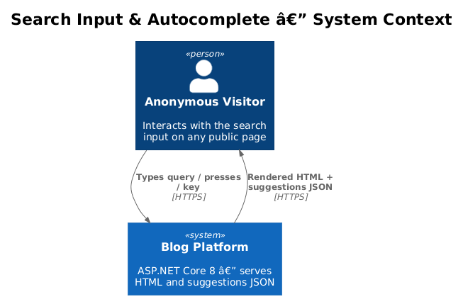
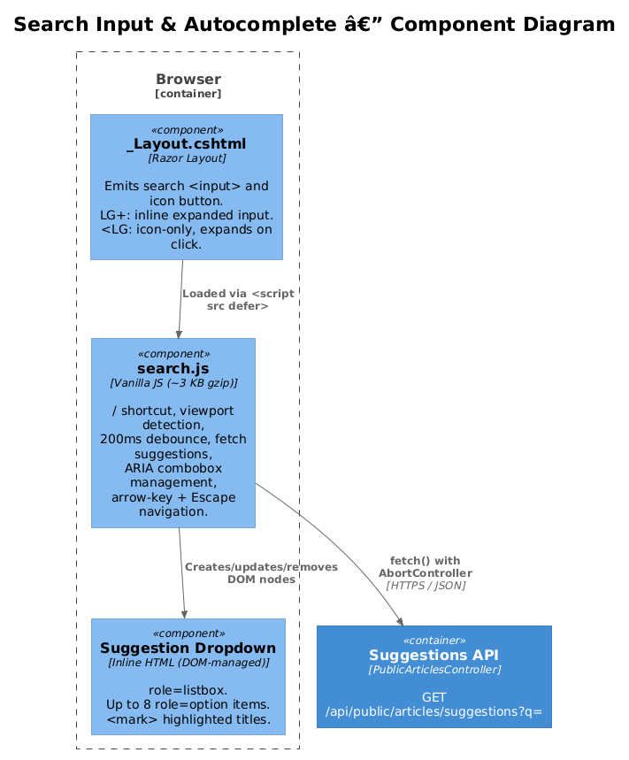
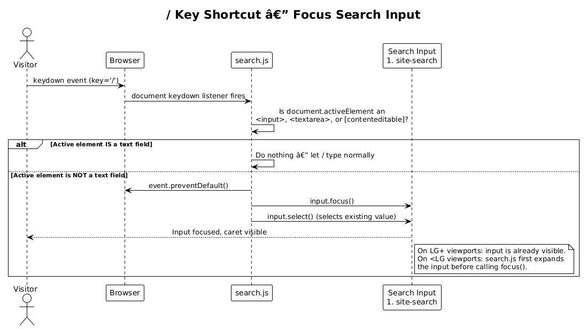
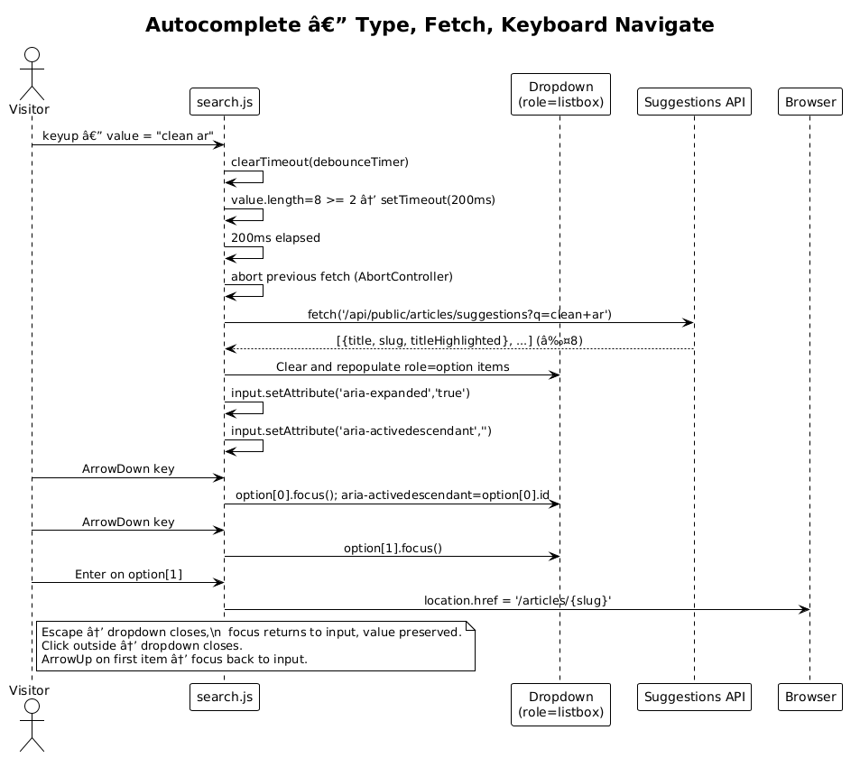

# Search Input & Autocomplete — Detailed Design

**Traces to:** L1-013, L2-043, L2-044, L2-045, L2-051, L2-052, L2-053

## 1. Overview

This design covers the global search input component embedded in the public site's shared layout (`_Layout.cshtml`) and the client-side JavaScript (`search.js`) that drives:

1. **Viewport-adaptive rendering** — expanded text field on large screens, icon-only collapsed state on small screens
2. **`/` keyboard shortcut** — focuses the input from anywhere on the page
3. **Live autocomplete suggestions** — debounced fetch to `/api/public/articles/suggestions`, rendered as an ARIA `combobox` / `listbox` dropdown
4. **Navigation** — selecting a suggestion navigates directly to the article; submitting the form navigates to `/search?q=`

No external UI library or framework is used. The component is implemented in vanilla HTML, CSS, and approximately 120 lines of vanilla JavaScript (≤3 KB gzip), consistent with the project's existing minimal-JavaScript philosophy (L2-017).

**Actors:** Anonymous visitors on any public page (index, article detail, feed, etc.)

**Scope boundary:** This design covers `_Layout.cshtml` modifications and `search.js` only. The backend suggestions endpoint is covered in design 11; the `/search` results page is covered in design 13.

## 2. Architecture

### 2.1 C4 Context Diagram



### 2.2 C4 Component Diagram



## 3. Component Details

### 3.1 `_Layout.cshtml` — Header Search HTML

The header `<nav>` block gains a search form and a magnifying-glass icon button. The form targets `/search` via `GET` so it degrades gracefully when JavaScript is disabled.

```html
<!-- Inside the <header> / <nav>, right-hand side -->
<div class="search-wrapper" role="search">
    <!-- LG+ viewports: inline expanded input -->
    <form action="/search" method="get" class="search-form" id="site-search-form">
        <label for="site-search" class="sr-only">Search articles</label>
        <span class="search-icon" aria-hidden="true">
            <svg ...><!-- magnifying glass --></svg>
        </span>
        <input
            type="search"
            id="site-search"
            name="q"
            class="search-input"
            placeholder="Search articles…"
            autocomplete="off"
            aria-label="Search articles"
            aria-autocomplete="list"
            aria-controls="search-suggestions"
            aria-expanded="false"
            maxlength="200"
            spellcheck="false" />
        <kbd class="search-shortcut" aria-hidden="true">/</kbd>
        <button type="button" class="search-clear" aria-label="Clear search" hidden>
            <svg ...><!-- × --></svg>
        </button>
    </form>

    <!-- SM/XS viewports: icon button that expands the form -->
    <button type="button" class="search-toggle" aria-label="Open search" aria-expanded="false">
        <svg ...><!-- magnifying glass --></svg>
    </button>

    <!-- Autocomplete dropdown (managed entirely by search.js) -->
    <ul id="search-suggestions" role="listbox" aria-label="Search suggestions" hidden></ul>
</div>
```

**CSS breakpoint rules (added to the existing inline `<style>` block):**

```css
/* LG+ (>= 992px): show form, hide toggle button */
.search-form   { display: flex; align-items: center; }
.search-toggle { display: none; }

@media (max-width: 991px) {
    /* SM/XS: hide form, show toggle icon */
    .search-form   { display: none; }
    .search-toggle { display: flex; }

    /* When JS adds .search-expanded to <header>, show the form full-width */
    header.search-expanded .search-form   { display: flex; width: 100%; }
    header.search-expanded .search-toggle { display: none; }
}

/* Hide the / shortcut hint once the input has focus or a value */
.search-input:focus ~ .search-shortcut,
.search-input:not(:placeholder-shown) ~ .search-shortcut { display: none; }

/* <mark> highlight in dropdown */
#search-suggestions mark { background: #3B82F6; color: #fff; border-radius: 2px; padding: 0 2px; }
```

### 3.2 `search.js` — Keyboard Shortcut

`search.js` is loaded with `<script src="/js/search.js" defer></script>` in `_Layout.cshtml`. It runs after the DOM is interactive but before `DOMContentLoaded` blocks the page.

**`/` key shortcut implementation:**

```javascript
document.addEventListener('keydown', (e) => {
    if (e.key !== '/') return;
    const active = document.activeElement;
    const isTextField = active &&
        (active.tagName === 'INPUT' ||
         active.tagName === 'TEXTAREA' ||
         active.isContentEditable);
    if (isTextField) return; // let the / type normally
    e.preventDefault();
    expandSearch();   // no-op on LG+; expands header on <LG
    input.focus();
    input.select();
});
```

**Small-screen expand/collapse:**

```javascript
function expandSearch() {
    if (window.innerWidth >= 992) return; // already visible
    document.querySelector('header').classList.add('search-expanded');
    toggleBtn.setAttribute('aria-expanded', 'true');
}

function collapseSearch() {
    if (window.innerWidth >= 992) return;
    document.querySelector('header').classList.remove('search-expanded');
    toggleBtn.setAttribute('aria-expanded', 'false');
    closeSuggestions();
}

toggleBtn.addEventListener('click', () => {
    const expanded = toggleBtn.getAttribute('aria-expanded') === 'true';
    expanded ? collapseSearch() : (expandSearch(), input.focus());
});
```

### 3.3 `search.js` — Autocomplete / ARIA Combobox

The input implements the [ARIA 1.1 Combobox pattern](https://www.w3.org/TR/wai-aria-practices/#combobox):

- `input` has `role="combobox"`, `aria-expanded`, `aria-controls="search-suggestions"`, `aria-activedescendant`
- `#search-suggestions` has `role="listbox"`
- Each rendered `<li>` has `role="option"` and a unique `id` (`suggestion-0`, `suggestion-1`, …)

**Debounced fetch:**

```javascript
let debounceTimer = null;
let currentFetch = null;

input.addEventListener('input', () => {
    updateClearButton();
    closeSuggestions();
    clearTimeout(debounceTimer);
    if (input.value.trim().length < 2) return;
    debounceTimer = setTimeout(fetchSuggestions, 200);
});

async function fetchSuggestions() {
    if (currentFetch) currentFetch.abort();
    const controller = new AbortController();
    currentFetch = controller;
    const q = encodeURIComponent(input.value.trim());
    try {
        const res = await fetch(`/api/public/articles/suggestions?q=${q}`,
            { signal: controller.signal });
        if (!res.ok) return;
        const items = await res.json();
        renderSuggestions(items);
    } catch (err) {
        if (err.name !== 'AbortError') console.warn('Suggestions fetch failed', err);
    }
}
```

**Render suggestions (innerHTML is safe — server HTML-encodes and only inserts `<mark>`):**

```javascript
function renderSuggestions(items) {
    list.innerHTML = '';
    if (!items.length) { closeSuggestions(); return; }
    items.forEach((item, i) => {
        const li = document.createElement('li');
        li.setAttribute('role', 'option');
        li.id = `suggestion-${i}`;
        li.innerHTML = item.titleHighlighted; // safe: server-encoded + <mark> only
        li.addEventListener('click', () => navigate(item.slug));
        li.addEventListener('keydown', (e) => handleOptionKey(e, i, items));
        li.tabIndex = -1;
        list.appendChild(li);
    });
    list.hidden = false;
    input.setAttribute('aria-expanded', 'true');
}
```

**Keyboard navigation:**

```javascript
input.addEventListener('keydown', (e) => {
    if (e.key === 'ArrowDown' && !list.hidden) {
        e.preventDefault();
        const first = list.querySelector('[role=option]');
        if (first) { first.focus(); setActivedescendant(first.id); }
    }
    if (e.key === 'Escape') { collapseSearch(); }
    if (e.key === 'Enter' && !list.hidden) { /* form submit handled natively */ }
});

function handleOptionKey(e, i, items) {
    if (e.key === 'ArrowDown') {
        e.preventDefault();
        const next = list.children[i + 1];
        if (next) { next.focus(); setActivedescendant(next.id); }
    }
    if (e.key === 'ArrowUp') {
        e.preventDefault();
        if (i === 0) { input.focus(); setActivedescendant(''); }
        else { const prev = list.children[i - 1]; prev.focus(); setActivedescendant(prev.id); }
    }
    if (e.key === 'Enter') { e.preventDefault(); navigate(items[i].slug); }
    if (e.key === 'Escape') { closeSuggestions(); input.focus(); }
    if (e.key === 'Tab') closeSuggestions();
}

function navigate(slug) { window.location.href = `/articles/${slug}`; }
```

**Dismiss on outside click:**

```javascript
document.addEventListener('click', (e) => {
    if (!e.target.closest('.search-wrapper')) closeSuggestions();
});
```

### 3.4 `search.js` — Clear Button

```javascript
function updateClearButton() {
    clearBtn.hidden = input.value.length === 0;
    // Also hide the / shortcut hint
}

clearBtn.addEventListener('click', () => {
    input.value = '';
    input.focus();
    closeSuggestions();
    updateClearButton();
});
```

## 4. Data Model

There is no server-side data model for this feature. All state is in-memory within the browser:

| Variable | Type | Description |
|----------|------|-------------|
| `debounceTimer` | `number \| null` | setTimeout handle; reset on each keyup |
| `currentFetch` | `AbortController \| null` | Cancelled when a new request starts |
| `list` | `HTMLUListElement` | Reference to `#search-suggestions` |
| `input` | `HTMLInputElement` | Reference to `#site-search` |

## 5. Key Workflows

### 5.1 `/` Keyboard Shortcut



### 5.2 Autocomplete — Type, Fetch, Navigate



## 6. API Contracts

This feature consumes `GET /api/public/articles/suggestions?q={query}` (defined in design 11). `search.js` reads `titleHighlighted` (HTML-safe string with `<mark>` tags) and `slug` from each suggestion object.

## 7. Security Considerations

| Threat | Mitigation |
|--------|-----------|
| XSS via `titleHighlighted` in dropdown | `titleHighlighted` is produced by `SearchHighlighter` (design 11), which HTML-encodes the source text before injecting `<mark>`. No user-typed content is ever inserted as raw HTML into the DOM — only the pre-encoded server response. |
| Reflected XSS via the `q` parameter in form submission | `action="/search" method="get"` causes the browser to URL-encode the `q` value. The results page (design 13) HTML-encodes the query before rendering it in the heading. |
| Open redirect via `navigate(slug)` | `navigate()` constructs URLs as `/articles/{slug}` — a fixed-prefix relative URL. The `slug` value comes from the server-controlled suggestion response, not from user input. |
| Clickjacking the search input | The existing `X-Frame-Options: DENY` header (design 08) prevents the page from being embedded in a frame. |
| Excessive suggestion requests | `search.js` uses a 200 ms debounce and `AbortController` — at most one in-flight request exists at any time. The server enforces a minimum query length of 2 characters (returns `[]` immediately for shorter inputs). |
