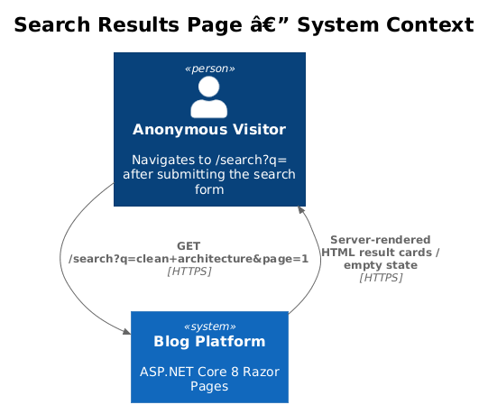
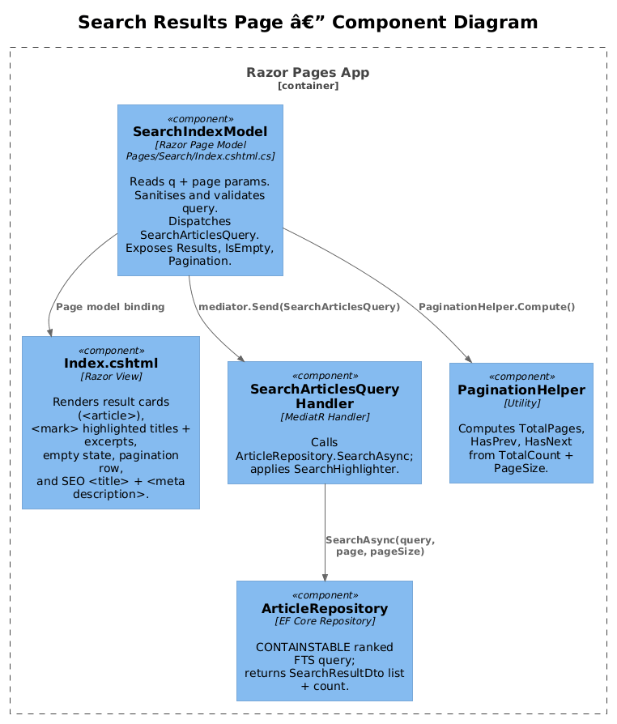
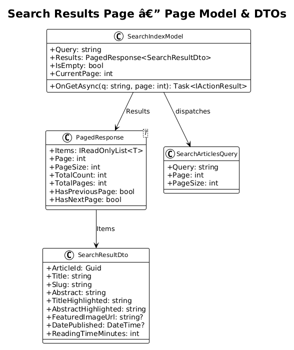
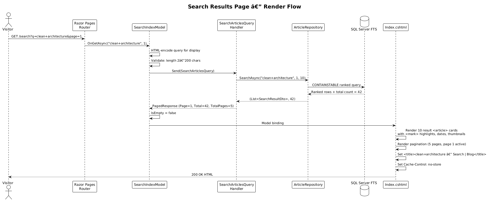
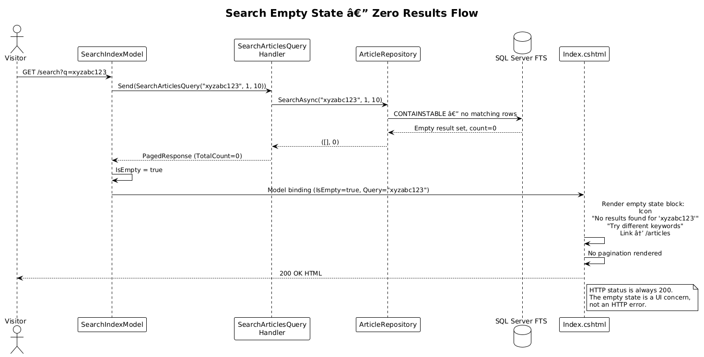

# Search Results Page — Detailed Design

**Traces to:** L1-013, L2-046, L2-047, L2-048, L2-049, L2-050, L2-051, L2-052, L2-053

## 1. Overview

This design covers the dedicated `/search` Razor Page that renders full-text search results. The page is server-rendered (SSR), requires no JavaScript to display results, and is reachable by navigating to `/search?q={query}&page={n}` directly or by submitting the search form from any public page.

The page displays:
- A heading echoing the search query: `Results for "azure"`
- A result count: `42 results`
- Up to 10 `<article>` result cards per page, with `<mark>`-highlighted title and excerpt
- Numbered pagination with Previous / Next controls
- A meaningful empty state when no articles match

**Actors:** Anonymous visitors — no authentication required.

**Scope boundary:** This design covers `Pages/Search/Index.cshtml` and `Pages/Search/Index.cshtml.cs` only. The search infrastructure (FTS query, highlighting) is covered in design 11; the header input and autocomplete are in design 12.

## 2. Architecture

### 2.1 C4 Context Diagram



### 2.2 C4 Component Diagram



## 3. Component Details

### 3.1 `SearchIndexModel` — Page Model

**File:** `src/Blog.Api/Pages/Search/Index.cshtml.cs`

```csharp
public class SearchIndexModel(IMediator mediator) : PageModel
{
    public string Query { get; private set; } = string.Empty;
    public PagedResponse<SearchResultDto> Results { get; private set; } = new();
    public bool IsEmpty => Results.TotalCount == 0 && !string.IsNullOrWhiteSpace(Query);
    public int CurrentPage { get; private set; } = 1;

    public async Task<IActionResult> OnGetAsync(
        [FromQuery(Name = "q")] string? q,
        [FromQuery(Name = "page")] int page = 1)
    {
        // Empty query → render empty state immediately, no DB call
        if (string.IsNullOrWhiteSpace(q))
        {
            Query = string.Empty;
            return Page();
        }

        // Enforce max length per L2-053
        if (q.Length > 200)
            q = q[..200];

        Query = q.Trim();
        CurrentPage = Math.Max(1, page);

        Results = await mediator.Send(
            new SearchArticlesQuery(Query, CurrentPage, 10));

        // Set page title and cache control
        ViewData["Title"] = $"{HtmlEncoder.Default.Encode(Query)} — Search";
        Response.Headers.CacheControl = "no-store"; // search results must not be cached

        return Page();
    }
}
```

**Cache policy:** `no-store` — search results are personalised by query and must not be served from a shared cache. This does not affect non-search pages.

### 3.2 `Index.cshtml` — Razor View

**File:** `src/Blog.Api/Pages/Search/Index.cshtml`

The view is structured as follows:

```html
@page "/search"
@model SearchIndexModel
@{
    Layout = "_Layout";
    ViewData["Title"] = Model.Query.Length > 0
        ? $"{Html.Encode(Model.Query)} — Search | {Configuration["Site:Name"]}"
        : $"Search | {Configuration["Site:Name"]}";
    ViewData["Description"] = Model.Query.Length > 0
        ? $"Search results for '{Html.Encode(Model.Query)}'"
        : "Search published articles";
}

<main id="main-content">
    <section class="search-results-header">
        <h1>
            @if (Model.Query.Length > 0)
            {
                <span>Results for</span>
                <q>@Model.Query</q>   <!-- HTML-encodes automatically -->
            }
            else { <span>Search</span> }
        </h1>
        @if (!Model.IsEmpty)
        {
            <p aria-live="polite" class="result-count">
                @Model.Results.TotalCount result@(Model.Results.TotalCount == 1 ? "" : "s")
            </p>
        }
    </section>

    @if (Model.IsEmpty)
    {
        <!-- Empty state (L2-048) -->
        <section class="search-empty" aria-label="No results">
            <svg ...><!-- search icon --></svg>
            <p class="empty-heading">No results found for <q>@Model.Query</q></p>
            <p class="empty-hint">Try different keywords or fewer terms.</p>
            <a href="/articles" class="btn btn-secondary">Browse all articles</a>
        </section>
    }
    else if (!string.IsNullOrWhiteSpace(Model.Query))
    {
        <!-- Result cards -->
        <ol class="search-results" aria-label="Search results">
            @foreach (var result in Model.Results.Items)
            {
                <li>
                    <article class="result-card" data-testid="search-result">
                        <div class="result-card-body">
                            <h2 class="result-title">
                                <a href="/articles/@result.Slug">
                                    @Html.Raw(result.TitleHighlighted)
                                </a>
                            </h2>
                            <p class="result-excerpt">@Html.Raw(result.AbstractHighlighted)</p>
                            <footer class="result-meta">
                                <span class="result-type">Article</span>
                                <time datetime="@result.DatePublished?.ToString("yyyy-MM-dd")">
                                    @result.DatePublished?.ToString("MMMM d, yyyy")
                                </time>
                                <span class="result-reading-time">
                                    @result.ReadingTimeMinutes min read
                                </span>
                            </footer>
                        </div>
                        @if (result.FeaturedImageUrl != null)
                        {
                            <div class="result-card-thumb">
                                
                            </div>
                        }
                    </article>
                </li>
            }
        </ol>

        <!-- Pagination (L2-049) -->
        @if (Model.Results.TotalPages > 1)
        {
            <nav aria-label="Search results pages" class="pagination">
                @if (Model.Results.HasPreviousPage)
                {
                    <a href="/search?q=@Uri.EscapeDataString(Model.Query)&page=@(Model.CurrentPage - 1)"
                       rel="prev" class="page-link">← Previous</a>
                }
                else
                {
                    <span class="page-link disabled" aria-disabled="true">← Previous</span>
                }

                @for (int p = 1; p <= Model.Results.TotalPages; p++)
                {
                    @if (p == Model.CurrentPage)
                    {
                        <span class="page-link active" aria-current="page">@p</span>
                    }
                    else
                    {
                        <a href="/search?q=@Uri.EscapeDataString(Model.Query)&page=@p"
                           class="page-link">@p</a>
                    }
                }

                @if (Model.Results.HasNextPage)
                {
                    <a href="/search?q=@Uri.EscapeDataString(Model.Query)&page=@(Model.CurrentPage + 1)"
                       rel="next" class="page-link">Next →</a>
                }
                else
                {
                    <span class="page-link disabled" aria-disabled="true">Next →</span>
                }
            </nav>
        }
    }
</main>
```

### 3.3 Result Card — Responsive Layout

The result card uses a CSS flex layout that adapts across breakpoints:

```css
.result-card {
    display: flex;
    gap: 20px;
    align-items: flex-start;
    padding: 24px 0;
    border-bottom: 1px solid #1E1E1E;
}

.result-card-body   { flex: 1; min-width: 0; }
.result-card-thumb  { flex-shrink: 0; width: 180px; }
.result-card-thumb img { width: 180px; height: 101px; object-fit: cover; border-radius: 4px; }

/* XS: hide thumbnail, full-width single column */
@media (max-width: 575px) {
    .result-card-thumb { display: none; }
}

/* Constrained reading column on XL */
.search-results-header,
.search-results,
.pagination {
    max-width: 860px;
    margin-inline: auto;
}
```

### 3.4 SEO and Discoverability

- `<title>`: `{HTML-encoded query} — Search | {Site Name}` (per L2-046)
- `<meta name="description">`: `Search results for '{query}'`
- The search page is listed in `robots.txt` as `Disallow: /search` to prevent search engines from indexing search result pages (avoids duplicate content indexing)
- No `<link rel="canonical">` on the search page — it is already excluded from crawl

### 3.5 `PagedResponse<T>` Extension

The existing `PagedResponse<T>` in `Common/Models/` needs `TotalPages`, `HasPreviousPage`, and `HasNextPage` computed properties if not already present:

```csharp
public class PagedResponse<T>
{
    public IReadOnlyList<T> Items { get; set; } = [];
    public int Page { get; set; }
    public int PageSize { get; set; }
    public int TotalCount { get; set; }
    public int TotalPages => PageSize > 0 ? (int)Math.Ceiling((double)TotalCount / PageSize) : 0;
    public bool HasPreviousPage => Page > 1;
    public bool HasNextPage => Page < TotalPages;
}
```

## 4. Data Model

### 4.1 Class Diagram



### 4.2 Entity Descriptions

**`SearchIndexModel`** — the Razor Page model. `IsEmpty` is `true` only when a non-empty query was submitted but produced zero results. An empty `Query` (blank URL visit) renders a neutral state with just the search heading, not the empty-state illustration.

**`SearchResultDto`** — consumed from the `SearchArticlesQuery` response. `TitleHighlighted` and `AbstractHighlighted` are rendered via `Html.Raw()` — they are pre-encoded by `SearchHighlighter` (design 11) and contain only `<mark>` tags.

**`PagedResponse<SearchResultDto>`** — the same generic envelope used by existing article listing pages. The `TotalPages`, `HasPreviousPage`, and `HasNextPage` derived properties drive the pagination component.

## 5. Key Workflows

### 5.1 Results Page Render



### 5.2 Empty State



## 6. API Contracts

The `/search` Razor Page is a server-rendered GET endpoint. It is not a REST API endpoint and does not return JSON.

**URL:** `GET /search?q={query}&page={n}`

| Parameter | Type | Constraints |
|-----------|------|-------------|
| `q` | string | optional; 0–200 chars; truncated to 200 if longer |
| `page` | int | optional; default 1; clamped to `Math.Max(1, page)` |

**Response:** `200 OK` with `Content-Type: text/html` in all cases (including zero results and empty query). HTTP errors are not used for search state — the UI communicates result state visually.

## 7. Security Considerations

| Threat | Mitigation |
|--------|-----------|
| Reflected XSS via `q` in page heading | `Model.Query` is emitted inside a `<q>` element using Razor's default HTML encoding — it cannot break out of the text context |
| Reflected XSS via `q` in `<title>` | `ViewData["Title"]` uses `HtmlEncoder.Default.Encode(Query)` before assignment |
| Reflected XSS via `Html.Raw(result.TitleHighlighted)` | `TitleHighlighted` is generated by `SearchHighlighter` (design 11) which HTML-encodes the source then inserts only `<mark>` — the result is safe to render raw |
| Path traversal via `slug` in pagination links | `slug` values come from the database, not from user input; `Uri.EscapeDataString(Model.Query)` ensures the query string value in pagination hrefs is safely encoded |
| Cache poisoning | `Cache-Control: no-store` prevents caching of search results at any intermediary |
| Query length denial of service | Queries longer than 200 characters are truncated server-side before reaching the FTS engine; no unbounded FTS query is possible |
| Search engine duplicate content | `/search` is disallowed in `robots.txt` — search engine crawlers will not index result pages |
