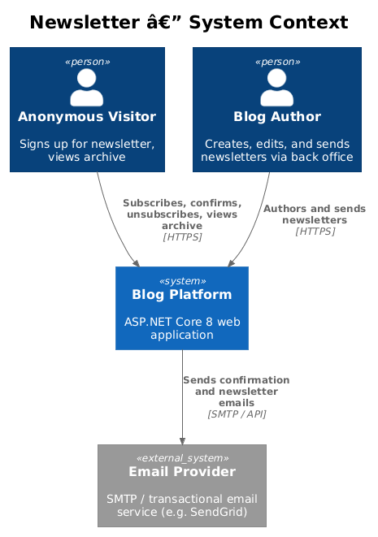
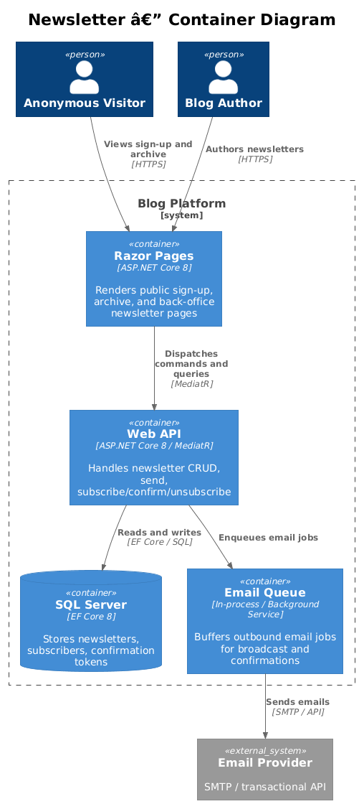
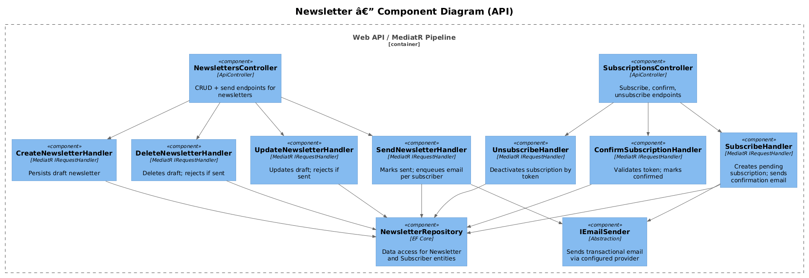
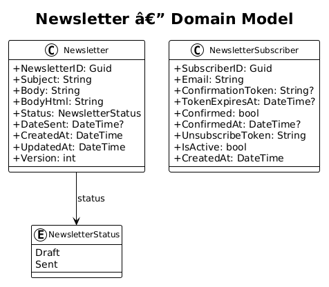
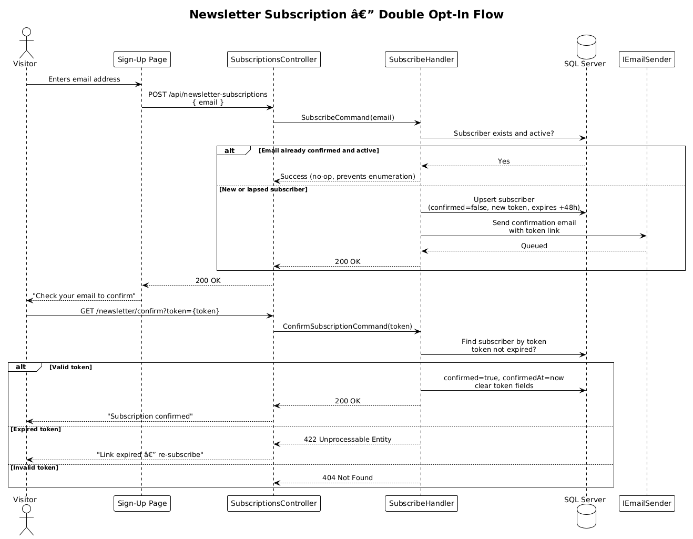
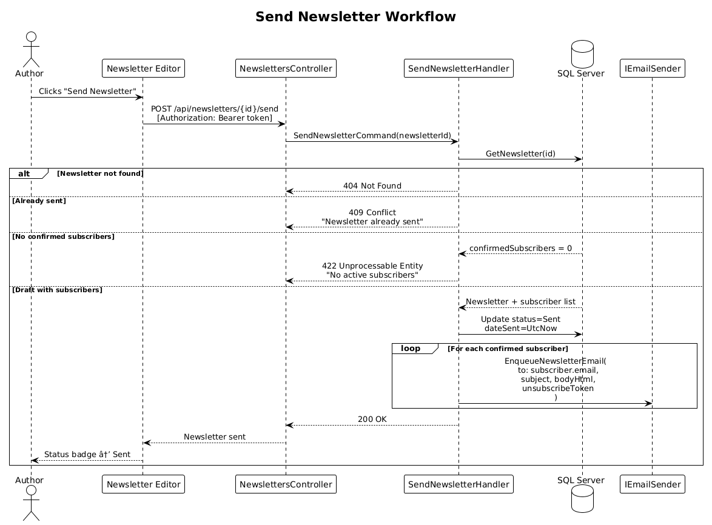

# Newsletter — Detailed Design

## 1. Overview

The Newsletter feature allows the blog author to compose and send email newsletters to confirmed subscribers. Anonymous visitors can sign up via a public form, confirm their subscription through a double opt-in link, and unsubscribe at any time. Sent newsletters are also viewable in a public web archive.

### Requirements Traceability

| Requirement | Description |
|-------------|-------------|
| L1-014 | Newsletter authoring, publishing, subscriber management, and public archive |
| L2-054 | Newsletter subscription sign-up |
| L2-055 | Subscription confirmation (double opt-in) |
| L2-056 | Unsubscribe |
| L2-057 | Create newsletter |
| L2-058 | Edit newsletter |
| L2-059 | Delete newsletter |
| L2-060 | Send newsletter |
| L2-061 | List newsletters (back office) |
| L2-062 | Subscriber management (back office) |
| L2-063 | Public newsletter archive |

### Actors

- **Anonymous Visitor** — subscribes, confirms, unsubscribes, views archive
- **Blog Author** — creates, edits, sends, and deletes newsletters via back office

---

## 2. Architecture

### 2.1 C4 Context Diagram



### 2.2 C4 Container Diagram



### 2.3 C4 Component Diagram



---

## 3. Component Details

### 3.1 NewslettersController

- **Responsibility**: Exposes authenticated API endpoints for newsletter CRUD and send operations.
- **Interfaces**:
  - `POST /api/newsletters` — create draft
  - `PUT /api/newsletters/{id}` — update draft
  - `DELETE /api/newsletters/{id}` — delete draft
  - `POST /api/newsletters/{id}/send` — send newsletter
  - `GET /api/newsletters/{id}` — back-office detail by PK; used by the edit form to pre-populate fields
  - `GET /api/newsletters` — paginated list (with optional `status` filter)
- **Dependencies**: MediatR dispatcher, JWT middleware (all endpoints require `[Authorize]`)

### 3.2 SubscriptionsController

- **Responsibility**: Public endpoints for subscription lifecycle — sign-up, confirmation, unsubscribe.
- **Interfaces**:
  - `POST /api/newsletter-subscriptions` — subscribe (anonymous); returns 202 (confirmation email delivery is recorded in the transactional outbox atomically with the subscriber insert; 202 signals "accepted, check your email" — the email itself is dispatched asynchronously by the outbox worker)
  - `POST /api/newsletter-subscriptions/confirm` — confirm subscription via token in request body (anonymous); POST prevents link prefetchers from accidentally activating the confirmation
  - `DELETE /api/newsletter-subscriptions/{token}` — unsubscribe (anonymous, token-based); returns 204; idempotent — if the subscriber is already inactive the endpoint still returns 204 (prevents status enumeration)
  - `GET /api/subscribers` — paginated subscriber list (auth-guarded, for back office). The route lives on `SubscriptionsController` rather than a separate admin controller because the subscriber lifecycle (subscribe, confirm, unsubscribe, list) is cohesive within this controller. A future back-office controller split is straightforward — the route path itself is not coupled to the controller class name.
- **Security**: No authentication required for sign-up/confirm/unsubscribe. Tokens are opaque random values (not guessable). The sign-up endpoint never reveals whether an email is already subscribed (L2-054.2). The confirmation endpoint uses POST (not GET) to prevent HTTP proxies and link-preview crawlers from pre-fetching and unintentionally confirming subscriptions (OWASP A01 — using GET for state-changing operations is unsafe).
- **Unsubscribe token Referer leakage**: The unsubscribe token appears in the URL path (`DELETE /api/newsletter-subscriptions/{token}`). When a user visits a page containing third-party resources (analytics, fonts, images), browsers may send the full URL — including the token — in the `Referer` request header to those third-party origins. Mitigation: the Razor Page that renders the unsubscribe confirmation must set `Referrer-Policy: no-referrer` (or `strict-origin-when-cross-origin`) in its HTTP response headers so the token is not forwarded to third-party origins. Additionally, unsubscribe confirmation links sent in emails should be loaded as the sole navigation on that page rather than embedded in pages with external resource loads. The token itself remains sufficient as proof of intent since it is a 256-bit CSPRNG value; the Referer risk is about token disclosure, not forgery.

### 3.3 Command Handlers

| Handler | Command | Validator | Effect |
|---------|---------|-----------|--------|
| `CreateNewsletterHandler` | `CreateNewsletterCommand` | `CreateNewsletterCommandValidator` — rules: `Subject` NotEmpty, MaximumLength(512); `Body` NotEmpty | Persists newsletter with `status=Draft`; sets `CreatedAt = UpdatedAt = UtcNow` and `Version = 1` on insert. `UpdatedAt` must be explicitly set on insert (not left to a DB default) so that the value is always populated and consistent with the EF Core entity model — EF Core does not automatically populate `UpdatedAt` on insert unless a value converter or `SaveChanges` interceptor is configured. |
| `UpdateNewsletterHandler` | `UpdateNewsletterCommand` | `UpdateNewsletterCommandValidator` — rules: `Subject` NotEmpty, MaximumLength(512); `Body` NotEmpty; `Version` GreaterThan(0) | Updates draft; returns 409 if sent (L2-058.2) or if `version` mismatches (optimistic concurrency) |
| `DeleteNewsletterHandler` | `DeleteNewsletterCommand` | — | Deletes draft; returns 409 if sent (L2-059.2). **`NewsletterSendLog` cascade note**: the `NewsletterSendLog` FK on `NewsletterId` is configured `ON DELETE CASCADE`, but this cascade is always a no-op on draft deletion — only `Sent` newsletters have send log rows, and those cannot be deleted (409 guard above). No pre-delete check of `NewsletterSendLog` is needed. |
| `SendNewsletterHandler` | `SendNewsletterCommand` | — | Sets `status=Sent`, `dateSent=UtcNow`; writes one `OutboxMessage` row per confirmed subscriber into the outbox table **within the same DB transaction** as the status change (L2-060); calls `ICacheInvalidator` to bust the public archive list cache after the transaction commits. The outbox rows contain the serialised delivery payload (`{ newsletterId, subscriberId, email }`) — the unsubscribe URL is not stored; it is computed at dispatch time by `NewsletterEmailDispatchService` using `IUnsubscribeTokenService.GenerateToken(subscriberId)` (§3.10). The `OutboxDispatchService` (§3.9) later dequeues and forwards outbox rows to Azure Service Bus. Because the status flip and outbox inserts share a single `SaveChangesAsync` call, there is no window in which the newsletter is `Sent` with zero durable dispatch work — if the transaction fails, both the status change and the outbox rows are rolled back. |
| `SubscribeHandler` | `SubscribeCommand` | `SubscribeCommandValidator` | Upserts subscriber record; writes a `ConfirmationEmail` `OutboxMessage` row **within the same DB transaction** as the subscriber insert/update (L2-054). Because the subscriber row and the outbox row share a single `SaveChangesAsync` call, there is no state in which the subscriber exists without a durable delivery intent — if the transaction fails, both rows are rolled back and the visitor can safely retry. The confirmation email is dispatched asynchronously by `OutboxDispatchService` (§3.9), which calls `IEmailSender.SendConfirmationEmailAsync`. Moving delivery out of the HTTP request path eliminates the previous coupling between response latency and the SendGrid call, and removes the need to roll back the subscriber insert on email-send failure — the outbox worker retries independently. The `Email` column has a unique index; if two concurrent requests for the same email both pass the initial existence check and both attempt insert, the second will hit a unique constraint violation — the handler must catch this exception and treat it as a successful no-op (returning 202), not bubble a 500. |
| `ConfirmSubscriptionHandler` | `ConfirmSubscriptionCommand` | `ConfirmSubscriptionCommandValidator` | Receives the raw confirmation token from the request body, computes `SHA256.HashData` and hex-encodes it, then calls `GetSubscriberByConfirmationTokenHashAsync(hash)` to look up the subscriber. Validates the 48h expiry window; returns 422 if no matching hash is found (token not found or already used), or if the token has expired; on success sets `Confirmed = true`, `ConfirmedAt = UtcNow`, `ConfirmationTokenHash = null`, `TokenExpiresAt = null`, and `UpdatedAt = UtcNow` (L2-055). `ConfirmationTokenHash` and `TokenExpiresAt` are single-use and must be cleared atomically with the `Confirmed = true` write so that a replay of the same token is rejected at the lookup step (the hash lookup returns null once the column is null). The expiry check must use strict less-than (`TokenExpiresAt < UtcNow`), meaning a token submitted at exactly the boundary instant is still accepted. This avoids penalising users who click a link in the final second of the window due to clock skew or network delay. **Null `TokenExpiresAt` guard**: `TokenExpiresAt` is nullable — it is cleared to null after a subscriber is confirmed (single-use token). `GetSubscriberByConfirmationTokenHashAsync` looks up by `ConfirmationTokenHash`; because `ConfirmationTokenHash` is also set to null on confirmation, a confirmed subscriber will not be returned by this lookup — the handler reaches the "token not found" 422 branch before the expiry check is reached. However, as a defensive guard against malformed rows (`Confirmed = false` with `TokenExpiresAt = null`), the expiry check must treat a null `TokenExpiresAt` as expired and return 422. The handler must therefore check `TokenExpiresAt == null || TokenExpiresAt < UtcNow` rather than relying on a direct null comparison that evaluates to `false` in C# and would incorrectly pass the expiry gate for a malformed row. `ConfirmSubscriptionCommandValidator` rules: `Token` must be non-empty (NotEmpty) and ≤ 128 chars (MaximumLength(128)) — matching the raw token length. Requests failing these rules are rejected with 400 before any hashing or DB lookup is attempted. |
| `UnsubscribeHandler` | `UnsubscribeCommand` | — | Receives the compound unsubscribe token from the URL path, calls `IUnsubscribeTokenService.ValidateAndExtractSubscriberId(token)` (§3.10) to verify the HMAC signature and extract the `subscriberId`. If the HMAC is invalid, the handler treats it as a no-op and returns 204 (same as a miss — prevents token enumeration). On valid HMAC, looks up the subscriber by `subscriberId` (PK), sets `IsActive = false`, and clears `ConfirmationTokenHash = null` and `TokenExpiresAt = null` (L2-056). Clearing `ConfirmationTokenHash` on unsubscribe invalidates any pending opt-in link for a subscriber who unsubscribes before confirming — without this, the subscriber could reactivate their subscription by clicking the old confirmation link after having explicitly unsubscribed. Always returns 204 regardless of whether the HMAC is valid, the subscriber exists, is already inactive, or was never issued — the endpoint is fully idempotent and must not reveal token validity or subscriber existence. |

### 3.4 NewsletterRepository

- **Responsibility**: Data access for `Newsletter`, `NewsletterSubscriber`, `NewsletterSendLog`, and `OutboxMessage` entities.
- **Key methods**: `GetByIdAsync`, `GetAllAsync(page, pageSize, status?)`, `GetBySlugAsync(slug)`, `SlugExistsAsync(slug)`, `StreamConfirmedSubscribersAsync()`, `GetSubscribersAsync(page, pageSize)`, `GetSubscriberByEmailAsync(email)`, `GetSubscriberByConfirmationTokenHashAsync(tokenHash)`, `GetSubscriberByIdAsync(subscriberId)`, `AddSubscriberAsync(entity)`, `UpdateSubscriberAsync(entity)`, `AddOutboxMessageAsync(entity)`, `AddOutboxMessagesAsync(entities)` (batch insert for newsletter send)
- **`GetAllAsync` sort behaviour**: When `status` is null (all newsletters) or `status=Draft`, results are ordered by `CreatedAt DESC` (newest draft first). When `status=Sent`, results are ordered by `DateSent DESC` (most recently sent newsletter first) — this is more useful for the back-office list than `CreatedAt DESC` because a newsletter may have been drafted long before it was sent. The caller (`GetNewslettersHandler`) must pass the sort column choice through to the repository based on the resolved status value. An unrecognised `status` string is rejected with 400 at the controller level before the repository is called.
- **`NewsletterSendLog` methods**: `SendLogExistsAsync(newsletterId, subscriberId)` — returns `bool`; called by `NewsletterEmailDispatchService` before sending to enforce idempotency. `AddSendLogAsync(entity)` — inserts a `NewsletterSendLog` row atomically with message completion. These methods belong on `NewsletterRepository` (same bounded context) rather than a separate repository class — the log table is an implementation detail of the send pipeline and not queried from any other component.
- **Notes**: List queries project only `Subject`, `Slug`, `Status`, `DateSent`, `CreatedAt` — `Body`/`BodyHtml` excluded for performance (same pattern as `ArticleRepository`). `StreamConfirmedSubscribersAsync()` uses `IAsyncEnumerable<(Guid SubscriberId, string Email)>` — a projected value-tuple stream — to yield the two fields per subscriber that `SendNewsletterHandler` needs to construct `OutboxMessage` rows (`{ newsletterId, subscriberId, email }`) without a per-subscriber DB roundtrip. The unsubscribe token is no longer stored in the database; it is computed at email-dispatch time by `IUnsubscribeTokenService.GenerateToken(subscriberId)` (§3.10). Using `IAsyncEnumerable` avoids loading the full subscriber list into memory before writing outbox rows. The method must not yield `SubscriberId` alone (`IAsyncEnumerable<Guid>`) because doing so would force the handler to issue a separate `GetByIdAsync` call per subscriber — an O(N) DB roundtrip that degrades proportionally with subscriber count. `GetSubscriberByConfirmationTokenHashAsync(tokenHash)` accepts the pre-computed SHA-256 hex hash of the raw confirmation token and queries `WHERE ConfirmationTokenHash = @hash`; returns `null` when no matching row is found; callers are responsible for returning the appropriate 422 response. `GetSubscriberByIdAsync(subscriberId)` returns a subscriber by PK; used by `UnsubscribeHandler` after validating the HMAC-derived unsubscribe token (§3.10). `GetSubscriberByEmailAsync` returns `null` when no matching row exists; `SubscribeHandler` uses this to detect the upsert path. `AddSubscriberAsync` inserts a new subscriber row; the caller (handler) must set `CreatedAt = UpdatedAt = UtcNow` on the entity before calling — EF Core does not auto-populate `UpdatedAt` on insert without a `SaveChanges` interceptor, and no such interceptor is specified. `UpdateSubscriberAsync` saves changes to an existing subscriber row (confirm, unsubscribe, resubscribe paths); the caller must set `UpdatedAt = UtcNow` on the entity before calling for the same reason — this applies to all three mutation paths: `ConfirmSubscriptionHandler`, `UnsubscribeHandler`, and the resubscribe branch in `SubscribeHandler`. `AddOutboxMessageAsync(entity)` inserts a single `OutboxMessage` row (used by `SubscribeHandler` for the confirmation email). `AddOutboxMessagesAsync(entities)` batch-inserts multiple `OutboxMessage` rows (used by `SendNewsletterHandler` to insert one row per subscriber). Both methods add to the `DbContext` change tracker and do **not** call `SaveChangesAsync` — the caller is responsible for calling `SaveChangesAsync` to commit the outbox rows atomically with the domain state change.

### 3.5 Query Handlers

| Handler | Query | Returns |
|---------|-------|---------|
| `GetNewslettersHandler` | `GetNewslettersQuery(page, pageSize, status?)` | Paginated list for back office |
| `GetNewsletterByIdHandler` | `GetNewsletterByIdQuery(newsletterId)` | Single newsletter by PK (back office); 404 if not found. Returns the newsletter regardless of status — both `Draft` and `Sent` newsletters are returned; the handler applies no status filter. The response `NewsletterDto` includes the `status` field so the back-office form can render the appropriate read-only or editable state. |
| `GetNewsletterArchiveHandler` | `GetNewsletterArchiveQuery(page, pageSize)` | Paginated list of sent newsletters for public archive, ordered `DateSent DESC` (most recent first) |
| `GetNewsletterBySlugHandler` | `GetNewsletterBySlugQuery(slug)` | Single sent newsletter by slug; 404 if not found or not Sent |

### 3.6 PublicNewslettersController

- **Responsibility**: Unauthenticated endpoints for the public newsletter archive. Separate from `NewslettersController` to avoid auth middleware applying globally.
- **Interfaces**:
  - `GET /api/newsletters/archive` — paginated list of sent newsletters
  - `GET /api/newsletters/archive/{slug}` — single sent newsletter detail
- **Routing constraint**: Both `NewslettersController` (`GET /api/newsletters/{id}`) and `PublicNewslettersController` (`GET /api/newsletters/archive`) share the `api/newsletters` URL prefix. ASP.NET Core attribute routing resolves this correctly because `archive` is a literal segment and takes precedence over the `{id}` parameter segment when both match — literal segments always rank higher than parameter segments in ASP.NET Core's route matching order. No special registration ordering or route constraint (e.g. `[id:guid]`) is required, but applying a `Guid` route constraint to `{id}` on `NewslettersController` (e.g. `[HttpGet("{id:guid}")]`) is recommended to make the disambiguation explicit and to reject malformed IDs with 404 rather than a handler-level error.

### 3.7 NewsletterEmailDispatchService

- **Responsibility**: Background `IHostedService` that continuously dequeues messages from the Azure Service Bus newsletter queue and dispatches one email per subscriber via `IEmailSender`. Messages arrive on the queue via `OutboxDispatchService` (§3.9), which reads committed `OutboxMessage` rows and forwards them to Service Bus. Runs as a hosted service registered in `Program.cs` alongside the web host. The class name `NewsletterEmailDispatchService` is the single concrete implementation of this consumer; it must implement `IHostedService` (or extend `BackgroundService`) and be registered with `services.AddHostedService<NewsletterEmailDispatchService>()`.
- **Dependencies**: `IEmailSender`, `NewsletterRepository` (for `SendLogExistsAsync` and `AddSendLogAsync`), `ServiceBusClient` (injected via `IOptions<ServiceBusOptions>`)
- **Queue name**: The Service Bus queue name is read from `ServiceBusOptions:NewsletterQueueName` in `appsettings.json` (e.g. `"newsletter-dispatch"`). This value must also be set in the Azure infrastructure configuration (ARM/Bicep/Terraform) and in the application's environment-specific settings. `OutboxDispatchService` (§3.9) enqueues to the same queue name; both services must reference the identical configuration key so that the queue used for enqueue and the queue used for dequeue are always in sync.
- **DI scope**: `NewsletterEmailDispatchService` is registered as a singleton (all `IHostedService` registrations are singleton-lifetime by default in ASP.NET Core). `NewsletterRepository` and the EF Core `DbContext` it depends on are scoped services. A singleton cannot hold a direct constructor reference to a scoped service — doing so captures the scoped instance for the lifetime of the host, causing stale `DbContext` state and potential cross-request data leakage. **The service must inject `IServiceScopeFactory` and create a new `IServiceScope` for each dequeued message using `await using var scope = _scopeFactory.CreateAsyncScope()`**, resolving `NewsletterRepository` (and its `DbContext`) within that scope. The `await using` declaration guarantees that the scope — and the `DbContext` it owns — is disposed even if message processing throws an exception. A plain `var scope = ...` without `await using` or an explicit `try/finally` is incorrect: an exception before `scope.Dispose()` is called will leak the `DbContext` connection for the lifetime of the host. `IEmailSender` may be registered as singleton or transient depending on its implementation and can be injected directly if its lifetime permits; otherwise it too must be resolved per-scope.
- **Non-transient `IEmailSender` failures**: Not all `SendNewsletterEmailAsync` failures are worth retrying. A `400 Bad Request` from SendGrid (e.g. the subscriber's email address is syntactically invalid or has been permanently rejected by the provider) will never succeed regardless of retry count. If Service Bus retries such a message up to `MaxDeliveryCount` times, the full retry budget is consumed on a single undeliverable address before the message is dead-lettered — delaying processing of all subsequent messages on the same queue (or blocking the session, if session-based queues are used). **The consumer must distinguish transient failures from permanent failures**: (a) wrap `SendNewsletterEmailAsync` in a try/catch; (b) if the caught exception indicates a permanent provider rejection (e.g. HTTP 400/422 from the email API, or a typed `PermanentDeliveryException` thrown by the `IEmailSender` implementation), **dead-letter the message immediately** by calling `ServiceBusReceiver.DeadLetterMessageAsync` with a reason string (e.g. `"PermanentProviderRejection"`) rather than abandoning it (which re-enqueues and consumes a retry); (c) emit `newsletter.send_failed` at `Error` level with the subscriberId and reason so operators can identify bad addresses. This prevents a single bad address from stalling the delivery pipeline. The `IEmailSender` implementation contract must document which exception types indicate permanent failures so the consumer can make this determination reliably.

### 3.8 IEmailSender

- **Responsibility**: Abstraction over the transactional email provider. Implementations may use SMTP, SendGrid, or similar.
- **Key methods**: `SendConfirmationEmailAsync(email, confirmUrl)`, `SendNewsletterEmailAsync(email, subject, bodyHtml, unsubscribeUrl)`
- **Notes**: `SendNewsletterHandler` writes one `OutboxMessage` row per confirmed subscriber in the same DB transaction as the `status=Sent` update. `OutboxDispatchService` (§3.9) later reads those rows and enqueues them to Azure Service Bus. `NewsletterEmailDispatchService` (§3.7) dequeues and calls `IEmailSender` per message with dead-letter retry.
- **Service Bus message payload**: Each enqueued message must contain all fields the consumer needs to call `SendNewsletterEmailAsync` without an additional DB lookup per message: `{ newsletterId, subscriberId, email }`. The `newsletterId` and `subscriberId` fields are required for the `NewsletterSendLog` idempotency check; `email` is passed directly to `SendNewsletterEmailAsync`. The unsubscribe URL is **not** stored in the outbox payload or the Service Bus message — it is computed at dispatch time by `NewsletterEmailDispatchService` using `IUnsubscribeTokenService.GenerateToken(subscriberId)` (§3.10). Because the unsubscribe token is HMAC-derived from `subscriberId` and a server-side secret, it can be recomputed deterministically without storing any token material. The `subject` and `bodyHtml` of the newsletter are **not** included in each per-subscriber message — they are loaded once by the consumer at startup of the batch (or per-newsletter-id, cached in a local dictionary keyed on `newsletterId`) to avoid duplicating the newsletter body across every subscriber message payload. Concretely: `NewsletterEmailDispatchService` must load the newsletter's `subject` and `bodyHtml` from the repository (keyed on `newsletterId`) before calling `SendNewsletterEmailAsync(email, subject, bodyHtml, unsubscribeUrl)`. If the newsletter cannot be found (e.g. it was deleted after enqueue), the message must be dead-lettered with reason `"NewsletterNotFound"` rather than retried.
- **Service Bus consumer idempotency**: Azure Service Bus delivers messages at-least-once; a transient failure after `IEmailSender` succeeds but before the lock is released causes the same message to be redelivered. To prevent duplicate emails, each Service Bus message payload includes both `newsletterId` and `subscriberId`. The consumer checks a `NewsletterSendLog` table (columns: `NewsletterId`, `SubscriberId`, `SentAt datetime2`, unique composite index `UQ_NewsletterSendLog_Newsletter_Subscriber`) before sending; if a row already exists, the message is completed without re-sending. The log row must be inserted (via `AddSendLogAsync`) and the DB write must complete successfully **before** `ServiceBusReceiver.CompleteMessageAsync` is called. This ordering is critical: if `CompleteMessageAsync` were called first and the subsequent `AddSendLogAsync` then failed, the message would be completed with no log row, causing a duplicate email on the next redelivery. If `AddSendLogAsync` succeeds but `CompleteMessageAsync` subsequently fails (transient Service Bus error), the message is redelivered — on redelivery `SendLogExistsAsync` returns `true` and the consumer must call `CompleteMessageAsync` (not `AbandonMessageAsync`) to settle the message — the email was already sent so re-queuing via abandon would only cause another redundant delivery attempt; calling `CompleteMessageAsync` here is the correct idempotent completion, and idempotency is preserved in this direction. **Per-subscriber failure isolation**: because the design enqueues one Service Bus message per subscriber, each message is processed, retried, and dead-lettered independently. A transient failure for subscriber B (causing the message to be abandoned and retried by Service Bus) has no effect on subscriber A's already-completed message or subscriber C's pending message — the three outcomes are handled by three independent Service Bus messages. An exception thrown while processing subscriber B's message must never be allowed to propagate to the outer hosting loop in a way that terminates the consumer or skips subsequent messages; the consumer must catch all exceptions at the per-message level, settle the message appropriately (abandon for transient, dead-letter for permanent), and continue dequeuing. The `SentAt` column enables a scheduled retention job to purge log rows older than a configurable threshold (e.g. 90 days) so the table does not grow unbounded. **Multi-instance TOCTOU**: When the application is scaled to two or more instances, two consumers may dequeue the same message concurrently (Service Bus at-least-once delivery with competing consumers). Both instances may pass the `SendLogExistsAsync` check simultaneously before either has inserted the log row, then both attempt `AddSendLogAsync` — the second insert will hit the `UQ_NewsletterSendLog_Newsletter_Subscriber` unique constraint. The consumer must therefore wrap `AddSendLogAsync` in a try/catch for `DbUpdateException` (or `DbUpdateException` with a unique-constraint inner exception) and treat the constraint violation as a signal that the peer instance has already processed this message — complete the Service Bus message without re-sending the email. A plain read-then-write without this catch is a TOCTOU race under concurrent scale-out and will cause a duplicate email delivery on constraint violation. Checking `SendLogExistsAsync` first remains valuable as a fast-path optimisation (avoids an attempted insert on every replay of an already-sent message) but is not sufficient as the sole idempotency gate.
- **Dead-letter queue (DLQ) monitoring**: Azure Service Bus moves messages to the DLQ after the configured `MaxDeliveryCount` (e.g. 10 attempts). Once in the DLQ a message will never be retried automatically — it is effectively lost unless an operator explicitly replays it. Therefore: (a) the `MaxDeliveryCount` on the newsletter queue must be set explicitly in infrastructure config (do not rely on the Service Bus default of 10); (b) the DLQ depth must be monitored via an Azure Monitor alert (threshold: DLQ count > 0) so operators are notified of any permanently failed deliveries; (c) `NewsletterEmailDispatchService` must emit a `newsletter.send_failed` structured log event at `Warning` level for every message that is abandoned (each delivery attempt), and at `Error` level when a message is dead-lettered (delivery count exhausted), so that per-subscriber failures are visible in APM tooling without requiring direct DLQ inspection; (d) operators must have a documented runbook for replaying DLQ messages — the `NewsletterSendLog` idempotency check ensures replayed messages do not re-send to subscribers who already received the email. A permanent `IEmailSender` failure (e.g. invalid SendGrid API key) will drain the entire newsletter send into the DLQ; this scenario must be treated as a P1 incident because affected subscribers will never receive the newsletter without a manual replay after the API key is corrected.
- **Transactional outbox — eliminating the post-commit enqueue window**: In the previous design, `SendNewsletterHandler` persisted `status=Sent` in a DB transaction and then attempted to enqueue messages to Service Bus in a separate step. If the enqueue failed after the DB commit, the newsletter was marked `Sent` with no durable dispatch work — recovery depended on an ad hoc operator runbook. The transactional outbox eliminates this gap: `SendNewsletterHandler` now writes `OutboxMessage` rows **within the same transaction** that commits `status=Sent` and the slug. Because both writes share a single `SaveChangesAsync` call, the transition is atomic — there is no state in which the newsletter is `Sent` without corresponding outbox rows. `OutboxDispatchService` (§3.9) reads committed outbox rows and forwards them to Service Bus; if the dispatch service is temporarily unavailable, the outbox rows persist and are processed when the service recovers. If the DB transaction itself fails, both the status change and the outbox inserts are rolled back — the newsletter remains Draft and the author can retry the send.
- **Recommended DB indexes**: `IX_NewsletterSubscriber_ConfirmationTokenHash` on `ConfirmationTokenHash` (filtered index, non-NULL rows only — SQL Server syntax: `CREATE INDEX IX_NewsletterSubscriber_ConfirmationTokenHash ON NewsletterSubscriber (ConfirmationTokenHash) WHERE ConfirmationTokenHash IS NOT NULL`; EF Core cannot generate filtered indexes from fluent configuration alone and this index must be added via a manual migration using `migrationBuilder.Sql(...)`). **Filtered-index and equality predicate**: SQL Server's query optimizer CAN use a filtered index (`WHERE ConfirmationTokenHash IS NOT NULL`) to satisfy an equality predicate (`WHERE ConfirmationTokenHash = @hash`) because any row matching the equality is by definition non-null and therefore covered by the filter. Implementers must not add a redundant full (non-filtered) index on `ConfirmationTokenHash` — the filtered index is sufficient for both the confirmation lookup and any null-exclusion scan. The `UnsubscribeToken` column has been eliminated — unsubscribe tokens are HMAC-derived (§3.10) and no DB index is needed; the unsubscribe handler validates the HMAC and then performs a PK lookup on `SubscriberId`. `IX_Newsletter_Status` on `Newsletter.Status` to support the `?status` filter on the back-office list endpoint efficiently. `IX_NewsletterSubscriber_IsActive` on `IsActive` — required to support the `GET /api/subscribers?status=inactive` query efficiently (`WHERE IsActive = 0`); this query does not use the `(Confirmed, TokenExpiresAt)` composite index (which covers only the cleanup-job filter) and will perform a full table scan without a dedicated index on `IsActive`. Add via a manual migration: `CREATE INDEX IX_NewsletterSubscriber_IsActive ON NewsletterSubscriber (IsActive)`.
- **`NewsletterSendLog` FK to `NewsletterSubscriber`**: The `NewsletterSendLog` table has a foreign key from `SubscriberId` → `NewsletterSubscriber.SubscriberId`. This FK must be configured with `ON DELETE SET NULL` (and `SubscriberId` in `NewsletterSendLog` must therefore be nullable). When a `NewsletterSubscriber` row is hard-deleted for GDPR erasure, SQL Server will null out the `SubscriberId` column in the corresponding `NewsletterSendLog` rows rather than blocking the delete or cascading a delete of the log rows. `ON DELETE CASCADE` is incorrect here because `NewsletterSendLog` rows are audit records of emails dispatched and must not be removed when a subscriber is erased; `ON DELETE RESTRICT` (the default) would block the erasure entirely, violating GDPR obligations.

### 3.9 Transactional Outbox

#### 3.9.1 Overview

The transactional outbox ensures that every side-effect triggered by a command handler (newsletter delivery dispatch, confirmation-email delivery) is durably recorded in the database **within the same transaction** that persists the domain state change. An independent background worker reads committed outbox rows and forwards them to their destination (Azure Service Bus for newsletter delivery, `IEmailSender` for confirmation emails). This eliminates two consistency gaps present in the prior design:

1. **Send newsletter**: `SendNewsletterHandler` previously committed `status=Sent` before enqueuing to Service Bus. If the enqueue failed after the DB commit, the newsletter was `Sent` with no dispatch work. Now, outbox rows and the `Sent` status share a single `SaveChangesAsync` call — if the transaction fails, both are rolled back.
2. **Subscribe**: `SubscribeHandler` previously called `IEmailSender.SendConfirmationEmailAsync` inline. If the call failed, the subscriber row was rolled back — but a transient SendGrid outage would surface as an HTTP 500 to the visitor. Now, the outbox row and the subscriber row share a single transaction — the visitor always receives 202, and the outbox worker retries delivery independently.

#### 3.9.2 OutboxMessage Entity

| Field | Type | Notes |
|-------|------|-------|
| `OutboxMessageId` | `Guid` | PK; generated by the handler at write time |
| `MessageType` | `nvarchar(128)` | Discriminator: `NewsletterDelivery` or `ConfirmationEmail` |
| `Payload` | `nvarchar(max)` | JSON-serialised message body. For `NewsletterDelivery`: `{ newsletterId, subscriberId, email }` (the unsubscribe URL is computed at dispatch time using HMAC-derived tokens — §3.10 — and is not stored in the payload). For `ConfirmationEmail`: `{ subscriberId, email, confirmUrl }` (the `confirmUrl` contains the **raw** confirmation token; this is the sole durable record of the raw token — see §3.9.6) |
| `CreatedAt` | `datetime2` | UTC; set by the handler on insert |
| `ProcessedAt` | `datetime2?` | UTC; set by `OutboxDispatchService` on successful dispatch; `null` while pending |
| `RetryCount` | `int` | Starts at `0`; incremented on each failed dispatch attempt |
| `NextRetryAt` | `datetime2?` | UTC; set on failure using exponential back-off; `null` on initial insert and after successful dispatch |
| `Error` | `nvarchar(max)?` | Last error message/stack trace from the most recent failed attempt; `null` while untried or after success |
| `Status` | `tinyint` | Enum: `Pending = 0`, `Completed = 1`, `DeadLettered = 2` |

**Indexes**:
- `IX_OutboxMessage_Status_NextRetryAt` on `(Status, NextRetryAt)` — the dispatch worker queries `WHERE Status = 0 AND (NextRetryAt IS NULL OR NextRetryAt <= @now)` ordered by `CreatedAt ASC`; this composite index covers the predicate and avoids a full table scan.
- Retention: completed rows (`Status = Completed`) are retained for 7 days (configurable) for diagnostics, then purged by a scheduled cleanup job. Dead-lettered rows are retained indefinitely until an operator resolves them.

#### 3.9.3 OutboxDispatchService

- **Responsibility**: Background `IHostedService` (or `BackgroundService`) that polls the `OutboxMessage` table for dispatchable rows, routes each message to its destination, and updates the row status.
- **Registration**: `services.AddHostedService<OutboxDispatchService>()` in `Program.cs`.
- **DI scope**: Singleton hosted service; must inject `IServiceScopeFactory` and create a new `IServiceScope` per polling cycle (same pattern as `NewsletterEmailDispatchService` §3.7) to obtain a scoped `DbContext`.
- **Polling interval**: Configurable via `OutboxOptions:PollIntervalSeconds` (default: 5 seconds). The worker sleeps for the configured interval between polls. An adaptive strategy may reduce the interval when rows are found and increase it (up to a cap) when idle, but the fixed-interval approach is sufficient for the initial implementation.

**Dispatch loop (per poll cycle)**:

1. Open a new `IServiceScope`.
2. Query: `SELECT TOP(@batchSize) * FROM OutboxMessage WHERE Status = 0 AND (NextRetryAt IS NULL OR NextRetryAt <= @now) ORDER BY CreatedAt ASC`. Default `batchSize`: 100.
3. For each row:
   a. **Route by `MessageType`**:
      - `NewsletterDelivery` → Enqueue to Azure Service Bus newsletter queue (same payload format as §3.8).
      - `ConfirmationEmail` → Call `IEmailSender.SendConfirmationEmailAsync(email, confirmUrl)` directly (no need for Service Bus indirection — confirmation emails are single-recipient, low-volume, and idempotent at the SMTP level).
   b. On **success**: Set `Status = Completed`, `ProcessedAt = UtcNow`, `Error = null`; call `SaveChangesAsync`.
   c. On **transient failure** (e.g. Service Bus unavailable, SendGrid 5xx): Increment `RetryCount`; set `NextRetryAt` using exponential back-off (§3.9.4); persist the exception message in `Error`; call `SaveChangesAsync`. The row remains `Status = Pending` and will be re-polled after `NextRetryAt`.
   d. On **permanent failure** (e.g. SendGrid 400/422 for an invalid email address, or `RetryCount >= MaxRetries`): Set `Status = DeadLettered`, `ProcessedAt = UtcNow`, persist the exception in `Error`; call `SaveChangesAsync`. Emit `outbox.dead_lettered` at `Error` level.
4. Dispose the scope.

**Concurrency under scale-out**: When multiple application instances run `OutboxDispatchService` concurrently, two instances may read the same `Pending` row simultaneously. To prevent duplicate processing, the worker must use an optimistic concurrency update: after selecting a batch, the worker issues `UPDATE OutboxMessage SET Status = 0 WHERE OutboxMessageId = @id AND Status = 0` with a row-version check (or `ROWLOCK` + output clause) to claim each row before processing. If the update affects zero rows, another instance has already claimed it — skip without processing. Alternatively, a `ProcessingInstanceId` column (set on claim, cleared on completion/failure) can serve as a distributed lock. The simpler initial approach for a single-instance deployment is to rely on the `NextRetryAt` timestamp as a soft lock and accept rare duplicate dispatches — the Service Bus consumer's `NewsletterSendLog` idempotency check (§3.8) and the SMTP-level idempotency of confirmation emails make duplicate dispatch harmless.

#### 3.9.4 Retry Policy

| Attempt | Delay |
|---------|-------|
| 1 | 10 seconds |
| 2 | 30 seconds |
| 3 | 1 minute |
| 4 | 5 minutes |
| 5 | 15 minutes |
| 6+ | Dead-letter |

- **Formula**: `NextRetryAt = UtcNow + min(baseDelay * 2^(RetryCount - 1), maxDelay)` where `baseDelay = 10s` and `maxDelay = 15 minutes`.
- **MaxRetries**: 5 (configurable via `OutboxOptions:MaxRetries`). After 5 failed attempts the row is moved to `DeadLettered` status.
- **Jitter**: Each computed delay is perturbed by ±20% random jitter to prevent thundering-herd effects when many outbox rows fail simultaneously (e.g. a SendGrid outage that affects all confirmation emails in the batch).

#### 3.9.5 Dead-Letter and Replay

**Dead-lettered rows** (`Status = DeadLettered`) are **not retried automatically**. They represent messages that exhausted the retry budget or were classified as permanent failures. Recovery:

1. **Monitoring**: `OutboxDispatchService` emits a structured log event `outbox.dead_lettered` at `Error` level with `{ outboxMessageId, messageType, retryCount, error }` on every dead-letter transition. An Azure Monitor (or APM) alert on this event ensures operators are notified promptly.
2. **Diagnosis**: The `Error` column contains the last exception message. The `Payload` column contains the full serialised message for inspection.
3. **Replay**: A back-office admin endpoint `POST /api/admin/outbox/{id}/replay` (authenticated, admin-only) resets a dead-lettered row: sets `Status = Pending`, `RetryCount = 0`, `NextRetryAt = null`, `ProcessedAt = null`, `Error = null`. The outbox worker picks it up on the next poll cycle. The endpoint returns 204 on success, 404 if the row does not exist, and 409 if the row is not in `DeadLettered` status.
4. **Bulk replay**: `POST /api/admin/outbox/replay` with an optional `?messageType=NewsletterDelivery` filter resets **all** dead-lettered rows matching the filter. This supports the scenario where a transient infrastructure failure (e.g. expired SendGrid API key) caused an entire newsletter's delivery to dead-letter — after the root cause is fixed, the operator replays all affected rows in a single action. The endpoint returns 200 with `{ replayedCount }`.
5. **Purge**: Dead-lettered rows are never auto-purged. An operator must explicitly replay or delete them. A future admin endpoint (`DELETE /api/admin/outbox/{id}`) may be added for manual purge.

**Idempotency on replay**: For `NewsletterDelivery` messages, replay is safe because the Service Bus consumer's `NewsletterSendLog` check (§3.8) prevents duplicate emails. For `ConfirmationEmail` messages, replay is safe because sending a second confirmation email is harmless — the subscriber clicks the same link; if the subscriber has already confirmed, the token hash will have been cleared (`ConfirmationTokenHash = null`) and `ConfirmSubscriptionHandler` returns 422 (token not found), which the subscriber can safely ignore.

#### 3.9.6 Confirmation Email via Outbox

`SubscribeHandler` writes a `ConfirmationEmail` outbox row in the same transaction as the subscriber insert/update. Key details:

- **Payload**: `{ subscriberId, email, confirmUrl }` where `confirmUrl` is the full HTTPS URL containing the **raw** confirmation token (not the hash). The raw token is generated by `SubscribeHandler`, included in the outbox payload so it can be embedded in the email link, and never stored in the database — only its SHA-256 hash is persisted in `ConfirmationTokenHash`. The outbox payload is the sole durable record of the raw token; once the outbox row is processed and deleted, the raw token exists only in the delivered email.
- **Dispatch**: `OutboxDispatchService` calls `IEmailSender.SendConfirmationEmailAsync(email, confirmUrl)` directly (no Service Bus indirection needed for single-recipient transactional emails).
- **Failure**: If the email provider is down, the outbox worker retries per §3.9.4. The subscriber row persists in `Confirmed = false` with a valid `ConfirmationTokenHash` — once the email is eventually delivered, the subscriber can confirm normally. The 48-hour token expiry window starts at sign-up time (not at email delivery time); if outbox retries delay delivery beyond 48 hours, the token will have expired and the subscriber must re-sign-up. This is an acceptable trade-off: a 48-hour outage of the email provider is an exceptional event, and the subscriber's retry path (re-submitting the form) is straightforward. **Expired-token guard**: Before dispatching a `ConfirmationEmail` outbox row, `OutboxDispatchService` must re-query the subscriber row's `TokenExpiresAt`. If `TokenExpiresAt` is null (subscriber already confirmed) or `TokenExpiresAt < UtcNow` (token expired), the outbox row must be marked `Completed` (not `DeadLettered`) without sending the email — the confirmation is either already complete or the token is stale, and sending the email would produce a confusing 422 when the subscriber clicks the expired link.
- **Already-confirmed / already-active subscriber**: `SubscribeHandler` returns 202 without writing an outbox row when the subscriber is already confirmed and active (same behaviour as before — prevents enumeration and avoids sending a redundant confirmation email).

### 3.10 IUnsubscribeTokenService

- **Responsibility**: Generates and validates HMAC-derived unsubscribe tokens. Unlike confirmation tokens (which are random CSPRNG values stored as SHA-256 hashes), unsubscribe tokens are **deterministically derived** from the `subscriberId` using a server-side HMAC key. This eliminates the need to store any token material in the database — the token can be recomputed from the `subscriberId` whenever it is needed (e.g. when composing newsletter email footers).
- **Key methods**:
  - `GenerateToken(Guid subscriberId) → string`: Computes `HMAC-SHA256(serverSecret, subscriberId.ToByteArray())`, then produces a compound token: `Base64Url(subscriberId_bytes || hmac_bytes)`. The resulting opaque string is safe for use in URL paths. The compound format encodes both the subscriber identity and the cryptographic proof in a single token, so the unsubscribe endpoint (`DELETE /api/newsletter-subscriptions/{token}`) does not require a separate `subscriberId` parameter.
  - `ValidateAndExtractSubscriberId(string token) → Guid?`: Decodes the Base64Url token, splits it into `subscriberId` (first 16 bytes) and `hmac` (remaining 32 bytes), recomputes `HMAC-SHA256(serverSecret, subscriberId_bytes)`, and performs a **constant-time comparison** (using `CryptographicOperations.FixedTimeEquals`) against the provided HMAC. Returns the `subscriberId` on success, `null` on failure (malformed input, length mismatch, or HMAC mismatch). Constant-time comparison is critical — a variable-time comparison leaks information about how many bytes of the HMAC matched, enabling a timing side-channel attack that could allow an attacker to forge valid unsubscribe tokens incrementally.
- **Configuration**: The HMAC key is stored in `appsettings` under `UnsubscribeToken:HmacKey` (Base64-encoded, minimum 256 bits). Injected via `IOptions<UnsubscribeTokenOptions>`. The key must be generated with a CSPRNG and treated as a secret — if the key is compromised, an attacker can forge unsubscribe tokens for any subscriber. Key rotation requires re-generating all unsubscribe URLs in future emails; previously sent emails will contain tokens signed with the old key. To support graceful rotation, the service may accept an optional `PreviousHmacKey` — if validation fails with the primary key, the service retries with the previous key before returning null. This allows a rolling transition period where both old and new keys are accepted.
- **Why HMAC instead of stored hashes for unsubscribe tokens**: Unsubscribe tokens differ from confirmation tokens in a key way — they must be **embeddable in every future newsletter email**. `SendNewsletterHandler` creates outbox rows for all confirmed subscribers, and each resulting email footer must contain the subscriber's personal unsubscribe URL. If the token were a random CSPRNG value stored only as a hash, the raw token could not be recovered for inclusion in future emails. The HMAC approach solves this: the token is derived from `subscriberId` + server secret and can be recomputed at any time without storing the raw value. A database read leak exposes no usable token material because no token is stored. The security of the scheme rests on the secrecy of the HMAC key, which is managed as an application secret (not stored in the database).
- **Logging**: `IUnsubscribeTokenService` must never log the raw token, the HMAC output, or the server secret. Only the `subscriberId` (which is not sensitive — it is a system-generated GUID) may appear in log output.
- **Registration**: Registered as a singleton in `Program.cs` (`services.AddSingleton<IUnsubscribeTokenService, HmacUnsubscribeTokenService>()`). The service is stateless and thread-safe.

---

## 4. Data Model

### 4.1 Class Diagram



### 4.2 Entity Descriptions

#### Newsletter

| Field | Type | Notes |
|-------|------|-------|
| `NewsletterId` | `Guid` | PK |
| `Subject` | `nvarchar(512)` | Required |
| `Slug` | `nvarchar(512)` | Filtered unique index on non-NULL values (SQL Server syntax: `CREATE UNIQUE INDEX IX_Newsletter_Slug ON Newsletter (Slug) WHERE Slug IS NOT NULL`; EF Core cannot generate filtered unique indexes from fluent configuration alone — this index must be added via a manual migration using `migrationBuilder.Sql(...)`); auto-generated from `Subject` at send time; NULL while Draft (SQL Server allows multiple NULLs in a unique index) |
| `Body` | `nvarchar(max)` | Raw Markdown source |
| `BodyHtml` | `nvarchar(max)` | Pre-rendered, sanitized HTML |
| `Status` | `tinyint` | Enum: `Draft=0`, `Sent=1` |
| `DateSent` | `datetime2?` | Set when status transitions to Sent |
| `CreatedAt` | `datetime2` | UTC, set on insert |
| `UpdatedAt` | `datetime2` | UTC, updated on save |
| `Version` | `int` | Optimistic concurrency; starts at `1` on first insert, incremented by `1` on each update |

#### NewsletterSubscriber

| Field | Type | Notes |
|-------|------|-------|
| `SubscriberId` | `Guid` | PK |
| `Email` | `nvarchar(256)` | Unique index |
| `ConfirmationTokenHash` | `nvarchar(64)?` | SHA-256 hash (hex-encoded, 64 chars) of the raw CSPRNG confirmation token; null once confirmed. The raw token is never stored — the handler generates a 32-byte random token via `RandomNumberGenerator.GetBytes(32)`, computes `SHA256.HashData(token)`, hex-encodes the hash, and stores only the hash. The raw hex-encoded token is passed to the outbox payload / email link. Lookup is performed by hashing the presented token and querying `WHERE ConfirmationTokenHash = @hash`. This ensures a database read leak does not expose usable confirmation tokens. |
| `TokenExpiresAt` | `datetime2?` | 48 hours from sign-up |
| `Confirmed` | `bit` | `false` on insert; set to `true` by `ConfirmSubscriptionHandler` on successful opt-in |
| `ConfirmedAt` | `datetime2?` | `null` on insert; set to `UtcNow` by `ConfirmSubscriptionHandler` on successful opt-in; not reset on unsubscribe or resubscribe (retains the most recent confirmation timestamp) |
| `IsActive` | `bit` | `true` on insert (subscriber is active from sign-up, pending email confirmation); set to `false` by `UnsubscribeHandler`; set back to `true` by the resubscribe branch of `SubscribeHandler` |
| `ResubscribedAt` | `datetime2?` | UTC timestamp of most recent reactivation; null on first sign-up |
| `CreatedAt` | `datetime2` | UTC, set on insert |
| `UpdatedAt` | `datetime2` | UTC, updated whenever the row changes (confirm, unsubscribe, resubscribe). Provides a single "last modified" timestamp useful for change-feed auditing and as a cache-busting signal on the subscriber management UI. |

#### NewsletterSendLog

| Field | Type | Notes |
|-------|------|-------|
| `NewsletterSendLogId` | `Guid` | PK |
| `NewsletterId` | `Guid` | FK → `Newsletter.NewsletterId`; `ON DELETE CASCADE` (log rows are meaningless without the newsletter) |
| `SubscriberId` | `Guid?` | FK → `NewsletterSubscriber.SubscriberId`; nullable; `ON DELETE SET NULL` (erasure must not block; see FK note below) |
| `SentAt` | `datetime2` | UTC timestamp when the email was confirmed sent by the Service Bus consumer |

**Unique constraint**: `UQ_NewsletterSendLog_Newsletter_Subscriber` on `(NewsletterId, SubscriberId)` — enforces idempotency; the consumer checks for an existing row before sending and inserts the row atomically with message completion. Because `SubscriberId` is nullable (GDPR erasure sets it to NULL), the constraint must be implemented as a **filtered unique index** so that multiple NULL values are permitted (one per erased subscriber) without violating uniqueness: `CREATE UNIQUE INDEX UQ_NewsletterSendLog_Newsletter_Subscriber ON NewsletterSendLog (NewsletterId, SubscriberId) WHERE SubscriberId IS NOT NULL`. EF Core cannot generate filtered unique indexes from fluent configuration alone — this index must be added via a manual migration using `migrationBuilder.Sql(...)`. Do **not** use `.HasIndex(x => new { x.NewsletterId, x.SubscriberId }).IsUnique()` in the entity configuration: while SQL Server does allow multiple NULLs in a standard unique index, using the filtered form is the explicit, self-documenting choice and matches the filtered-index pattern used for `Newsletter.Slug` and `NewsletterSubscriber.ConfirmationTokenHash`.

**Recommended index**: The unique constraint index on `(NewsletterId, SubscriberId)` also serves as the lookup index for the idempotency check. A separate index on `SentAt` is only needed if the retention purge job filters by `SentAt` alone rather than using a batch-delete approach; for a 90-day purge a table scan on a small log table is acceptable.

#### OutboxMessage

| Field | Type | Notes |
|-------|------|-------|
| `OutboxMessageId` | `Guid` | PK; generated by the command handler on insert |
| `MessageType` | `nvarchar(128)` | Discriminator: `NewsletterDelivery` or `ConfirmationEmail` |
| `Payload` | `nvarchar(max)` | JSON-serialised message body (schema varies by `MessageType` — see §3.9.2) |
| `CreatedAt` | `datetime2` | UTC; set by the handler on insert |
| `ProcessedAt` | `datetime2?` | UTC; set by `OutboxDispatchService` on successful dispatch; `null` while pending |
| `RetryCount` | `int` | Starts at `0`; incremented on each failed dispatch attempt |
| `NextRetryAt` | `datetime2?` | UTC; computed by exponential back-off on failure; `null` on insert and after success |
| `Error` | `nvarchar(max)?` | Last exception message from the most recent failed attempt; `null` while untried or after success |
| `Status` | `tinyint` | Enum: `Pending = 0`, `Completed = 1`, `DeadLettered = 2` |

**Indexes**: `IX_OutboxMessage_Status_NextRetryAt` on `(Status, NextRetryAt)` — covers the dispatch worker's polling query `WHERE Status = 0 AND (NextRetryAt IS NULL OR NextRetryAt <= @now) ORDER BY CreatedAt ASC`. Add via a manual migration: `CREATE INDEX IX_OutboxMessage_Status_NextRetryAt ON OutboxMessage (Status, NextRetryAt) INCLUDE (CreatedAt)`. **Query optimisation note**: the `OR` condition (`NextRetryAt IS NULL OR NextRetryAt <= @now`) may prevent SQL Server from performing a tight range scan on the second column. If query performance degrades at scale, the worker should split the query into a `UNION ALL` of two index-friendly branches — one for `NextRetryAt IS NULL` and one for `NextRetryAt <= @now` — or introduce a persisted computed column. For the initial deployment volume this is not expected to be a bottleneck.

**Retention**: Completed rows (`Status = Completed`) older than 7 days (configurable via `OutboxOptions:RetentionDays`) are purged by a scheduled cleanup job. Dead-lettered rows are retained indefinitely until an operator replays or manually deletes them (§3.9.5).

---

## 5. Key Workflows

### 5.1 Subscribe (Double Opt-In)



Key points:
- If the email is already confirmed and active, the endpoint returns success without sending another email (prevents enumeration per L2-054.2).
- The confirmation link directs the visitor to a page that submits a `POST` request containing the token; this prevents link-prefetching tools from accidentally confirming subscriptions (L2-055.1).
- The confirmation token is valid for 48 hours (L2-055.2).
- On confirmation, `ConfirmationTokenHash` is set to `null` and `TokenExpiresAt` is cleared — tokens are single-use and cannot be replayed. The raw token was never stored; only its SHA-256 hash was persisted.
- Emails include `List-Unsubscribe` and `List-Unsubscribe-Post` headers with the unsubscribe token URL (L2-056.3). The unsubscribe token is HMAC-derived from `subscriberId` (§3.10) and is not stored in the database.
- **Outbox-based confirmation delivery**: `SubscribeHandler` writes a `ConfirmationEmail` `OutboxMessage` row in the same DB transaction as the subscriber insert/update. The outbox payload contains the raw confirmation token (in the `confirmUrl`) — this is the sole durable record of the raw token. The confirmation email is not sent inline — `OutboxDispatchService` (§3.9) picks up the row and calls `IEmailSender.SendConfirmationEmailAsync`. This means the HTTP 202 response is returned as soon as the transaction commits, without waiting for SendGrid. If the outbox worker encounters a transient email-provider failure, it retries per §3.9.4 — the subscriber row persists in `Confirmed = false` with a valid `ConfirmationTokenHash`, and the confirmation email is eventually delivered. The 48-hour token expiry window starts at sign-up time; if outbox retries delay delivery beyond 48 hours (an exceptional scenario), the token expires and the subscriber must re-sign-up.
- **Expired token cleanup**: Subscriber rows whose `Confirmed = false` and `TokenExpiresAt < UtcNow` are never automatically removed by any request handler. A scheduled background job (e.g. a nightly `IHostedService` or Hangfire job) must delete rows where `Confirmed = false AND TokenExpiresAt < UtcNow` to prevent indefinite accumulation of unconfirmed records. Until the cleanup job is implemented, operators should document this as a known operational gap. **Index note**: The filtered index `IX_NewsletterSubscriber_ConfirmationTokenHash` (covering `ConfirmationTokenHash IS NOT NULL`) is optimised for token-lookup hot paths (confirmation flow); it is **not** usable by the cleanup job query, which filters on `Confirmed` and `TokenExpiresAt`. The cleanup job must either perform a small-table scan (acceptable at typical blog subscriber volumes) or rely on a separate composite index `IX_NewsletterSubscriber_Confirmed_TokenExpiresAt` on `(Confirmed, TokenExpiresAt)` added via a manual migration. Add this index if subscriber volume grows to the point where the nightly cleanup scan causes measurable I/O pressure.

### 5.2 Send Newsletter



Key points:
- Guard conditions: must be Draft status, must have ≥1 confirmed active subscriber. Returns 422 otherwise.
- Status transitions from `Draft` to `Sent` atomically with the `dateSent` timestamp, `Slug` generation, **and outbox row inserts** in a single `SaveChangesAsync` call. If `ISlugGenerator` produces an empty or blank slug (e.g. the `Subject` contains only non-ASCII characters), `SendNewsletterHandler` must fall back to the newsletter's `NewsletterId` (formatted as a lowercase hex string without hyphens) as the slug, ensuring uniqueness without blocking the send. **Slug collision retry cap**: When the generated slug conflicts with an existing newsletter, the handler appends a numeric suffix (`-2`, `-3`, etc.) and retries. This retry loop must have a hard cap of **10 attempts**. If no unique slug is found within 10 attempts, the handler must fall back to the newsletter's `NewsletterId` hex string as the slug (guaranteed unique). Without a cap, an adversary who creates many newsletters with nearly identical subjects could force an unbounded loop.
- Confirmed subscribers are streamed via `StreamConfirmedSubscribersAsync()` (`IAsyncEnumerable<(SubscriberId, Email)>`) and materialised into `OutboxMessage` rows (one per subscriber) within the same DB transaction that commits `status=Sent`. Each outbox row's `Payload` contains `{ newsletterId, subscriberId, email }` — the unsubscribe token is **not** stored in the payload because it is HMAC-derived and can be recomputed at dispatch time (§3.10). The handler does **not** enqueue to Service Bus directly — `OutboxDispatchService` (§3.9) reads committed outbox rows and forwards them to the Service Bus queue. This eliminates the post-commit enqueue window: if the transaction fails, both the `Sent` status and the outbox rows are rolled back; if it succeeds, the outbox rows are guaranteed to be present for the dispatch worker. **Zero-subscriber race**: the ≥1 subscriber guard runs before the DB transaction commits status to `Sent`. Between that check and the streaming materialisation, subscribers may unsubscribe, resulting in zero outbox rows even though the newsletter transitions to `Sent`. This is accepted as an edge case: the newsletter is still correctly marked Sent (no emails were sent because no subscribers remained at send time). `SendNewsletterHandler` must log `newsletter.sent` with `recipientCount=0` at `Warning` level (rather than `Information`) when the streamed count is zero, so the anomalous outcome is visible in APM tooling.
- Each outbound email includes the subscriber's personal unsubscribe URL in the footer, computed by `NewsletterEmailDispatchService` using `IUnsubscribeTokenService.GenerateToken(subscriberId)` (§3.10). The unsubscribe token is HMAC-derived and never stored in the database or in outbox/Service Bus message payloads.
- **Replay via outbox**: If the outbox dispatch worker is temporarily unavailable after the transaction commits, the outbox rows persist in `Pending` status and are processed when the worker recovers. No ad hoc operator replay is required — recovery is defined entirely in terms of outbox state (§3.9.5).

---

## 6. API Contracts

### Newsletter endpoints (all require `Authorization: Bearer <token>`)

| Method | Path | Body / Params | Success | Errors |
|--------|------|---------------|---------|--------|
| `POST` | `/api/newsletters` | `{ subject, body }` | 201 + `NewsletterDto` | 400, 401 |
| `PUT` | `/api/newsletters/{id}` | `{ subject, body, version }` | 200 + `NewsletterDto` | 400, 401, 404, 409 |
| `DELETE` | `/api/newsletters/{id}` | — | 204 | 401, 404, 409 |
| `POST` | `/api/newsletters/{id}/send` | — | 202 | 401, 404, 409, 422, 500 (DB transaction failure — newsletter remains Draft; the outbox rows and status change are rolled back atomically) |
| `GET` | `/api/newsletters/{id}` | — | 200 + `NewsletterDto` | 401, 404 |
| `GET` | `/api/newsletters?page&pageSize&status` (default pageSize=20, max 50) | — | 200 + `PagedResponse<NewsletterListDto>` | 401 |

**`status` filter format**: The `status` query parameter must be supplied as the **string name** of the enum value: `Draft` or `Sent` (case-insensitive). Integer values (`0`, `1`) are not part of the public contract and must not be relied upon — ASP.NET Core model binding can accept integers by default for enum parameters, but this creates a brittle dependency on enum ordinal values that must survive schema migrations. The controller action parameter must be declared as `[FromQuery] string? status` and parsed explicitly (e.g. `Enum.TryParse<NewsletterStatus>(status, ignoreCase: true, out var parsed)`). An unrecognised `status` value is rejected with 400.

### Subscription endpoints (public)

| Method | Path | Body / Params | Success | Errors |
|--------|------|---------------|---------|--------|
| `POST` | `/api/newsletter-subscriptions` | `{ email }` | 202 | 400, 429 |
| `POST` | `/api/newsletter-subscriptions/confirm` | `{ token }` | 200 | 422, 429 |
| `DELETE` | `/api/newsletter-subscriptions/{token}` | — | 204 | — |

### Public archive endpoints (no auth)

| Method | Path | Params | Success | Errors |
|--------|------|--------|---------|--------|
| `GET` | `/api/newsletters/archive` | `?page&pageSize` | 200 + `PagedResponse<NewsletterArchiveDto>` | — |
| `GET` | `/api/newsletters/archive/{slug}` | — | 200 + `NewsletterArchiveDetailDto` | 404 |

**Empty archive**: `GET /api/newsletters/archive` returns `200` with an empty `items` array (`items: [], totalCount: 0`) when no newsletters have been sent yet — not `204` and not `404`. A `204` would prevent clients from distinguishing "no newsletters" from "resource not found", and a `404` would be incorrect for a collection endpoint whose URL is always valid. Clients and the public Razor Page must treat an empty `items` array as the normal pre-launch state and render an appropriate empty-state message rather than treating the response as an error.

**Caching**: Both public archive endpoints are served with `Cache-Control: public, max-age=300, stale-while-revalidate=600`. The newsletter archive is append-only (new newsletters are added but existing ones are immutable once sent), so a 5-minute TTL with a 10-minute stale window is safe. When a new newsletter is sent, `SendNewsletterHandler` must call `ICacheInvalidator` to bust the `/api/newsletters/archive` list cache so the new entry is visible within the TTL window. The detail endpoint cache (`/api/newsletters/archive/{slug}`) need not be invalidated on send — the detail page for a slug does not exist until it is sent, so there is no stale entry to evict.

**ETag / conditional GET**: The public archive endpoints do not generate ETag or Last-Modified response headers. Clients and reverse proxies therefore cannot perform conditional requests (`If-None-Match` / `If-Modified-Since`) for efficient revalidation — every revalidation fetches the full response body. This is acceptable for the current scale. If bandwidth or origin load becomes a concern, the list endpoint should add a `Last-Modified` header derived from the most-recently-sent newsletter's `DateSent`, and the detail endpoint should add a `Last-Modified` header from the newsletter's `DateSent`. ETag generation is an alternative but requires a stable hash over the response body.

### Subscriber management (requires `Authorization`)

| Method | Path | Params | Success | Errors |
|--------|------|--------|---------|--------|
| `GET` | `/api/subscribers` | `?page&pageSize&status` (status: `confirmed` \| `unconfirmed` \| `inactive`; default pageSize=20, max 50) | 200 + `PagedResponse<SubscriberDto>` | 401 |

**`status` filter predicates**: Each `status` value maps to an exact repository query predicate — implementers must not deviate from these definitions:
- `confirmed` → `WHERE Confirmed = true AND IsActive = true`. This is the set of subscribers who have completed double opt-in and are currently active; it matches the set that `SendNewsletterHandler` targets. A subscriber who previously confirmed but has since unsubscribed (`IsActive = false`) is **not** returned by this filter.
- `unconfirmed` → `WHERE Confirmed = false AND IsActive = true`. Subscribers who signed up but have not yet clicked the confirmation link (pending opt-in, not yet expired). Inactive rows (`IsActive = false`) are excluded regardless of `Confirmed` state.
- `inactive` → `WHERE IsActive = false`. Subscribers who have unsubscribed (or whose resubscribe was not re-confirmed). Includes both previously confirmed and never-confirmed rows that were deactivated, because `IsActive` is the authoritative active/inactive signal. An unrecognised `status` value is rejected with 400 at the controller level before the repository is called.

**Subscriber count for send confirmation UI**: The `PagedResponse<SubscriberDto>` envelope includes a `totalCount` field (total rows matching the current `status` filter). The back-office "send newsletter" flow must call `GET /api/subscribers?status=confirmed&pageSize=1` to obtain the `totalCount` of confirmed active subscribers and display "You are about to send to N subscribers" before the author confirms the send. A dedicated count endpoint is not needed — the paginated list with `pageSize=1` returns the total without fetching subscriber rows.

### Outbox administration (requires `Authorization`)

| Method | Path | Body / Params | Success | Errors |
|--------|------|---------------|---------|--------|
| `POST` | `/api/admin/outbox/{id}/replay` | — | 204 | 401, 404, 409 (not DeadLettered) |
| `POST` | `/api/admin/outbox/replay` | `?messageType` (optional: `NewsletterDelivery` \| `ConfirmationEmail`) | 200 + `{ replayedCount }` | 401 |

**Replay semantics**: Replay resets a dead-lettered `OutboxMessage` row to `Pending` (`Status = 0`, `RetryCount = 0`, `NextRetryAt = null`, `ProcessedAt = null`, `Error = null`). The outbox dispatch worker picks it up on the next poll cycle. Single-row replay returns 409 if the row is not in `DeadLettered` status. Bulk replay returns the count of rows reset. Replay is idempotent downstream: `NewsletterSendLog` prevents duplicate newsletter emails (§3.8), and confirmation emails are idempotent at the SMTP level (§3.9.5).

### DTOs

```
NewsletterDto              { newsletterId, subject, slug, body, bodyHtml, status, dateSent, createdAt, updatedAt, version }
NewsletterListDto          { newsletterId, subject, slug?, status, dateSent, createdAt }  // slug is null while status=Draft
NewsletterArchiveDto       { subject, slug, dateSent }                           // newsletterId omitted — public consumers navigate by slug; exposing PK enables GUID enumeration
NewsletterArchiveDetailDto { subject, slug, bodyHtml, dateSent }                 // newsletterId omitted; body (Markdown) omitted — public consumers need only rendered HTML
SubscriberDto              { subscriberId, email, confirmed, isActive, confirmedAt, resubscribedAt, createdAt, updatedAt }
```

---

## 7. Security Considerations

- **Token generation and storage — no raw bearer tokens at rest**: The design explicitly prohibits storing raw bearer tokens in the database. Two complementary strategies are used depending on the token lifecycle:
  - **Confirmation tokens** (single-use, short-lived): Generated with `RandomNumberGenerator.GetBytes(32)` (256 bits from a CSPRNG), hex-encoded to a 64-character string. `Guid.NewGuid()` must NOT be used — version-4 GUIDs use a non-cryptographic pseudo-random number generator on some runtimes, making the token space predictable. Only the SHA-256 hash (hex-encoded, 64 chars) is persisted in `ConfirmationTokenHash`. The raw token is embedded in the confirmation URL within the outbox payload (§3.9.6) and the delivered email, but never in a durable database column. Lookup is performed by hashing the presented token and querying `WHERE ConfirmationTokenHash = @hash`. SHA-256 is a one-way hash; the 256-bit input entropy ensures brute-force pre-image attacks are computationally infeasible.
  - **Unsubscribe tokens** (long-lived, must be reproducible for every newsletter email): HMAC-SHA256-derived from `subscriberId` using a server-side secret key (§3.10). No token material is stored in the database at all — the `UnsubscribeToken` column has been eliminated. The token can be recomputed deterministically from `subscriberId` whenever it is needed for an email footer. Verification is performed by recomputing the HMAC and comparing constant-time. The security rests on the secrecy of the HMAC key, which is managed as an application secret.
  - **Common principle**: A database read leak exposes no usable tokens. For confirmation tokens, the attacker obtains only SHA-256 hashes (irreversible). For unsubscribe tokens, nothing is stored. Raw tokens must never appear in logs, telemetry, dead-letter error messages, or admin replay tooling — only the `subscriberId` or a truncated hash prefix (first 8 hex chars) may be logged for correlation.
- **Email enumeration**: The subscribe endpoint always returns 202 regardless of whether the email already exists (L2-054.2).
- **Sent newsletter protection**: Update and delete operations are rejected with 409 once `status=Sent`. This prevents accidental data mutation of historical records. Note: this feature uses status-based immutability (Sent newsletters are never physically deleted) rather than the hard-delete-with-guard pattern used by Events (which requires unpublish before delete) or the history-table pattern used by About. The divergence is intentional: sent newsletters are permanent records of communications dispatched to subscribers and must be preserved for audit and archive purposes; Events and About content have no such audit obligation.
- **Rate limiting**: The `POST /api/newsletter-subscriptions` and `POST /api/newsletter-subscriptions/confirm` endpoints are covered by an IP-based rate limit to prevent abuse (same `write-endpoints` sliding-window policy used elsewhere). Rate limiting the confirm endpoint prevents brute-force token enumeration.
- **Input length validation**: Command handlers enforce the DB column limits as server-side validation rules: `Subject` ≤ 512 chars, `Email` ≤ 256 chars (per RFC 5321 §4.5.3). Requests that exceed these limits are rejected with 400 before any persistence occurs.
- **Pagination bounds**: `page` must be ≥ 1 and `pageSize` must be ≥ 1 and ≤ 50. Requests outside these bounds are rejected with 400. Zero or negative values cause division-by-zero or negative offsets in pagination math and must not be forwarded to the repository.
- **Content-Type enforcement**: All `POST` and `PUT` endpoints must require `Content-Type: application/json`. Requests with a missing or mismatched `Content-Type` are rejected with 415 (Unsupported Media Type). This prevents silent null-model-binding failures when clients send `application/x-www-form-urlencoded` or other content types.
- **Optimistic concurrency — version-in-body vs ETag/If-Match**: `PUT /api/newsletters/{id}` passes `version` in the request body rather than using the standard REST `ETag` response header + `If-Match` request header pattern (RFC 7232). The body-version approach is an intentional deviation: it is simpler to implement with MediatR commands (the version travels with the rest of the command payload), avoids requiring clients to store and replay opaque header values, and is consistent across all three features (Newsletter, Events, About) that share this concurrency model. The trade-off is that it is non-standard — generic REST clients and HTTP caching intermediaries that understand `ETag`/`If-Match` will not interoperate with this pattern automatically. This is accepted for an author-only back-office API where the only client is the purpose-built Razor Pages front end.
- **HTML sanitisation**: `BodyHtml` is produced by `IMarkdownConverter` which wraps Markdig + HtmlSanitizer — XSS-safe.
- **Token URL security**: Confirmation and unsubscribe links are only ever sent over HTTPS. The `confirmUrl` and `unsubscribeUrl` passed to `IEmailSender` are always constructed with `https://` scheme. Tokens are invalidated immediately on first use.
- **GDPR — right to erasure**: Unsubscribing sets `IsActive = false` and clears `ConfirmationTokenHash` but retains the subscriber row and email address. If a subscriber invokes the right to erasure, `SubscribeHandler`'s upsert logic must detect a hard-deleted row cannot be re-used. The system must support a hard-delete path: a back-office action that physically removes the `NewsletterSubscriber` row, nulls any `NewsletterSendLog` references, and removes the email address. This path is not exposed publicly — it is an admin operation. Until implemented, operators must document the erasure procedure in a Data Protection Impact Assessment.
- **Observability**: Key lifecycle operations must emit structured log events at `Information` level: `subscriber.subscribed` (email hash only, never plaintext), `subscriber.confirmed`, `subscriber.unsubscribed`, `newsletter.sent` (newsletterId, recipientCount). `newsletter.send_failed` (newsletterId, subscriberId, error) must be emitted at `Warning` level for each individual delivery attempt that fails in the Service Bus consumer, and at `Error` level when a message is dead-lettered (i.e. the delivery count is exhausted or the consumer explicitly dead-letters due to a permanent provider rejection) — the `Error`-level emission signals that the subscriber will not receive the email without operator intervention and must trigger an alert. This two-level scheme matches §3.8 DLQ monitoring point (c) and ensures delivery failures surface in monitoring without being lost in routine operational noise. **Outbox events**: `OutboxDispatchService` must emit `outbox.dispatched` at `Information` level for each successfully processed row (with `outboxMessageId`, `messageType`); `outbox.retry` at `Warning` level on transient failure (with `outboxMessageId`, `messageType`, `retryCount`, `nextRetryAt`); `outbox.dead_lettered` at `Error` level when a row exhausts its retry budget or is classified as a permanent failure (with `outboxMessageId`, `messageType`, `retryCount`, `error`). The `outbox.dead_lettered` event must trigger an alert because it represents a message that will not be delivered without operator replay (§3.9.5). Tokens and plaintext emails must never appear in log output.

---

## 8. Open Questions

1. **Email sending at scale**: ~~Calling `IEmailSender` in a tight loop holds the HTTP request open.~~ **Resolved**: Bulk sends use a transactional outbox + Azure Service Bus. `SendNewsletterHandler` writes one `OutboxMessage` row per subscriber within the same DB transaction as the `status=Sent` update and returns immediately (HTTP 202). `OutboxDispatchService` reads committed outbox rows and forwards them to an Azure Service Bus queue. A background `NewsletterEmailDispatchService` dequeues messages and calls `IEmailSender` per subscriber with built-in retry via Service Bus dead-letter handling. The transactional outbox eliminates the post-commit enqueue window that existed in the prior design (§3.9.1).
2. **Newsletter slug for archive**: ~~Should the slug be auto-generated or a separate editable field?~~ **Resolved**: The slug is auto-generated from `Subject` at send time using `ISlugGenerator`, matching the Article pattern. If the generated slug conflicts, a numeric suffix is appended (e.g. `-2`). The slug is frozen after send and cannot be changed.
3. **Email provider**: ~~No concrete `IEmailSender` implementation specified.~~ **Resolved**: SendGrid. A `SendGridEmailSender` class implements `IEmailSender` using the `SendGrid` NuGet package. The API key is stored in `appsettings` under `SendGrid:ApiKey` and injected via `IOptions<SendGridOptions>`.
4. **Re-subscribe flow**: ~~New record or reactivate existing?~~ **Resolved**: The existing record is reactivated. The unsubscribe token is **not** rotated on resubscribe because it is HMAC-derived from `subscriberId` (§3.10) — it is deterministic and stable by design; all unsubscribe links in previously sent emails remain valid automatically. `SubscribeHandler` checks for an existing row with the same email; if found with `IsActive = false`, it sets `IsActive = true`, generates a **new** CSPRNG confirmation token, computes its SHA-256 hash, and stores the hash in `ConfirmationTokenHash` (overwriting any stale hash). The raw token is embedded in the `confirmUrl` of the outbox payload. Resets `TokenExpiresAt` to 48 hours from now, updates `ResubscribedAt`, and **resets `Confirmed = false`**. A `ConfirmationEmail` outbox row is written in the same transaction, and the subscriber must re-confirm before receiving newsletters. Re-confirmation is required on resubscribe regardless of whether the subscriber was previously confirmed — a gap in time between unsubscribe and resubscribe means the email address ownership should be re-verified; additionally, since `ConfirmationTokenHash` is overwritten with the hash of a fresh token, the subscriber must complete the new opt-in flow. No duplicate records are created. The old token must not be reused — it may have already expired or been observed by an attacker who intercepted the original confirmation email.

---

## 9. Migration Guidance: Plaintext Token Rows

If implementation has already started with plaintext `ConfirmationToken` / `UnsubscribeToken` columns, the following migration path applies:

1. **Add `ConfirmationTokenHash` column** (`nvarchar(64)`, nullable) alongside the existing `ConfirmationToken` column.
2. **Backfill**: Run a one-time migration script that computes `SHA256(ConfirmationToken)` for every non-null `ConfirmationToken` row and writes the result to `ConfirmationTokenHash`. This can be done in a SQL migration or a one-off EF Core data migration.
3. **Remove `ConfirmationToken` column**: Once backfill is verified, drop the plaintext column and rename `ConfirmationTokenHash` if desired.
4. **Remove `UnsubscribeToken` column**: The HMAC-derived approach (§3.10) does not need any stored token. Simply drop the column. Existing unsubscribe URLs in previously sent emails will become invalid — they contained old random tokens, not HMAC-derived tokens. To preserve existing unsubscribe links during transition, the `UnsubscribeHandler` can temporarily accept **both** the legacy token format (looked up via a hash of the plaintext token during a migration window) and the new HMAC format. Once the migration window closes (e.g. 90 days, or the retention period for sent emails), the legacy lookup path can be removed.
5. **Update indexes**: Replace the old filtered index on `ConfirmationToken` with the new filtered index on `ConfirmationTokenHash`; remove the `UnsubscribeToken` index entirely.

**If implementation has not yet started** (the current state): implement the hashed/HMAC design directly — no migration needed.
