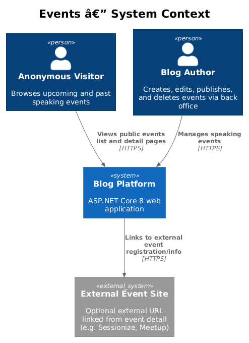
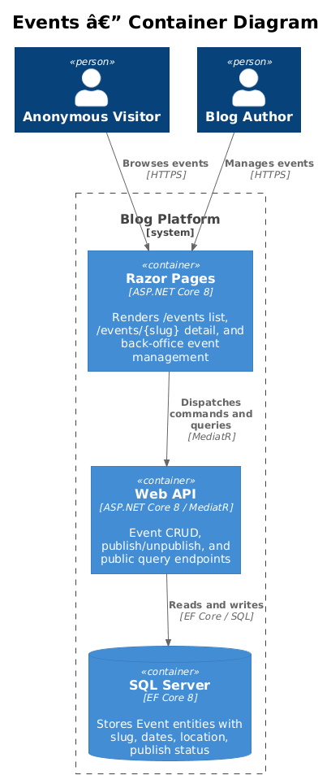
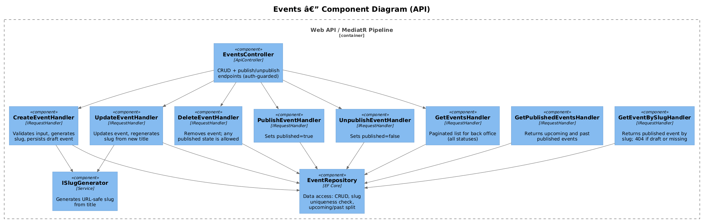
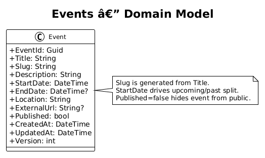
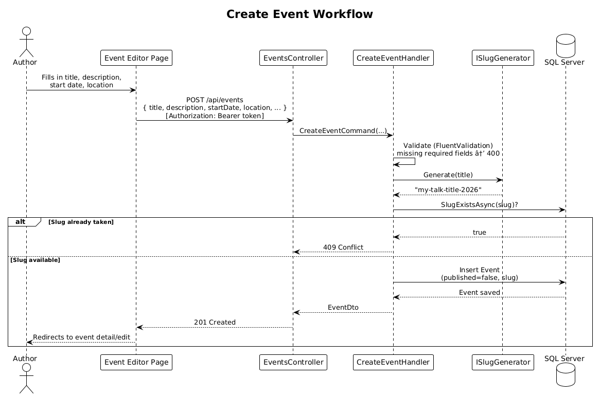
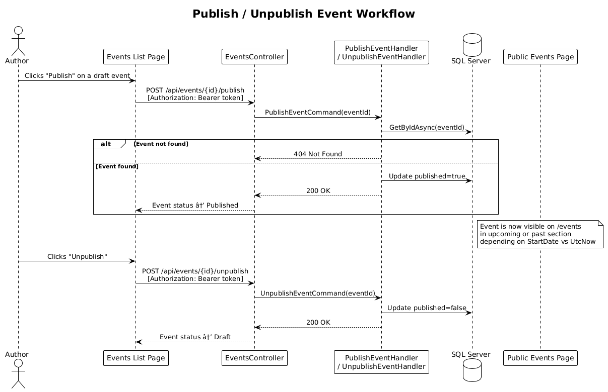

# Events — Detailed Design

## 1. Overview

The Events feature allows the blog author to manage a list of speaking engagements through the back office. Published events are displayed to anonymous visitors on the public site, split into upcoming and past sections, with a detail page for each event.

### Requirements Traceability

| Requirement | Description |
|-------------|-------------|
| L1-015 | Events: creation, editing, publish/unpublish, deletion, and public display |
| L2-064 | Create event |
| L2-065 | Edit event |
| L2-066 | Delete event |
| L2-067 | List events in back office |
| L2-068 | Publish and unpublish event |
| L2-069 | Public events display (`/events`) |
| L2-070 | Public event detail (`/events/{slug}`) |

### Actors

- **Anonymous Visitor** — browses upcoming and past published events, views event detail
- **Blog Author** — creates, edits, publishes/unpublishes, and deletes events via back office

---

## 2. Architecture

### 2.1 C4 Context Diagram



### 2.2 C4 Container Diagram



### 2.3 C4 Component Diagram



---

## 3. Component Details

### 3.1 EventsController

- **Responsibility**: Exposes API endpoints for event CRUD and publish/unpublish. All write operations are auth-guarded.
- **Interfaces**:
  - `POST /api/events` — create event
  - `PUT /api/events/{id}` — update event
  - `DELETE /api/events/{id}` — delete event
  - `POST /api/events/{id}/publish` — publish
  - `POST /api/events/{id}/unpublish` — unpublish
  - `GET /api/events` — paginated list for back office
  - `GET /api/events/{id}` — back-office detail by PK; used by the edit form to pre-populate fields (auth-guarded)
  - `GET /api/events/published` — public: returns paginated upcoming + past published events (no auth)
  - `GET /api/events/by-slug/{slug}` — public event detail by slug (no auth); uses explicit prefix to avoid routing conflict with `/{id}`

### 3.2 Command Handlers

| Handler | Command | Validator | Effect |
|---------|---------|-----------|--------|
| `CreateEventHandler` | `CreateEventCommand` | `CreateEventCommandValidator` | Generates slug, persists with `published=false` |
| `UpdateEventHandler` | `UpdateEventCommand` | `UpdateEventCommandValidator` | Updates all mutable fields; regenerates slug from new title; calls `ICacheInvalidator` if the event is currently `Published = true` |
| `DeleteEventHandler` | `DeleteEventCommand` | — | Removes event; returns 409 if `Published = true` (must unpublish first) |
| `PublishEventHandler` | `PublishEventCommand` | — | Sets `published=true`; calls `ICacheInvalidator` to bust the public events cache |
| `UnpublishEventHandler` | `UnpublishEventCommand` | — | Sets `published=false`; calls `ICacheInvalidator` to bust the public events cache |

### 3.3 Query Handlers

| Handler | Query | Returns |
|---------|-------|---------|
| `GetEventsHandler` | `GetEventsQuery(page, pageSize)` | Paginated list, all statuses, descending by `StartDate` |
| `GetPublishedEventsHandler` | `GetPublishedEventsQuery(upcomingPage, pastPage, pageSize)` | `{ upcoming: PagedResponse<PublicEventDto>, past: PagedResponse<PublicEventDto> }` split by `StartDate` vs `UtcNow` |
| `GetEventBySlugHandler` | `GetEventBySlugQuery(slug)` | Single published event; 404 if not found or not published |
| `GetEventByIdHandler` | `GetEventByIdQuery(eventId)` | Admin detail by ID |

### 3.4 EventRepository

- **Responsibility**: Data access for `Event` entities.
- **Key methods**:
  - `GetByIdAsync(eventId)` — by PK
  - `GetBySlugAsync(slug)` — by unique slug
  - `GetAllAsync(page, pageSize)` — paginated, all statuses, ordered by `StartDate DESC`
  - `GetUpcomingAsync(page, pageSize)` — published, `StartDate >= UtcNow`, ordered `StartDate ASC`
  - `GetPastAsync(page, pageSize)` — published, `StartDate < UtcNow`, ordered `StartDate DESC`
  - `SlugExistsAsync(slug, excludeEventId?)` — uniqueness check
  - `GetTotalUpcomingCountAsync()` — total published upcoming count for pagination metadata
  - `GetTotalPastCountAsync()` — total published past count for pagination metadata

### 3.5 ISlugGenerator

- Reused from existing infrastructure (`SlugGenerator`). Converts `Title` to a URL-safe slug. Called on both create and update.
- On update, the slug is regenerated from the new title. If the new slug conflicts with a **different** event, the handler returns 409 (L2-065.2).

---

## 4. Data Model

### 4.1 Class Diagram



### 4.2 Entity Description

#### Event

| Field | Type | Notes |
|-------|------|-------|
| `EventId` | `Guid` | PK |
| `Title` | `nvarchar(256)` | Required |
| `Slug` | `nvarchar(256)` | Unique index; generated from `Title` |
| `Description` | `nvarchar(max)` | Required; application layer enforces ≤ 4000 chars |
| `StartDate` | `datetime2` | Required; drives upcoming/past split |
| `EndDate` | `datetime2?` | Optional |
| `Location` | `nvarchar(512)` | Required |
| `ExternalUrl` | `nvarchar(2048)?` | Optional link to event site |
| `Published` | `bit` | `false` by default; toggle for visibility |
| `CreatedAt` | `datetime2` | UTC, set on insert |
| `UpdatedAt` | `datetime2` | UTC, updated on save including publish/unpublish state changes |
| `Version` | `int` | Optimistic concurrency; starts at `1` on first insert, incremented by `1` on each update |

**Recommended indexes**: `IX_Events_Published_StartDate` on `(Published, StartDate)` to support efficient upcoming/past queries. `IX_Events_Slug` unique on `Slug`.

---

## 5. Key Workflows

### 5.1 Create Event



Key points:
- New events are always created with `published=false` (draft state).
- The slug is generated from the title and checked for uniqueness before insert.
- Required fields: `Title`, `StartDate`, `Location` (L2-064.3).
- Validation: if `EndDate` is provided it must be ≥ `StartDate`; returns 400 otherwise.
- `ExternalUrl`, if provided, must be a well-formed absolute URL (`https://` or `http://`); returns 400 for malformed values.

### 5.2 Publish / Unpublish Event



Key points:
- Publish and unpublish are separate endpoints rather than a single toggle, making intent explicit.
- Once published, the event appears on `/events` in the appropriate upcoming or past section based on `StartDate` relative to the current UTC time.
- Unpublishing an event removes it from the public site immediately.
- Both `PublishEventHandler` and `UnpublishEventHandler` call `ICacheInvalidator` to bust the public events cache after the state change.

---

## 6. API Contracts

### Back-office endpoints (require `Authorization: Bearer <token>`)

| Method | Path | Body / Params | Success | Errors |
|--------|------|---------------|---------|--------|
| `POST` | `/api/events` | `{ title, description, startDate, location, endDate?, externalUrl? }` | 201 + `EventDto` | 400, 401, 409 |
| `PUT` | `/api/events/{id}` | `{ title, description, startDate, location, endDate?, externalUrl?, version }` | 200 + `EventDto` | 400, 401, 404, 409 |
| `DELETE` | `/api/events/{id}` | — | 204 | 401, 404, 409 |
| `POST` | `/api/events/{id}/publish` | — | 200 + `EventDto` | 401, 404 |
| `POST` | `/api/events/{id}/unpublish` | — | 200 + `EventDto` | 401, 404 |
| `GET` | `/api/events/{id}` | — | 200 + `EventDto` | 401, 404 |
| `GET` | `/api/events?page&pageSize` (default pageSize=20, max 50) | — | 200 + `PagedResponse<EventListDto>` | 401 |

### Public endpoints (no auth)

| Method | Path | Params | Success | Errors |
|--------|------|--------|---------|--------|
| `GET` | `/api/events/published` | `?upcomingPage&pastPage&pageSize` (default pageSize=20, max 50) | 200 + `PublicEventsDto` | — |
| `GET` | `/api/events/by-slug/{slug}` | — | 200 + `PublicEventDto` | 404 |

### DTOs

```
EventDto         { eventId, title, slug, description, startDate, endDate?, location, externalUrl?, published, createdAt, updatedAt, version }
EventListDto     { eventId, title, slug, startDate, location, published }
PublicEventDto   { title, slug, description, startDate, endDate?, location, externalUrl? }  // eventId omitted — public consumers navigate by slug; exposing PK enables GUID enumeration. Strips internal fields (published, version, updatedAt)
PublicEventsDto  { upcoming: PagedResponse<PublicEventDto>, past: PagedResponse<PublicEventDto> }
```

---

## 7. Security Considerations

- **Authorization**: All write endpoints (`POST`, `PUT`, `DELETE`, publish/unpublish) are protected by `[Authorize]` and the JWT middleware. The back-office list endpoint also requires auth (L2-067.3).
- **Slug regeneration**: Event slugs are regenerated on every update from the current title (see OQ1). Because slugs can change on title update, consumers should avoid hardcoding slug-based URLs; use `ExternalUrl` (when available) as a stable external reference to the event site.
- **Input validation**: `EndDate`, when provided, must be ≥ `StartDate` (validated in the command handler). `ExternalUrl`, when provided, must be a well-formed absolute URL; malformed values are rejected with 400 before any persistence occurs.
- **Delete guard**: Deleting a published event returns 409. The author must unpublish first, making removal from the public site an explicit step. This feature uses hard delete (physical row removal) rather than the status-based immutability used by Newsletter (Sent newsletters are never deleted) or the history-table approach used by About. The divergence is intentional: events have no audit or archive obligation and can legitimately be removed once they are no longer relevant, provided they are first hidden from public view via unpublish.
- **404 vs 410 after hard delete**: Once an event is hard-deleted, any request to `GET /api/events/by-slug/{slug}` (or the Razor Page `/events/{slug}`) returns 404 Not Found. A search crawler that had previously indexed the event's URL will re-request it and receive 404; HTTP 410 Gone would be semantically more correct (permanently removed, do not re-index), but this requires retaining a tombstone record or a separate deleted-slugs table. For a personal blog the SEO impact is low and the implementation cost is high, so 404 is accepted. If the author cares about de-indexing speed, the recommended workaround is to first set a `<meta name="robots" content="noindex">` via an unpublished but still-accessible state, wait for the next crawl, then delete. This limitation is documented here for future consideration.
- **Unpublished event access**: `GetEventBySlugHandler` explicitly checks `Published == true` before returning the event, ensuring draft events are not accessible to public visitors (L2-070.2).
- **HTTP caching**: The `GET /api/events/published` and `GET /api/events/by-slug/{slug}` endpoints are served with `Cache-Control: public, max-age=60, stale-while-revalidate=300`. Publish and unpublish operations must call `ICacheInvalidator` to bust the public events cache. `UpdateEventHandler` must also call `ICacheInvalidator` when the event being updated is currently published, so that title, date, or location changes are reflected immediately. **Slug change invalidation**: because the slug is regenerated from the title on every update (see OQ1), a title change produces a new slug. When this occurs, `UpdateEventHandler` must invalidate **both** the old slug's cache entry (`/api/events/by-slug/{oldSlug}`) and the published-list cache entry (`/api/events/published`). The old slug must be read from the existing entity before the update is applied so that the stale cache key is known. Failing to invalidate the old slug leaves a ghost cache entry that serves a 200 response for up to `max-age=60` seconds after the slug has changed, which is incorrect (a subsequent request for the old slug once the cache expires will return 404).
- **Optimistic concurrency**: `PUT /api/events/{id}` requires `version` in the request body. A mismatch returns 409 to prevent lost-update conflicts.
- **Input length validation**: Command handlers enforce DB column limits as server-side validation: `Title` ≤ 256 chars, `Description` ≤ 4000 chars (event blurb; `nvarchar(max)` is retained in the schema for migration flexibility but the application layer enforces this cap — equivalent to the Kestrel 1 MB limit applied to Newsletter/About `Body`), `Location` ≤ 512 chars, `ExternalUrl` ≤ 2048 chars. Requests exceeding these limits are rejected with 400 before any persistence occurs.
- **Pagination bounds**: `page`, `upcomingPage`, and `pastPage` must be ≥ 1 and `pageSize` must be ≥ 1 and ≤ 50. Requests outside these bounds are rejected with 400. Zero or negative values cause division-by-zero or negative offsets in pagination math and must not be forwarded to the repository.
- **Content-Type enforcement**: All `POST` and `PUT` endpoints must require `Content-Type: application/json`. Requests with a missing or mismatched `Content-Type` are rejected with 415 (Unsupported Media Type). This prevents silent null-model-binding failures when clients send `application/x-www-form-urlencoded` or other content types.
- **Slug generation failure**: If `ISlugGenerator` produces an empty or blank slug (e.g. `Title` contains only non-ASCII characters), `CreateEventHandler` and `UpdateEventHandler` must fall back to the event's `EventId` (formatted as a lowercase hex string without hyphens) as the slug, ensuring uniqueness without failing the operation.
- **Observability**: Key operations must emit structured log events at `Information` level: `event.created` (eventId, title), `event.published` (eventId), `event.unpublished` (eventId), `event.deleted` (eventId). Errors (slug conflict, optimistic concurrency failure) are logged at `Warning` level.
- **Razor Page error handling**: The public `/events` Razor Page (list) and `/events/{slug}` Razor Page (detail) call the API layer via MediatR directly (same process), so a complete API failure is unlikely in isolation. However, if `GetPublishedEventsHandler` or `GetEventBySlugHandler` throws an unhandled exception (e.g. database unavailable), the Razor Pages must catch the exception and render a user-friendly error page (HTTP 500) rather than exposing a stack trace. The `/events/{slug}` page must return HTTP 404 when `GetEventBySlugHandler` returns null (event not found or not published), consistent with L2-070.2. The stale-while-revalidate window (`max-age=60, stale-while-revalidate=300`) provides a degree of resilience — a brief database outage may be masked by the CDN/reverse-proxy serving stale responses.

---

## 8. Open Questions

1. **Slug regeneration on update**: ~~Consider freezing the slug after first publish.~~ **Resolved**: The slug is regenerated on every update from the current title. Bookmarked URLs may break on title changes; this is accepted. `UpdateEventHandler` regenerates the slug and returns 409 if it conflicts with a different event.
2. **Pagination on public events**: ~~L2-069 does not mention pagination.~~ **Resolved**: Pagination is added to the public events page. Both the upcoming and past sections are paginated independently. `GetPublishedEventsQuery` accepts `upcomingPage`, `pastPage`, and `pageSize` parameters. The public API response is updated to `{ upcoming: PagedResponse<PublicEventDto>, past: PagedResponse<PublicEventDto> }`.
3. **Time zone handling**: ~~Should the time zone be a field on the event, a site-wide setting, or always UTC?~~ **Resolved**: `StartDate` is stored and displayed as UTC. No time zone conversion is performed. The public page renders dates with an explicit "UTC" suffix so visitors understand the reference.
