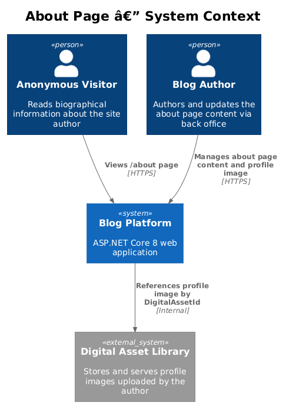
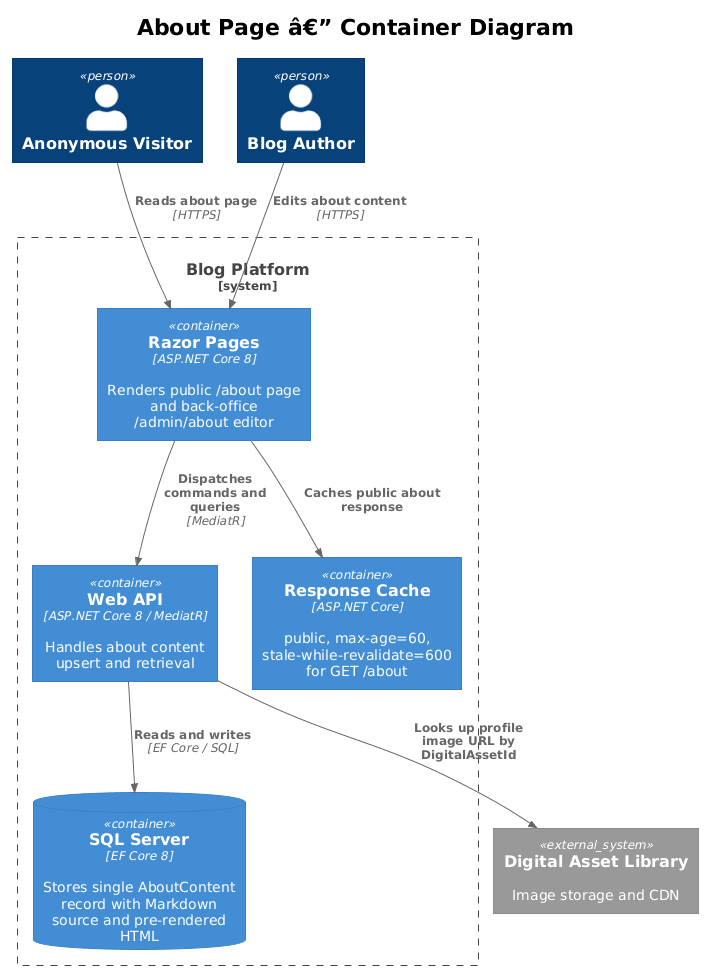
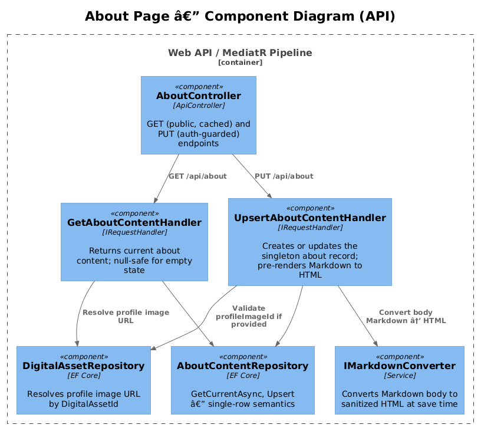
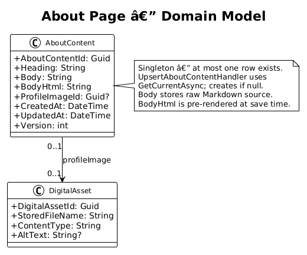
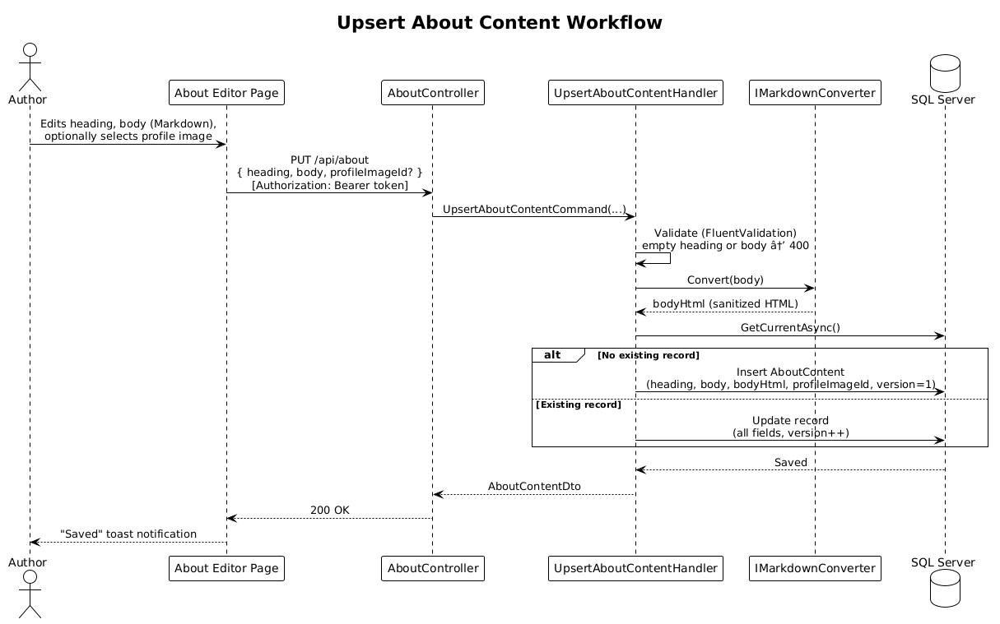

# About Page — Detailed Design

## 1. Overview

The About Page feature provides a publicly visible biography for the site author. A single authenticated user can author and update the about page content — consisting of a heading, a rich-text body (Markdown), and an optional profile image from the digital asset library. The public `/about` page renders the content with appropriate SEO metadata and HTTP caching headers.

### Requirements Traceability

| Requirement | Description |
|-------------|-------------|
| L1-016 | About page: public display and back-office content authoring |
| L2-071 | Public about page display (`/about`) |
| L2-072 | About content management (back office) |
| L2-073 | About page SEO |

### Actors

- **Anonymous Visitor** — reads the about page at `/about`
- **Blog Author** — authors and updates the about page content through the back-office editor

---

## 2. Architecture

### 2.1 C4 Context Diagram



### 2.2 C4 Container Diagram



### 2.3 C4 Component Diagram



---

## 3. Component Details

### 3.1 AboutController

- **Responsibility**: Public GET and authenticated PUT for the about content.
- **Interfaces**:
  - `GET /api/about` — returns current about content (anonymous, response-cached)
  - `PUT /api/about` — creates or updates about content (requires `[Authorize]`)
- **Caching**: The public GET response is served with `Cache-Control: public, max-age=60, stale-while-revalidate=600` (L2-071.3). The `ICacheInvalidator` is called on a successful PUT to bust the cached response.
- **Empty state**: If no about content has been authored, `GET /api/about` returns `null` in the body with HTTP 200. The public Razor Page renders a default message (L2-071.2).

### 3.2 UpsertAboutContentHandler

- **Responsibility**: Creates the about record if it does not exist; updates it if it does. This is the only mutation handler for about content.
- **Dependencies**: `AboutContentRepository`, `IMarkdownConverter`, `DigitalAssetRepository` (to validate `profileImageId` and verify asset ownership matches the requesting user)
- **Pre-render**: Markdown `Body` is converted to sanitized HTML at save time and stored in `BodyHtml`. Runtime rendering is not performed (same pattern as articles).
- **Version increment**: On update, `Version` is incremented for optimistic concurrency.

### 3.3 GetAboutContentHandler

- **Responsibility**: Retrieves the current about content record (singleton). Returns `null` if no record exists.
- **Dependencies**: `AboutContentRepository`, `DigitalAssetRepository` (resolves profile image URL from `ProfileImageId`)

### 3.4 AboutContentRepository

- **Responsibility**: Single-row data access for `AboutContent`.
- **Key methods**:
  - `GetCurrentAsync()` — `FirstOrDefaultAsync()` with profile image join
  - `AddAsync(entity)` — insert
  - `UpdateAsync(entity)` — update (caller increments version)
- **Notes**: No ID-based lookup needed — there is always at most one row. No `GetAllAsync` or pagination.

---

## 4. Data Model

### 4.1 Class Diagram



### 4.2 Entity Descriptions

#### AboutContent

| Field | Type | Notes |
|-------|------|-------|
| `AboutContentId` | `Guid` | PK |
| `Heading` | `nvarchar(256)` | Required; used as `<h1>` and SEO `<title>` |
| `Body` | `nvarchar(max)` | Raw Markdown source |
| `BodyHtml` | `nvarchar(max)` | Pre-rendered, sanitized HTML |
| `ProfileImageId` | `Guid?` | FK → `DigitalAssets.DigitalAssetId`; nullable |
| `CreatedAt` | `datetime2` | UTC, set on first insert |
| `UpdatedAt` | `datetime2` | UTC, updated on save |
| `Version` | `int` | Optimistic concurrency |

**Design note**: The table is treated as a singleton. `UpsertAboutContentHandler` calls `GetCurrentAsync()` — if null, it inserts; otherwise it copies the current row to `AboutContentHistory` then updates. No unique constraints beyond the PK are needed.

#### AboutContentHistory

| Field | Type | Notes |
|-------|------|-------|
| `AboutContentHistoryId` | `Guid` | PK |
| `AboutContentId` | `Guid` | FK → `AboutContent.AboutContentId` |
| `Heading` | `nvarchar(256)` | Snapshot at time of save |
| `Body` | `nvarchar(max)` | Raw Markdown snapshot |
| `BodyHtml` | `nvarchar(max)` | Pre-rendered HTML snapshot |
| `ProfileImageId` | `Guid?` | FK snapshot |
| `Version` | `int` | Version number copied from parent at time of snapshot |
| `ArchivedAt` | `datetime2` | UTC timestamp when snapshot was created |

---

## 5. Key Workflows

### 5.1 Upsert About Content



Key points:
- Validation rejects empty `Heading` or `Body` with 400 (L2-072.3).
- Unauthenticated PUT returns 401 (L2-072.4).
- Markdown is converted and sanitized at save time; the public page reads `BodyHtml` directly.
- `profileImageId`, if provided, must reference an existing `DigitalAsset` owned by the requesting user — validated before save (L2-072.5). Returns 403 if the asset exists but belongs to a different user.

### 5.2 Public About Page Render

1. Visitor navigates to `/about`.
2. The Razor Page dispatches `GetAboutContentQuery` via MediatR.
3. If no content exists, the page renders an empty-state message (HTTP 200, L2-071.2).
4. If content exists, the page renders `Heading` as `<h1>`, `BodyHtml` as the body, and the profile image (if set).
5. The `<head>` includes:
   - `<title>{Heading} — {SiteName}</title>` (L2-073.1)
   - `<meta name="description" content="...">` derived from the first ~160 chars of the body
   - `og:title`, `og:description`, `og:type` Open Graph tags (L2-073.2)
   - `og:image` referencing the profile image URL when set (L2-073.3)
6. `Cache-Control: public, max-age=60, stale-while-revalidate=600` is applied via the page's `[ResponseCache]` attribute.

---

## 6. API Contracts

| Method | Path | Auth | Body | Success | Errors |
|--------|------|------|------|---------|--------|
| `GET` | `/api/about` | None | — | 200 + `AboutContentDto?` | — |
| `PUT` | `/api/about` | Bearer token | `{ heading, body, profileImageId? }` | 200 + `AboutContentDto` | 400, 401, 403 |
| `GET` | `/api/about/history` | Bearer token | `?page&pageSize` | 200 + `PagedResponse<AboutContentHistoryDto>` | 401 |
| `PUT` | `/api/about/restore/{historyId}` | Bearer token | — | 200 + `AboutContentDto` | 401, 404 |

### DTOs

```
AboutContentDto  {
    aboutContentId: Guid,
    heading:        string,
    body:           string,       // Markdown source
    bodyHtml:       string,       // Pre-rendered HTML
    profileImageId: Guid?,
    profileImageUrl: string?,     // Resolved CDN/storage URL
    updatedAt:      DateTime,
    version:        int
}

AboutContentHistoryDto  {
    aboutContentHistoryId: Guid,
    heading:               string,
    body:                  string,
    profileImageId:        Guid?,
    version:               int,
    archivedAt:            DateTime
}
```

---

## 7. Security Considerations

- **Authorization**: The `PUT /api/about` endpoint is protected by `[Authorize]` and the JWT middleware. Anonymous access returns 401 (L2-072.4).
- **XSS**: `BodyHtml` is produced via `IMarkdownConverter`, which uses HtmlSanitizer to strip disallowed tags and attributes before storage.
- **Image validation**: `profileImageId` is validated against the `DigitalAssets` table to prevent orphaned references or SSRF-style manipulation of the image URL.
- **Cache invalidation**: The `ICacheInvalidator` is called after a successful PUT to flush the cached public response, ensuring visitors see updated content within `stale-while-revalidate` window.

---

## 8. Open Questions

1. **Profile image ownership**: ~~Should the about profile image be restricted to assets uploaded by the authenticated user, or any asset in the library?~~ **Resolved**: Restricted to assets uploaded by the authenticated user. `UpsertAboutContentHandler` must verify that the referenced `DigitalAsset` is owned by the requesting user before accepting the `profileImageId`.
2. **History / versioning**: ~~The design stores only the current version.~~ **Resolved**: Revision history is supported via a separate `AboutContentHistory` table. On every successful upsert, `UpsertAboutContentHandler` copies the current row into `AboutContentHistory` before applying the update. A back-office endpoint (`GET /api/about/history`) lists past revisions and a `PUT /api/about/restore/{version}` allows the author to revert to a previous version.
3. **Cache key**: ~~The `/about` route needs to be added to the invalidation set.~~ **Resolved**: The `/about` route is added to the `ICacheInvalidator` invalidation set. `UpsertAboutContentHandler` calls `ICacheInvalidator.InvalidateAsync("/about")` after a successful upsert.
